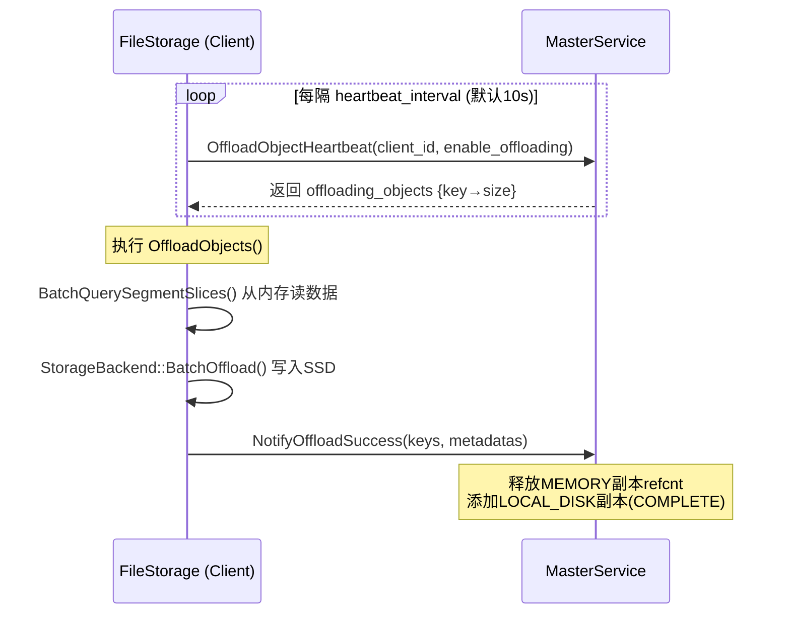
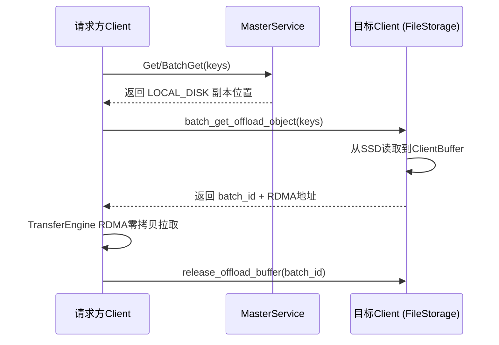
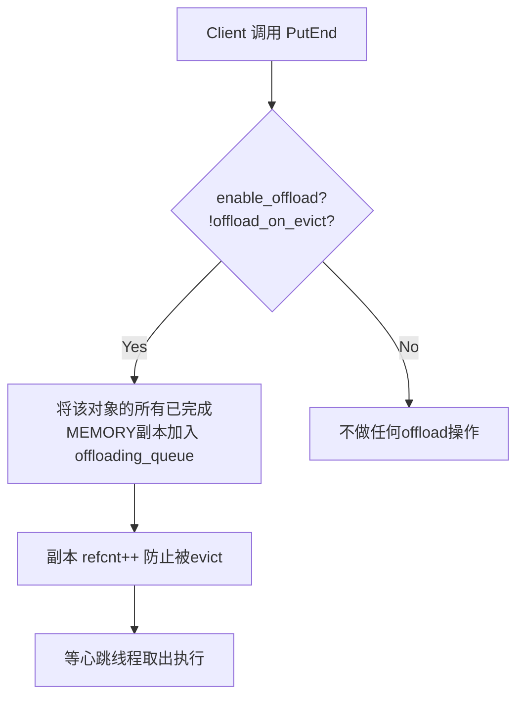
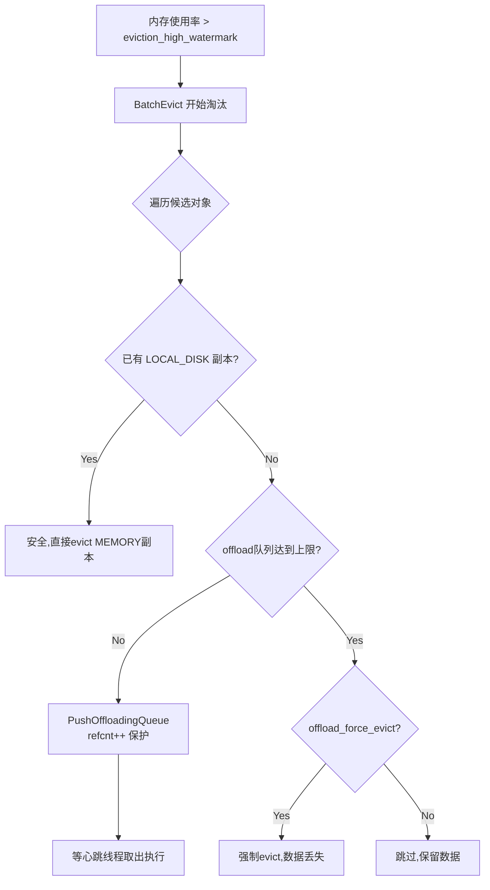
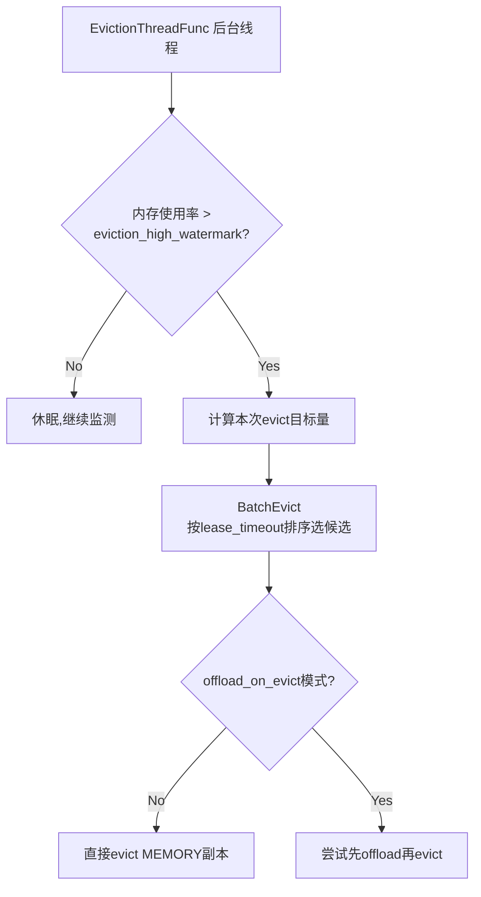
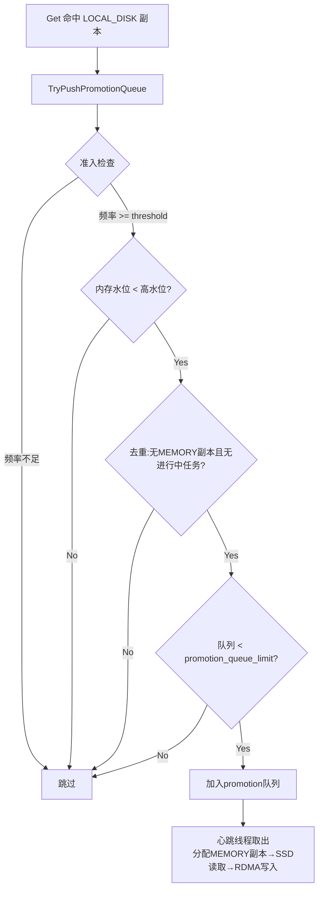

# Mooncake SSD Offload 机制

## 1. 核心概念

Offload 是 Mooncake 将数据从 **DRAM（MEMORY副本）** 迁移到 **本地 SSD（LOCAL_DISK副本）** 的过程。与 Eviction（直接丢弃）不同，Offload 将数据持久化到磁盘，后续可通过 Load 路径读回。

```
MEMORY副本 ──Offload──→ LOCAL_DISK副本 ──Promotion──→ MEMORY副本
    │                       │
    └──Eviction（丢弃）      └──Disk Eviction（丢弃）
```

## 2. 核心数据流

### 2.1 Offload（内存 → SSD）



### 2.2 Load（SSD → 请求方）



## 3. 触发时机与 Key 选取

系统有两种 offload 触发模式，由 `offload_on_evict` 开关控制：

### 模式 A：PutEnd 即入队（默认，`offload_on_evict=false`）



- **选取标准**：所有 PutEnd 完成的对象**无差别入队**
- **无筛选逻辑**：不区分冷热，全部 offload

### 模式 B：Eviction 时入队（`offload_on_evict=true`）



- **选取标准**：由 `BatchEvict` 决定候选对象，基于 **lease_timeout 时间排序**（近似 LRU）
- **两轮扫描**：第一轮淘汰无 soft pin 的对象，第二轮淘汰有 soft pin 的对象（需 `allow_evict_soft_pinned_objects=true`）
- **保护机制**：入队时 `refcnt++` 防止 offload 期间被 evict

### Master 端 Eviction 流程



## 4. Offload 与 Eviction 的关系

| 维度 | Offload | Eviction |
|------|---------|----------|
| 目的 | 将数据持久化到 SSD | 释放内存空间 |
| 数据去向 | 本地 SSD 文件 | 丢弃 |
| 数据可恢复 | 是（通过 Load/Promotion） | 否 |
| 触发者 | 心跳线程（定时） | Eviction 后台线程（水位触发） |
| 副本变化 | MEMORY → LOCAL_DISK | MEMORY → 删除 |

**协同关系**：
- Offload 是 Eviction 的**前置安全网**——先持久化再释放，避免数据丢失
- `offload_on_evict=true` 时二者紧密耦合：eviction 候选先尝试 offload，成功后才释放内存
- `offload_on_evict=false` 时二者独立：PutEnd 时入 offload 队列，eviction 按自己逻辑运行

## 5. 四种配置组合

| 组合 | enable_offload | offload_on_evict | offload_force_evict | 行为 |
|------|:-:|:-:|:-:|------|
| A（默认） | true | false | false | PutEnd 立即入 offload 队列，eviction 独立运行 |
| B | true | true | false | eviction 时才尝试 offload，失败则跳过（保留数据） |
| C | true | true | true | eviction 时先 offload，队列满则强制 evict（数据丢失） |
| D | true | false | true | 等同 A（force_evict 无效） |

## 6. Promotion（SSD → 内存热提升）

当 `promotion_on_hit=true` 时，频繁访问的 LOCAL_DISK 数据自动提升回内存：



- **频率统计**：Count-Min Sketch，阈值 `promotion_admission_threshold`（默认 2）
- **每次心跳限 1 个** promotion 任务（`kMaxPerHeartbeat=1`）

## 7. 所有控制开关与环境变量

### Master 端开关（master.yaml 或命令行参数）

| 开关 | 默认值 | 说明 |
|------|--------|------|
| `enable_offload` | false | 总开关：是否启用 SSD offload |
| `offload_on_evict` | false | true=推迟到 eviction 时才 offload；false=PutEnd 立即入队 |
| `offload_force_evict` | false | true=offload 队列满时强制 evict（数据丢失） |
| `promotion_on_hit` | false | true=自动将热 SSD 数据提升回内存 |
| `promotion_admission_threshold` | 2 | 提升的最小访问频率 |
| `promotion_queue_limit` | 50000 | 待提升队列最大长度 |
| `eviction_high_watermark_ratio` | 0.85 | 内存使用率触发 eviction 的阈值 |
| `eviction_ratio` | 0.05 | 每轮 eviction 目标回收比例 |

### Client 端环境变量

| 环境变量 | 默认值 | 说明 |
|----------|--------|------|
| `MOONCAKE_OFFLOAD_FILE_STORAGE_PATH` | `/data/file_storage` | SSD 存储目录 |
| `MOONCAKE_OFFLOAD_STORAGE_BACKEND_DESCRIPTOR` | `bucket_storage_backend` | 存储后端：`bucket_storage_backend` / `file_per_key_storage_backend` / `offset_allocator_storage_backend` |
| `MOONCAKE_OFFLOAD_LOCAL_BUFFER_SIZE_BYTES` | 1280MB | Load 用的 staging buffer 大小 |
| `MOONCAKE_OFFLOAD_TOTAL_SIZE_LIMIT_BYTES` | 2TB | SSD 磁盘使用上限 |
| `MOONCAKE_OFFLOAD_HEARTBEAT_INTERVAL_SECONDS` | 10 | 心跳间隔（秒） |
| `MOONCAKE_OFFLOAD_USE_URING` | false | 是否启用 io_uring 异步 I/O |

### 内部硬编码常量

| 常量 | 值 | 说明 |
|------|----|------|
| `offloading_queue_limit_` | 50000 | 单客户端 offload 队列最大长度 |
| `kOffloadCapRatio` | 0.5 | force_evict 触发阈值 = 队列上限 × 50% |
