# 基于 Mooncake 框架的 EmbTable Sharding 方案设计（V2 — RPC 化改造版）

## 1. 背景

### 1.1 业务场景

搜广推场景中，GPU 获取特征值对应的 embedding 时通过多级缓存加速，数据路径为 GPU-HBM-DDR-SSD。DDR 到 HBM 的数据加载一般采用 Sharding 模式的 one2all 访问方式。

### 1.2 现网问题

| 问题 | 描述 |
|------|------|
| **传输效率瓶颈** | 两次 RDMA one2all 分别传输 keys 和 Emb，同步单点瓶颈影响大 |
| **热点多副本** | 仅缓存在本 Shard HBM Cache，跨节点热点数据无法共享 |
| **负载不均** | 负载受热点数据分布影响，拥有热点数据的节点负载更大 |

### 1.3 Mooncake 框架引入

[Mooncake](https://github.com/kvcache-ai/Mooncake) 是 Moonshot AI 开发的 KVCache-centric disaggregated 架构，FAST 2025 最佳论文。核心特性：

| 特性 | 说明 |
|------|------|
| **零拷贝传输** | GPUDirect RDMA 实现 zero-copy，最高 87 GB/s |
| **Transfer Engine** | 支持 RDMA/TCP/NVMeoF 等多种传输模式 |
| **分布式存储** | Mooncake Store 提供分布式 KVCache 存储 |
| **多租户支持** | Lease 机制保护活跃数据，支持软硬 pin 和 TTL |

---

## 2. 设计理念

### 2.1 设计目标

1. **高性能**：利用 Mooncake Transfer Engine 的零拷贝 RDMA 能力
2. **低延迟**：本地优先 + 异步跨节点查询的混合策略
3. **可扩展**：基于 Mooncake Store 的分片管理，支持动态扩缩容
4. **高可用**：Lease 机制保护数据，Fault Tolerance 支持
5. **服务化**：ShareMapStore 提供标准 RPC 服务，支持跨节点调用

### 2.2 用户接口

```
CreateTable(tableName, numBuckets, valueSize) // 创建逻辑表
AlterTable(tableName, numBuckets, valueSize)  // 校验/变更表结构
DeleteTable(tableName)                        // 删除逻辑表元数据
Insert(tableName, embKeys, embValues)         // 批量插入
Find(tableName, embKeys, buffer)              // 批量查找
BuildIndex(tableName)                         // 构建完美哈希索引（全局生效）
```

### 2.3 核心概念定义

| 概念 | 定义 |
|------|------|
| **EmbTableClient** | 多表注册中心与本地 facade；持有一个 ShareMapStore，通过 tableName 懒加载多个 EmbTable；按部署参数决定是否启动 RPC |
| **EmbTableDummyClient** | 独立部署时用户侧客户端；DDL/keys 走 RPC，Insert values 与 Find results 走预注册 POSIX SHM |
| **EmbTable** | 逻辑 embedding 表，按 key 哈希拆分为多个 Bucket，管理 EmbTableMeta |
| **EmbTableMeta** | 记录 bucket 数量、分桶 hash 函数、table 名称、每个 bucket 容量规格等 |
| **Bucket** | value 大小规格相同的数据聚合单元，按 embKey 哈希分桶；含本地写缓冲 LocalBuffer |
| **BucketMeta** | 记录分桶大小规格、value size、分桶名称、replica 节点信息，托管给 Mooncake Store 维护 |
| **ShareMapStore** | **RPC 服务端**，管理多个 ShareMap，维护 RealClient 实例；对外提供 Publish / Find / BuildIndex 等 RPC 接口 |
| **ShareMapStoreClient** | **RPC 客户端**，封装到各 ShareMapStore 服务节点的 RPC 调用；Bucket 通过它发起远程请求 |
| **ShareMap** | 对应一个 Bucket，由 VectorObject、IndexObject、ShareMapMeta 及底层 ShareObject 组成 |
| **VectorObject** | 由多个固定大小 ShareObject 拼接的动态向量，分别存储 keys 和 values |
| **IndexObject** | 完美哈希索引结构，由一整块 ShareObject 管理 |
| **ShareMapMeta** | 记录 VectorObject 和 IndexObject 使用的 ShareObject 信息（key、大小、数据地址等） |
| **ShareObject** | 从 Mooncake Store 获取的连续存储单元，采用"本地缓冲 + 整对象上传"模型（对外保留 offset 读写语义，内部作用于本地副本，Publish 时整对象上传），是可共享的存储底座 |
| **RealClient** | Mooncake Store 的真实客户端，由 ShareMapStore 唯一创建和初始化，EmbTableClient 仅获取并复用 |
| **DummyClient** | 独立部署时转发请求到同节点 RealClient 的哑客户端 |
| **ReplicaInfo** | Bucket 副本信息，记录所属 nodeId 和 endpoint，用于定位 ShareMapStore 服务节点 |
| **NodeLocator** | 节点定位器，解析 ReplicaInfo 判断目标 ShareMapStore 是否本地节点 |

### 2.4 概念关联

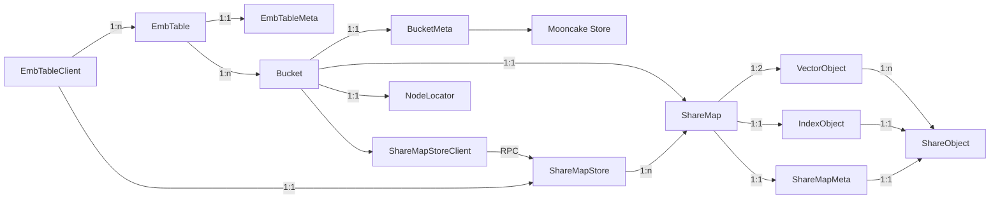
```mermaid
graph LR
    ETC[EmbTableClient] -- 1:n --> ET[EmbTable]
    ETC -- 1:1 --> SMS[ShareMapStore]
    ET -- 1:1 --> ETM[EmbTableMeta]
    ET -- 1:n --> B[Bucket]
    B -- 1:1 --> BM[BucketMeta]
    B -- 1:1 --> SM[ShareMap]
    B -- 1:1 --> NLOC[NodeLocator]
    BM --> MCS[Mooncake Store]
    B --> SMSC[ShareMapStoreClient]
    SMSC -- RPC --> SMS
    SMS -- 1:n --> SM
    SM -- 1:2 --> VO[VectorObject]
    SM -- 1:1 --> IO[IndexObject]
    SM -- 1:1 --> SMM[ShareMapMeta]
    VO -- 1:n --> SO[ShareObject]
    IO -- 1:1 --> SO
    SMM -- 1:1 --> SO
```

---

## 3. 整体架构

### 3.1 五层架构

引入 RPC 服务化改造后，整体架构从四层扩展为五层：

| 层级 | 组件 | 职责 |
|------|------|------|
| **EmbTableClient 层** | EmbTableClient / EmbTableDummyClient | 对外接口，两种部署形态 |
| **EmbTable 层** | EmbTable / EmbTableMeta / Bucket / BucketMeta | 逻辑表管理，按 key 分桶，元信息管理 |
| **ShareMapStoreClient 层** | ShareMapStoreClient / NodeLocator | RPC 客户端封装，节点感知，本地/远程路由决策 |
| **ShareMapStore 层** | ShareMapStore (RPC 服务) / RpcService | 管理 ShareMap 集合，提供跨节点 RPC 服务 |
| **ShareObject 层** | ShareMap / VectorObject / IndexObject / ShareMapMeta / ShareObject | HashMap 结构，存储底座 |

### 3.2 整体架构图

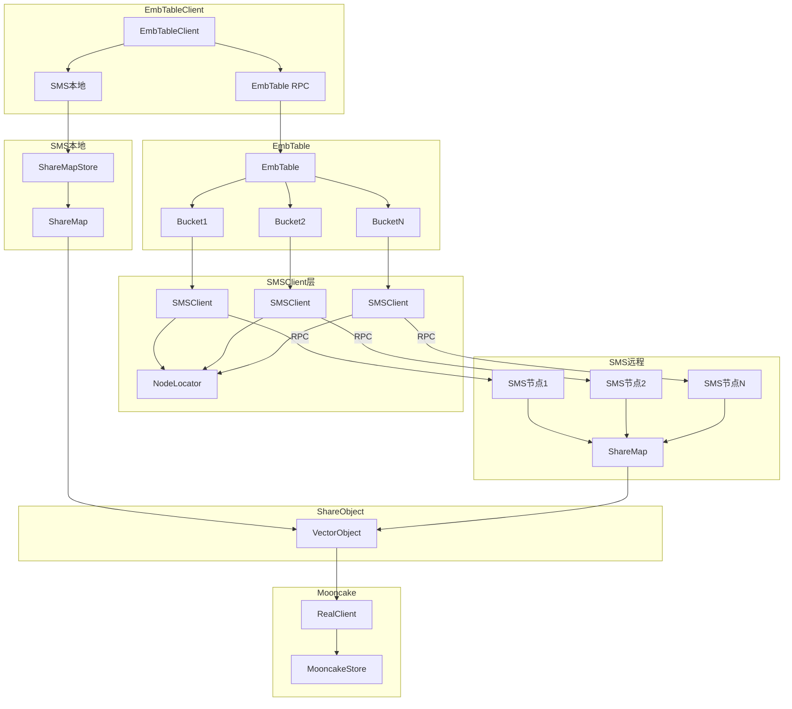
```mermaid
graph TB
    subgraph CLIENT["EmbTableClient"]
        A["EmbTableClient"] --> B["EmbTable RPC"]
        A --> C["SMS本地"]
    end

    subgraph ETABLE["EmbTable"]
        B --> D["EmbTable"]
        D --> E["Bucket1"]
        D --> F["Bucket2"]
        D --> G["BucketN"]
    end

    subgraph SMSC["SMSClient层"]
        E --> H["SMSClient"]
        F --> I["SMSClient"]
        G --> J["SMSClient"]
        H --> K["NodeLocator"]
        I --> K
        J --> K
    end

    subgraph SMSLOCAL["SMS本地"]
        C --> L["ShareMapStore"]
        L --> M["ShareMap"]
    end

    subgraph SMSREMOTE["SMS远程"]
        H -->|"RPC"| N["SMS节点1"]
        I -->|"RPC"| O["SMS节点2"]
        J -->|"RPC"| P["SMS节点N"]
        N --> Q["ShareMap"]
        O --> Q
        P --> Q
    end

    subgraph SOBJ["ShareObject"]
        M --> R["VectorObject"]
        Q --> R
    end

    subgraph MCS["Mooncake"]
        S["RealClient"] --> T["MooncakeStore"]
    end

    R --> S
```

### 3.3 RPC 调用链路

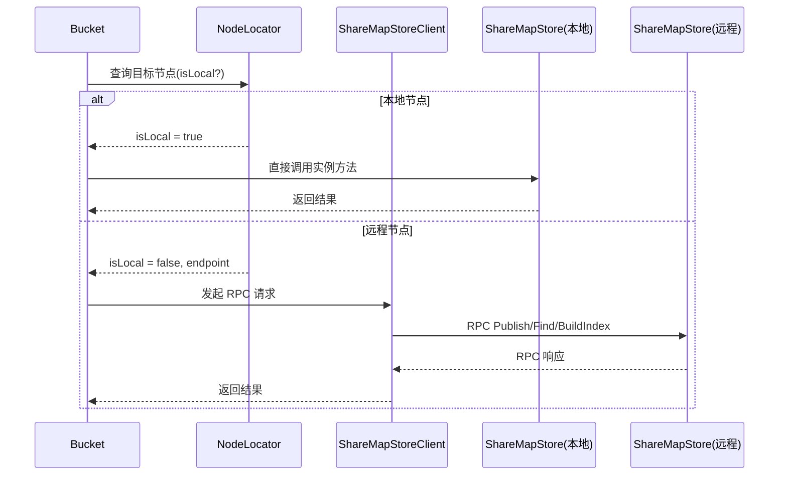
```mermaid
sequenceDiagram
    participant B as Bucket
    participant NLOC as NodeLocator
    participant SMSC as ShareMapStoreClient
    participant SMS_LOCAL as ShareMapStore(本地)
    participant SMS_REMOTE as ShareMapStore(远程)

    B->>NLOC: 查询目标节点(isLocal?)

    alt 本地节点
        NLOC-->>B: isLocal = true
        B->>SMS_LOCAL: 直接调用实例方法
        SMS_LOCAL-->>B: 返回结果
    else 远程节点
        NLOC-->>B: isLocal = false, endpoint
        B->>SMSC: 发起 RPC 请求
        SMSC->>SMS_REMOTE: RPC Publish/Find/BuildIndex
        SMS_REMOTE-->>SMSC: RPC 响应
        SMSC-->>B: 返回结果
    end
```

### 3.4 两种部署形态

#### 3.4.1 共进程部署

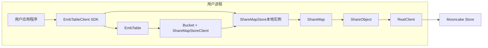
```mermaid
graph LR
    subgraph 用户进程
        A[用户应用程序] --> B[EmbTableClient SDK]
        B --> C[EmbTable]
        B --> D[ShareMapStore本地实例]
        C --> E[Bucket + ShareMapStoreClient]
        E --> D
        D --> F[ShareMap]
        F --> G[ShareObject]
        G --> H[RealClient]
    end
    H --> I[Mooncake Store]
```

用户直接链接 EmbTableClient 的头文件和 so 库，调用本地 API。`DeploymentConfig::enableEmbTableRpc=false`，不启动 EmbTable/ShareMapStore RPC 服务；ShareMapStore 与 EmbTable 同进程，本地调用无需 RPC。应用可通过 `Options::tableName` 选择一个默认表，也可使用带 `tableName` 的多表接口。

#### 3.4.2 独立部署

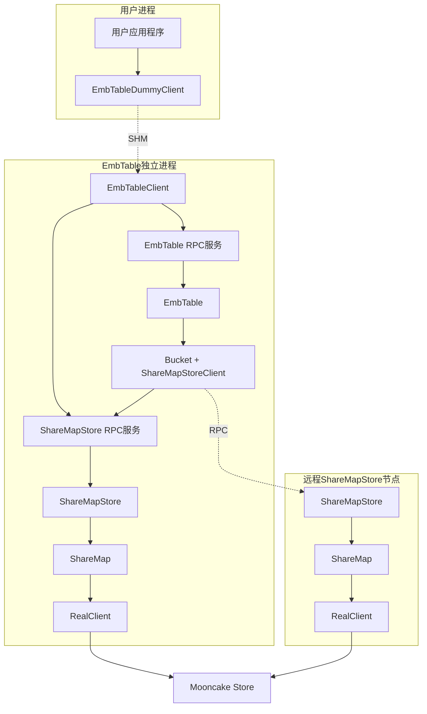
```mermaid
graph TB
    subgraph EmbTable独立进程
        A[EmbTableClient] --> B[EmbTable RPC服务]
        A --> C[ShareMapStore RPC服务]
        B --> D[EmbTable]
        C --> E[ShareMapStore]
        D --> F[Bucket + ShareMapStoreClient]
        F --> C
        E --> G[ShareMap]
        G --> H[RealClient]
    end

    subgraph 用户进程
        I[用户应用程序] --> J[EmbTableDummyClient]
        J -.->|SHM| A
    end

    subgraph 远程ShareMapStore节点
        K[ShareMapStore] --> L[ShareMap]
        L --> M[RealClient]
    end

    H --> N[Mooncake Store]
    M --> N
    F -.->|RPC| K
```

`embtable_client` 作为独立存储节点进程启动时不创建或绑定任何表，设置 `DeploymentConfig::enableEmbTableRpc=true` 后同时提供 EmbTable RPC 和 ShareMapStore RPC。用户通过 EmbTableDummyClient 发起 CreateTable/DeleteTable 及带 `tableName` 的数据请求；节点按表名懒加载 EmbTable，因此一个进程可管理多个逻辑表。跨节点时，Bucket 通过 ShareMapStoreClient 请求远程 ShareMapStore。

两种部署形态都只初始化一次 Mooncake `RealClient`：`ShareMapStore::Init` 接收 `localHostname`，调用 `setup_real`，EmbTableClient 再通过 `GetRealClient()` 复用该实例。

---

## 4. 核心模块设计

### 4.1 ShareMapStore RPC 服务模块

#### 4.1.1 模块职责

ShareMapStore 是本架构的**核心 RPC 服务节点**，承担以下职责：

- 基于 `yalantinglibs` 提供标准 RPC 服务，监听指定端口
- 管理多个 ShareMap 对象的生命周期
- 维护 Mooncake RealClient 实例，连接 Mooncake Store
- 对外暴露 **Publish / Find / BuildIndex** 三大 RPC 接口
- 接收来自任意节点 Bucket（通过 ShareMapStoreClient）的 RPC 请求，定位到具体 ShareMap 实例完成操作

#### 4.1.2 RPC 接口定义

```protobuf
// ShareMapStore RPC 接口定义（yalantinglibs struct_pack 风格）

// ===== Publish 请求/响应 =====
struct PublishRequest {
    std::string bucket_key;           // 目标 Bucket Key
    uint64_t value_size;              // value 大小（8B-512B）
    std::vector<uint64_t> keys;       // 待插入的 keys
    std::vector<std::string> values;  // 待插入的 values（已序列化）
    std::string source_node_id;       // 请求源节点 ID（用于审计）
};

struct PublishResponse {
    int32_t status_code;              // 0=OK, 非0=错误码
    std::string message;              // 错误信息（如有）
    uint64_t inserted_count;          // 实际插入数量
};

// ===== Find 请求/响应 =====
struct FindRequest {
    std::string bucket_key;           // 目标 Bucket Key
    std::vector<uint64_t> keys;       // 待查询的 keys
    std::string source_node_id;       // 请求源节点 ID
};

struct FindResponse {
    int32_t status_code;              // 0=OK, 非0=错误码
    std::string message;
    std::vector<std::string> values;  // 查询结果 values（按 keys 顺序）
    std::vector<uint64_t> found_keys; // 实际查到的 keys（子集）
    // 注：大数据量时通过 Mooncake Store Buffer + TE 传输，此处仅传元信息
    std::string buffer_handle;        // Mooncake Buffer 句柄（大数据量模式）
    uint64_t buffer_size = 0;         // Buffer 总大小
};

// ===== FindMultiBucket 请求/响应（EmbTable Find 聚合调用） =====
struct FindMultiBucketRequest {
    std::vector<std::string> bucket_keys;  // 该节点上的所有目标 Bucket
    std::unordered_map<std::string, std::vector<uint64_t>> bucket_keys_map;  // bucket -> keys
    std::string source_node_id;
    std::string result_buffer_handle;   // 结果聚合 Buffer 的 Mooncake handle
};

struct FindMultiBucketResponse {
    int32_t status_code;
    std::string message;
    std::unordered_map<std::string, uint64_t> bucket_result_offsets;  // bucket -> offset in buffer
    std::unordered_map<std::string, uint64_t> bucket_result_sizes;    // bucket -> size in buffer
};

// ===== BuildIndex 请求/响应 =====
struct BuildIndexRequest {
    std::string bucket_key;
    std::string source_node_id;
};

struct BuildIndexResponse {
    int32_t status_code;
    std::string message;
    uint64_t key_count;               // 索引包含的 key 数量
    uint64_t build_time_us;           // 构建耗时（微秒）
};

// ===== BuildIndexMultiBucket 请求/响应 =====
struct BuildIndexMultiBucketRequest {
    std::vector<std::string> bucket_keys;
    std::string source_node_id;
};

struct BuildIndexMultiBucketResponse {
    int32_t status_code;
    std::string message;
    std::unordered_map<std::string, BuildIndexResponse> results;
};
```

#### 4.1.3 类图

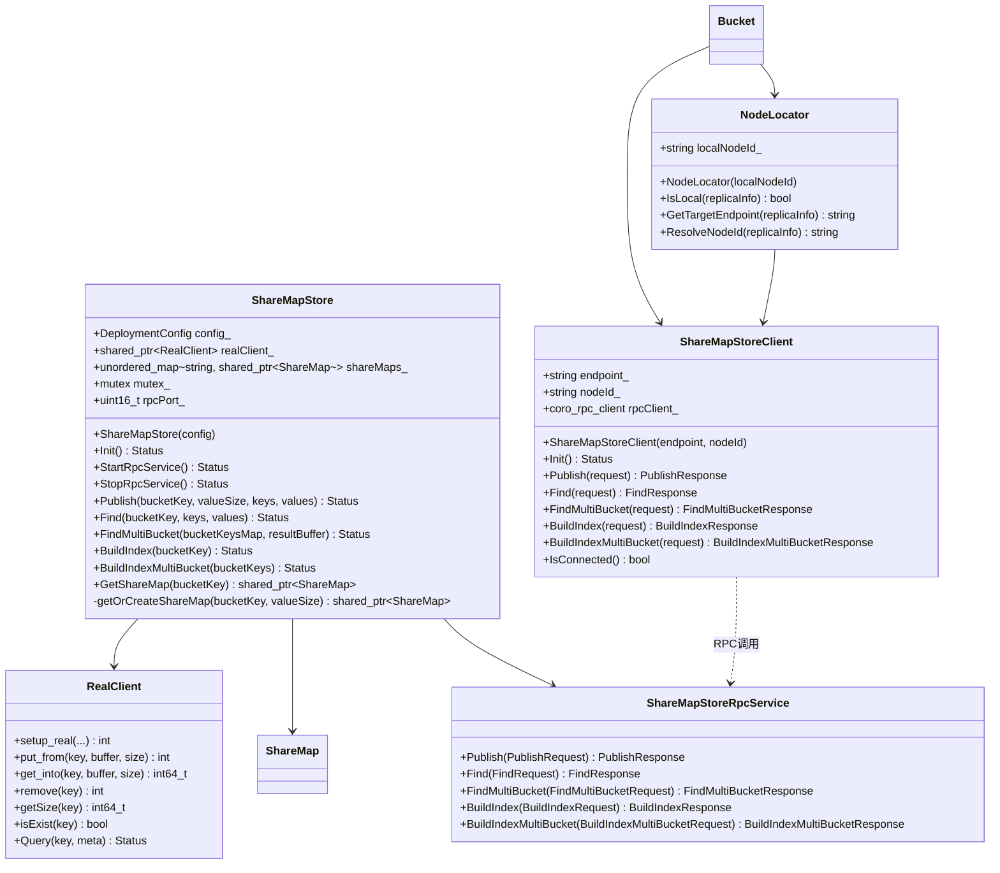
```mermaid
classDiagram
    class ShareMapStore {
        +DeploymentConfig config_
        +shared_ptr~RealClient~ realClient_
        +unordered_map~string, shared_ptr~ShareMap~~ shareMaps_
        +mutex mutex_
        +uint16_t rpcPort_
        +ShareMapStore(config)
        +Init() Status
        +StartRpcService() Status
        +StopRpcService() Status
        +Publish(bucketKey, valueSize, keys, values) Status
        +Find(bucketKey, keys, values) Status
        +FindMultiBucket(bucketKeysMap, resultBuffer) Status
        +BuildIndex(bucketKey) Status
        +BuildIndexMultiBucket(bucketKeys) Status
        +GetShareMap(bucketKey) shared_ptr~ShareMap~
        -getOrCreateShareMap(bucketKey, valueSize) shared_ptr~ShareMap~
    }

    class ShareMapStoreRpcService {
        +Publish(PublishRequest) PublishResponse
        +Find(FindRequest) FindResponse
        +FindMultiBucket(FindMultiBucketRequest) FindMultiBucketResponse
        +BuildIndex(BuildIndexRequest) BuildIndexResponse
        +BuildIndexMultiBucket(BuildIndexMultiBucketRequest) BuildIndexMultiBucketResponse
    }

    class ShareMapStoreClient {
        +string endpoint_
        +string nodeId_
        +coro_rpc_client rpcClient_
        +ShareMapStoreClient(endpoint, nodeId)
        +Init() Status
        +Publish(request) PublishResponse
        +Find(request) FindResponse
        +FindMultiBucket(request) FindMultiBucketResponse
        +BuildIndex(request) BuildIndexResponse
        +BuildIndexMultiBucket(request) BuildIndexMultiBucketResponse
        +IsConnected() bool
    }

    class NodeLocator {
        +string localNodeId_
        +NodeLocator(localNodeId)
        +IsLocal(replicaInfo) bool
        +GetTargetEndpoint(replicaInfo) string
        +ResolveNodeId(replicaInfo) string
    }

    class RealClient {
        +setup_real(...) int
        +put_from(key, buffer, size) int
        +get_into(key, buffer, size) int64_t
        +remove(key) int
        +getSize(key) int64_t
        +isExist(key) bool
        +Query(key, meta) Status
    }

    ShareMapStore --> RealClient
    ShareMapStore --> ShareMap
    ShareMapStore --> ShareMapStoreRpcService
    ShareMapStoreClient ..> ShareMapStoreRpcService : RPC调用
    Bucket --> ShareMapStoreClient
    Bucket --> NodeLocator
    NodeLocator --> ShareMapStoreClient
```

#### 4.1.4 数据结构（C++）

```cpp
// 部署配置（在 share_map_store.h 中定义）
struct DeploymentConfig {
    std::string masterAddress = "127.0.0.1:50051";
    std::string protocol = "tcp";
    std::string deviceNames;
    std::string metadataServer = "http://127.0.0.1:8080/metadata";
    uint64_t globalSegmentSize = 16ull * 1024 * 1024;
    uint64_t localBufferSize = 16ull * 1024 * 1024;
    uint16_t rpcPort = 0;
    bool enableEmbTableRpc = false;  // 部署模式开关；共进程 false，独立节点 true
    uint64_t transferBufferSize = 64ull * 1024 * 1024;
    uint64_t shareObjectSize = 64ull * 1024 * 1024;
};

// ShareMapStore：RPC 服务端 + ShareMap 管理器
class ShareMapStore {
public:
    explicit ShareMapStore(DeploymentConfig config,
                           std::string localHostname = "");

    // 唯一负责初始化 RealClient；RPC server 由 EmbTableClient 按部署模式启动
    Status Init();
    std::shared_ptr<mooncake::RealClient> GetRealClient() const;

    // ===== 本地直接调用接口（同进程内调用） =====
    Status Publish(const std::string& bucketKey, uint64_t valueSize,
                   const std::vector<uint64_t>& keys,
                   const std::vector<StringView>& values);

    // 单 Bucket 查询（小数据量）
    Status Find(const std::string& bucketKey,
                const std::vector<uint64_t>& keys,
                std::vector<StringView>& buffers);

    // 多 Bucket 聚合查询（大数据量，通过 Mooncake Buffer 返回）
    Status FindMultiBucket(
        const std::unordered_map<std::string, std::vector<uint64_t>>& bucketKeysMap,
        const std::string& resultBufferHandle,
        std::unordered_map<std::string, std::pair<uint64_t, uint64_t>>& outOffsets);

    Status BuildIndex(const std::string& bucketKey);

    // 批量索引构建
    Status BuildIndexMultiBucket(const std::vector<std::string>& bucketKeys,
                                 std::vector<BuildIndexResult>& outResults);

    std::shared_ptr<ShareMap> GetShareMap(const std::string& bucketKey);

private:
    Status getOrCreateShareMap(const std::string& bucketKey,
                               uint64_t valueSize,
                               std::shared_ptr<ShareMap>& out);

    // RPC 服务内部转发：将 RPC 请求路由到对应 ShareMap
    PublishResponse HandlePublishRpc(const PublishRequest& req);
    FindResponse HandleFindRpc(const FindRequest& req);
    FindMultiBucketResponse HandleFindMultiBucketRpc(const FindMultiBucketRequest& req);
    BuildIndexResponse HandleBuildIndexRpc(const BuildIndexRequest& req);
    BuildIndexMultiBucketResponse HandleBuildIndexMultiBucketRpc(
        const BuildIndexMultiBucketRequest& req);

private:
    DeploymentConfig config_;
    std::shared_ptr<mooncake::RealClient> realClient_;
    std::unordered_map<std::string, std::shared_ptr<ShareMap>> shareMaps_;
    mutable std::mutex mutex_;
    bool initialized_ = false;

    // RPC 服务端
    std::unique_ptr<ylt::coro_rpc::coro_rpc_server> rpcServer_;
    std::thread rpcServiceThread_;
};

// ShareMapStoreClient：RPC 客户端封装
class ShareMapStoreClient {
public:
    ShareMapStoreClient(const std::string& endpoint, 
                        const std::string& nodeId);

    Status Init();  // 建立 RPC 连接

    // ===== RPC 调用接口 =====
    coro_rpc::coro<PublishResponse> Publish(const PublishRequest& request);
    coro_rpc::coro<FindResponse> Find(const FindRequest& request);
    coro_rpc::coro<FindMultiBucketResponse> FindMultiBucket(
        const FindMultiBucketRequest& request);
    coro_rpc::coro<BuildIndexResponse> BuildIndex(const BuildIndexRequest& request);
    coro_rpc::coro<BuildIndexMultiBucketResponse> BuildIndexMultiBucket(
        const BuildIndexMultiBucketRequest& request);

    bool IsConnected() const;
    const std::string& GetEndpoint() const { return endpoint_; }
    const std::string& GetNodeId() const { return nodeId_; }

private:
    std::string endpoint_;      // 目标节点 endpoint，如 "192.168.1.10:9090"
    std::string nodeId_;        // 目标节点 ID
    std::unique_ptr<ylt::coro_rpc::coro_rpc_client> rpcClient_;
    bool connected_ = false;
};

// NodeLocator：节点定位器，负责本地/远程判断
class NodeLocator {
public:
    explicit NodeLocator(const std::string& localNodeId);

    // 判断目标 Replica 是否属于本地节点
    bool IsLocal(const ReplicaInfo& replica) const;

    // 获取目标节点的 RPC endpoint
    std::string GetTargetEndpoint(const ReplicaInfo& replica) const;

    // 解析 ReplicaInfo 获取目标节点 ID
    std::string ResolveNodeId(const ReplicaInfo& replica) const;

private:
    std::string localNodeId_;
};
```

#### 4.1.5 RPC 服务处理流程

ShareMapStore RPC 服务接收到请求后的统一处理流程：

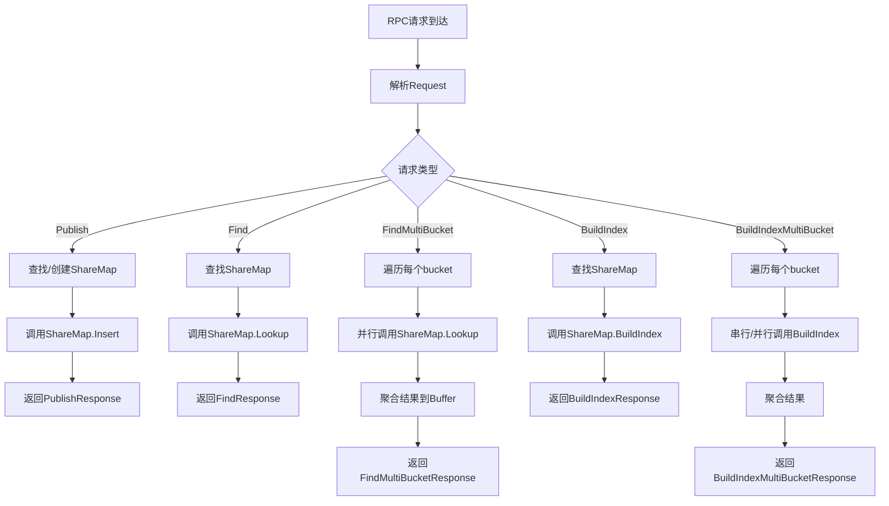
```mermaid
flowchart TD
    A[RPC请求到达] --> B[解析Request]
    B --> C{请求类型}

    C -->|Publish| D[查找/创建ShareMap]
    D --> E[调用ShareMap.Insert]
    E --> F[返回PublishResponse]

    C -->|Find| G[查找ShareMap]
    G --> H[调用ShareMap.Lookup]
    H --> I[返回FindResponse]

    C -->|FindMultiBucket| J[遍历每个bucket]
    J --> K[并行调用ShareMap.Lookup]
    K --> L[聚合结果到Buffer]
    L --> M[返回FindMultiBucketResponse]

    C -->|BuildIndex| N[查找ShareMap]
    N --> O[调用ShareMap.BuildIndex]
    O --> P[返回BuildIndexResponse]

    C -->|BuildIndexMultiBucket| Q[遍历每个bucket]
    Q --> R[串行/并行调用BuildIndex]
    R --> S[聚合结果]
    S --> T[返回BuildIndexMultiBucketResponse]
```

---

### 4.2 Bucket 模块（含节点感知）

#### 4.2.1 模块职责

Bucket 是 EmbTable 与 ShareMapStore 之间的**关键路由层**，承担以下职责：

- 维护本地写缓冲（LocalBuffer），批量聚合写入数据
- 通过 Mooncake Client **Query** 方法获取 **BucketMeta**，解析 **ReplicaInfo** 确定目标 ShareMapStore 节点
- 通过 **NodeLocator** 动态感知目标节点是否本地：
  - **本地节点**：直接调用本进程 ShareMapStore 实例方法
  - **远程节点**：通过 ShareMapStoreClient 发起 RPC 请求
- Buffer 满时触发 **Publish**，将数据发送到正确的 ShareMapStore 节点
- Find 时通过本地/远程路由获取查询结果

#### 4.2.2 节点发现与路由机制

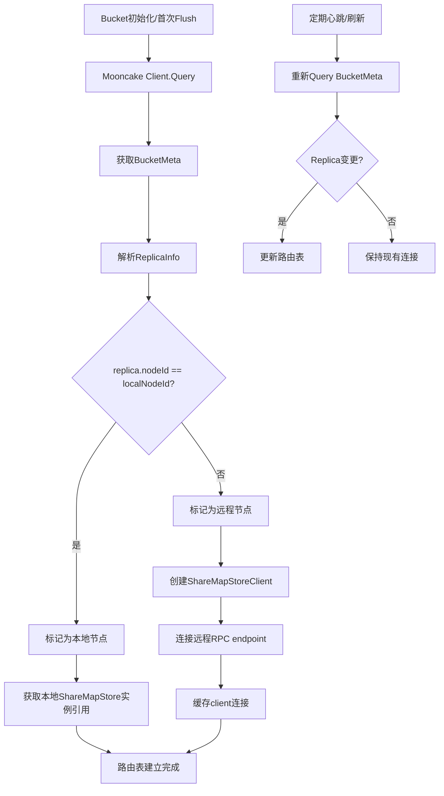
```mermaid
flowchart TD
    A[Bucket初始化/首次Flush] --> B[Mooncake Client.Query]
    B --> C[获取BucketMeta]
    C --> D[解析ReplicaInfo]
    D --> E{replica.nodeId == localNodeId?}
    E -->|是| F[标记为本地节点]
    F --> G[获取本地ShareMapStore实例引用]
    E -->|否| H[标记为远程节点]
    H --> I[创建ShareMapStoreClient]
    I --> J[连接远程RPC endpoint]
    J --> K[缓存client连接]
    G --> L[路由表建立完成]
    K --> L

    M[定期心跳/刷新] --> N[重新Query BucketMeta]
    N --> O{Replica变更?}
    O -->|是| P[更新路由表]
    O -->|否| Q[保持现有连接]
```

#### 4.2.3 类图

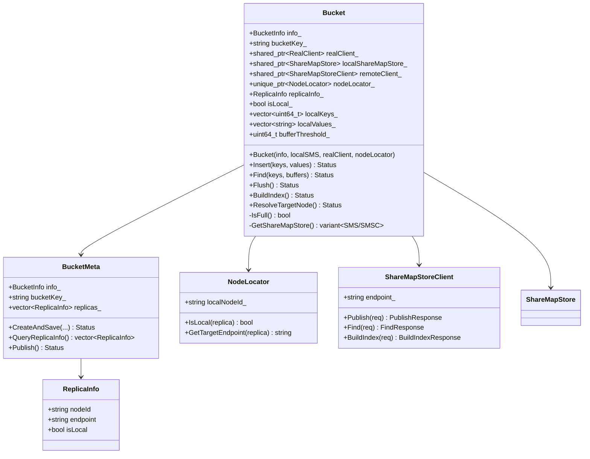
```mermaid
classDiagram
    class Bucket {
        +BucketInfo info_
        +string bucketKey_
        +shared_ptr~RealClient~ realClient_
        +shared_ptr~ShareMapStore~ localShareMapStore_
        +shared_ptr~ShareMapStoreClient~ remoteClient_
        +unique_ptr~NodeLocator~ nodeLocator_
        +ReplicaInfo replicaInfo_
        +bool isLocal_
        +vector~uint64_t~ localKeys_
        +vector~string~ localValues_
        +uint64_t bufferThreshold_

        +Bucket(info, localSMS, realClient, nodeLocator)
        +Insert(keys, values) Status
        +Find(keys, buffers) Status
        +Flush() Status
        +BuildIndex() Status
        +ResolveTargetNode() Status
        -IsFull() bool
        -GetShareMapStore() variant~SMS/SMSC~
    }

    class BucketMeta {
        +BucketInfo info_
        +string bucketKey_
        +vector~ReplicaInfo~ replicas_
        +CreateAndSave(...) Status
        +QueryReplicaInfo() vector~ReplicaInfo~
        +Publish() Status
    }

    class ReplicaInfo {
        +string nodeId
        +string endpoint
        +bool isLocal
    }

    class NodeLocator {
        +string localNodeId_
        +IsLocal(replica) bool
        +GetTargetEndpoint(replica) string
    }

    class ShareMapStoreClient {
        +string endpoint_
        +Publish(req) PublishResponse
        +Find(req) FindResponse
        +BuildIndex(req) BuildIndexResponse
    }

    Bucket --> BucketMeta
    Bucket --> NodeLocator
    Bucket --> ShareMapStoreClient
    Bucket --> ShareMapStore
    BucketMeta --> ReplicaInfo
```

#### 4.2.4 数据结构（C++）

```cpp
// ReplicaInfo：Bucket 副本信息，记录所属节点
struct ReplicaInfo {
    std::string nodeId;       // 节点唯一标识
    std::string endpoint;     // 节点 RPC 地址，如 "192.168.1.10:9090"
    bool isLocal = false;     // 是否为本地节点（冗余，便于快速判断）
};

// BucketMeta：通过 Mooncake Store 查询获取
class BucketMeta {
public:
    BucketMeta(std::shared_ptr<mooncake::RealClient> realClient);

    Status CreateAndSave(const BucketInfo& info, 
                         const std::vector<ReplicaInfo>& replicas);

    // 从 Mooncake Store 查询 BucketMeta（含 ReplicaInfo）
    Status Query(const std::string& bucketKey, BucketInfo& info,
                 std::vector<ReplicaInfo>& replicas);

    Status UpdateReplicas(const std::vector<ReplicaInfo>& replicas);

private:
    std::shared_ptr<mooncake::RealClient> realClient_;
};

class Bucket {
public:
    Bucket(const BucketInfo& info,
           std::shared_ptr<ShareMapStore> localShareMapStore,  // 本地 SMS 实例
           std::shared_ptr<mooncake::RealClient> realClient,
           std::shared_ptr<NodeLocator> nodeLocator);

    // 写入本地缓冲
    Status Insert(const std::vector<uint64_t>& keys,
                  const std::vector<StringView>& values);

    // 查询：本地/远程路由自动处理
    Status Find(const std::vector<uint64_t>& keys,
                std::vector<StringView>& buffers);

    // Flush：Buffer 满时调用，自动路由到正确节点
    Status Flush();

    // 构建索引：路由到 ShareMapStore 节点执行
    Status BuildIndex();

private:
    // 初始化时或定期调用，解析 Bucket 所属节点
    Status ResolveTargetNode();

    // 判断 Buffer 是否达到阈值
    bool IsBufferFull() const;

    // 获取当前应使用的 ShareMapStore（本地实例或远程 RPC client）
    // 返回 variant：本地时使用 shared_ptr<ShareMapStore>，远程时使用 ShareMapStoreClient*
    std::variant<std::shared_ptr<ShareMapStore>, ShareMapStoreClient*> 
    GetShareMapStore();

    // 执行 Publish 到目标节点（本地或远程）
    Status PublishToStore(const std::vector<uint64_t>& keys,
                          const std::vector<std::string>& values);

private:
    BucketInfo info_;
    std::string bucketKey_;
    std::shared_ptr<mooncake::RealClient> realClient_;

    // 本地 ShareMapStore 实例引用（同进程时直接使用）
    std::shared_ptr<ShareMapStore> localShareMapStore_;

    // 节点定位器
    std::shared_ptr<NodeLocator> nodeLocator_;

    // 远程 RPC client（远程节点时使用）
    std::shared_ptr<ShareMapStoreClient> remoteClient_;

    // 目标 Replica 信息
    ReplicaInfo targetReplica_;
    bool isLocalNode_ = true;     // 目标是否为本地节点
    bool nodeResolved_ = false;   // 是否已完成节点解析

    // 本地写缓冲
    std::vector<uint64_t> localKeys_;
    std::vector<std::string> localValues_;
    uint64_t bufferThreshold_ = 4096;  // 默认 4096 条触发 Flush
};
```

#### 4.2.5 本地/远程路由逻辑

```cpp
// Bucket::Flush() 核心路由逻辑伪代码
Status Bucket::Flush() {
    if (localKeys_.empty()) return Status::OK();

    // 首次 Flush 或需要重新解析时，确定目标节点
    if (!nodeResolved_) {
        RETURN_IF_ERROR(ResolveTargetNode());
    }

    // 根据节点位置选择调用方式
    if (isLocalNode_) {
        // ===== 本地节点：直接调用 ShareMapStore 实例 =====
        return localShareMapStore_->Publish(
            bucketKey_, info_.valueSize, localKeys_, 
            std::vector<StringView>(localValues_.begin(), localValues_.end()));
    } else {
        // ===== 远程节点：通过 RPC 发送 =====
        PublishRequest req;
        req.bucket_key = bucketKey_;
        req.value_size = info_.valueSize;
        req.keys = localKeys_;
        req.values = localValues_;
        req.source_node_id = nodeLocator_->GetLocalNodeId();

        auto resp = remoteClient_->Publish(req);
        if (resp.status_code != 0) {
            return Status::Error(static_cast<ErrorCode>(resp.status_code), resp.message);
        }
    }

    // 清空本地缓冲
    localKeys_.clear();
    localValues_.clear();
    return Status::OK();
}

// Bucket::ResolveTargetNode() 核心逻辑
Status Bucket::ResolveTargetNode() {
    // 1. 通过 Mooncake Client Query BucketMeta
    BucketMeta meta(realClient_);
    BucketInfo info;
    std::vector<ReplicaInfo> replicas;
    RETURN_IF_ERROR(meta.Query(bucketKey_, info, replicas));

    if (replicas.empty()) {
        return Status::Error(ErrorCode::kNotFound, 
                             "No replica found for bucket: " + bucketKey_);
    }

    // 2. 选择主 Replica（简化策略：取第一个）
    targetReplica_ = replicas[0];

    // 3. 通过 NodeLocator 判断是否本地节点
    isLocalNode_ = nodeLocator_->IsLocal(targetReplica_);

    if (!isLocalNode_) {
        // 4. 远程节点：创建并初始化 RPC client
        std::string endpoint = nodeLocator_->GetTargetEndpoint(targetReplica_);
        remoteClient_ = std::make_shared<ShareMapStoreClient>(
            endpoint, targetReplica_.nodeId);
        RETURN_IF_ERROR(remoteClient_->Init());
    }

    nodeResolved_ = true;
    return Status::OK();
}
```

---

### 4.3 EmbTable 模块

#### 4.3.1 模块职责

EmbTable 是用户侧的逻辑 embedding 表：
- 管理 EmbTableMeta 元信息
- 按 key 哈希分桶到不同 Bucket
- 对 Insert / Find / Load / BuildIndex 进行**全局调度和聚合**
- **Insert**：按 bucket 分组写入各 Bucket 的本地 Buffer，Buffer 满时触发各自独立 Flush
- **Find**：按 ShareMapStore **节点维度聚合** bucket 列表，向各节点发起 RPC 查询，通过 Mooncake TE 聚合结果
- **Load**：解析本地文件，提取 key-value 数据，调用 Insert 完成数据加载
- **BuildIndex**：数据加载完成后，向各 ShareMapStore 节点发起 RPC 请求，为每个 ShareMap 创建索引

#### 4.3.2 类图

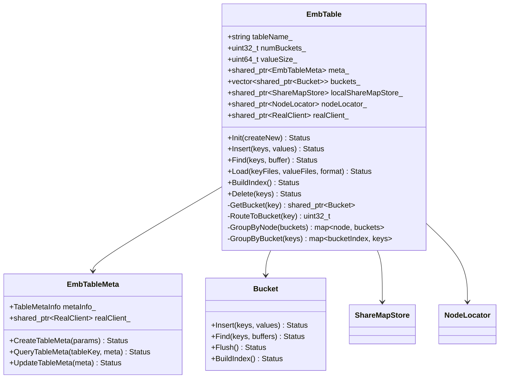
```mermaid
classDiagram
    class EmbTable {
        +string tableName_
        +uint32_t numBuckets_
        +uint64_t valueSize_
        +shared_ptr~EmbTableMeta~ meta_
        +vector~shared_ptr~Bucket~~ buckets_
        +shared_ptr~ShareMapStore~ localShareMapStore_
        +shared_ptr~NodeLocator~ nodeLocator_
        +shared_ptr~RealClient~ realClient_

        +Init(createNew) Status
        +Insert(keys, values) Status
        +Find(keys, buffer) Status
        +Load(keyFiles, valueFiles, format) Status
        +BuildIndex() Status
        +Delete(keys) Status
        -GetBucket(key) shared_ptr~Bucket~
        -RouteToBucket(key) uint32_t
        -GroupByNode(buckets) map~node, buckets~
        -GroupByBucket(keys) map~bucketIndex, keys~
    }

    class EmbTableMeta {
        +TableMetaInfo metaInfo_
        +shared_ptr~RealClient~ realClient_
        +CreateTableMeta(params) Status
        +QueryTableMeta(tableKey, meta) Status
        +UpdateTableMeta(meta) Status
    }

    class Bucket {
        +Insert(keys, values) Status
        +Find(keys, buffers) Status
        +Flush() Status
        +BuildIndex() Status
    }

    EmbTable --> EmbTableMeta
    EmbTable --> Bucket
    EmbTable --> ShareMapStore
    EmbTable --> NodeLocator
```

#### 4.3.3 数据结构（C++）

```cpp
struct TableMetaInfo {
    std::string tableKey;
    int tableIndex = 0;
    std::string tableName;
    uint64_t dimSize = 0;          // value 大小（8B-512B）
    uint64_t tableCapacity = 0;
    uint64_t bucketNum = 0;
    HashFunctionType hashType = HashFunctionType::kXxHash;
    uint64_t bucketCapacity = 0;
};

class EmbTable {
public:
    EmbTable(const std::string& tableName, uint32_t numBuckets,
             uint64_t valueSize,
             std::shared_ptr<ShareMapStore> localShareMapStore,
             std::shared_ptr<mooncake::RealClient> realClient,
             std::shared_ptr<NodeLocator> nodeLocator);

    // createNew=true 创建表元信息；false 则查询已有表元信息。
    Status Init(bool createNew);

    // 按 bucket 分组批量插入并逐桶 Flush（各自独立路由）
    Status Insert(const std::vector<uint64_t>& keys,
                  const std::vector<StringView>& values);

    // 按 ShareMapStore 节点聚合后并行查询，结果按原序回填
    Status Find(const std::vector<uint64_t>& keys,
                std::vector<StringView>& buffers);

    // 解析本地文件，提取 key-value 调用 Insert 加载
    Status Load(const std::vector<std::string>& keyFiles,
                const std::vector<std::string>& valueFiles,
                const std::string& format);

    // 向所有 ShareMapStore 节点发起 BuildIndex RPC
    Status BuildIndex();

    Status Delete(const std::vector<uint64_t>& keys);

private:
    // 路由：XXH64(&key, sizeof(key), 0) % numBuckets_
    uint32_t RouteToBucket(uint64_t key) const;
    std::shared_ptr<Bucket> GetBucket(uint64_t key);

    // 将 bucket 列表按目标节点分组（用于 Find/BuildIndex 聚合）
    using NodeId = std::string;
    Status GroupBucketsByNode(
        const std::vector<std::shared_ptr<Bucket>>& buckets,
        std::unordered_map<NodeId, std::vector<std::shared_ptr<Bucket>>>& outGroups);

    // 将 keys 按 bucket 分组
    Status GroupKeysByBucket(
        const std::vector<uint64_t>& keys,
        std::unordered_map<uint32_t, std::vector<uint64_t>>& outGroups);

private:
    std::string tableName_;
    uint32_t numBuckets_;
    uint64_t valueSize_;
    std::shared_ptr<EmbTableMeta> meta_;
    std::vector<std::shared_ptr<Bucket>> buckets_;
    std::shared_ptr<ShareMapStore> localShareMapStore_;
    std::shared_ptr<NodeLocator> nodeLocator_;
    std::shared_ptr<mooncake::RealClient> realClient_;
};
```

---

## 5. 关键路径流程设计

### 5.1 Insert 流程（含 Bucket Buffer Flush + 本地/远程路由）

#### 5.1.1 整体流程图

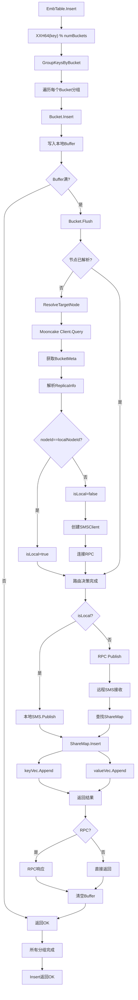
```mermaid
flowchart TD
    A["EmbTable.Insert"] --> B["XXH64(key) % numBuckets"]
    B --> C["GroupKeysByBucket"]
    C --> D["遍历每个Bucket分组"]
    D --> E["Bucket.Insert"]
    E --> F["写入本地Buffer"]
    F --> G{"Buffer满?"}
    G -->|"否"| H["返回OK"]
    G -->|"是"| I["Bucket.Flush"]
    I --> J{"节点已解析?"}
    J -->|"否"| K["ResolveTargetNode"]
    K --> L["Mooncake Client.Query"]
    L --> M["获取BucketMeta"]
    M --> N["解析ReplicaInfo"]
    N --> O{"nodeId==localNodeId?"}
    O -->|"是"| P["isLocal=true"]
    O -->|"否"| Q["isLocal=false"]
    Q --> R["创建SMSClient"]
    R --> S["连接RPC"]
    P --> T["路由决策完成"]
    S --> T
    J -->|"是"| T
    T --> U{"isLocal?"}
    U -->|"是"| V["本地SMS.Publish"]
    U -->|"否"| W["RPC Publish"]
    W --> X["远程SMS接收"]
    X --> Y["查找ShareMap"]
    V --> Z["ShareMap.Insert"]
    Y --> Z
    Z --> AA["keyVec.Append"]
    Z --> AB["valueVec.Append"]
    AA --> AC["返回结果"]
    AB --> AC
    AC --> AD{"RPC?"}
    AD -->|"是"| AE["RPC响应"]
    AD -->|"否"| AF["直接返回"]
    AE --> AG["清空Buffer"]
    AF --> AG
    AG --> H
    H --> AH["所有分组完成"]
    AH --> AI["Insert返回OK"]
```

#### 5.1.2 时序图（含远程节点 RPC 场景）

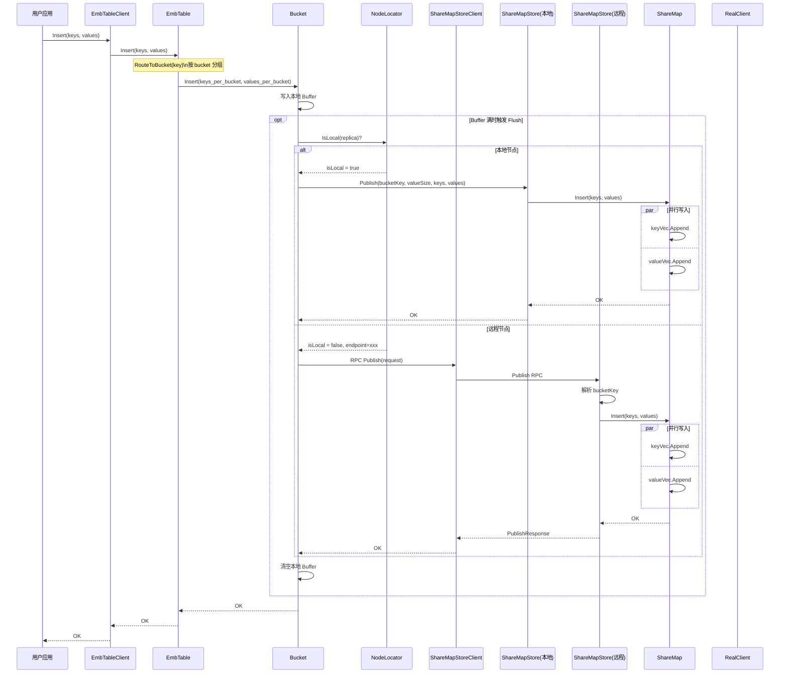
```mermaid
sequenceDiagram
    participant App as 用户应用
    participant EC as EmbTableClient
    participant ET as EmbTable
    participant B as Bucket
    participant NLOC as NodeLocator
    participant SMSC as ShareMapStoreClient
    participant SMS_L as ShareMapStore(本地)
    participant SMS_R as ShareMapStore(远程)
    participant SM as ShareMap
    participant RC as RealClient

    App->>EC: Insert(keys, values)
    EC->>ET: Insert(keys, values)

    Note over ET: RouteToBucket(key)\n按 bucket 分组
    ET->>B: Insert(keys_per_bucket, values_per_bucket)

    B->>B: 写入本地 Buffer

    opt Buffer 满时触发 Flush
        B->>NLOC: IsLocal(replica)?

        alt 本地节点
            NLOC-->>B: isLocal = true
            B->>SMS_L: Publish(bucketKey, valueSize, keys, values)
            SMS_L->>SM: Insert(keys, values)

            par 并行写入
                SM->>SM: keyVec.Append
            and
                SM->>SM: valueVec.Append
            end

            SM-->>SMS_L: OK
            SMS_L-->>B: OK

        else 远程节点
            NLOC-->>B: isLocal = false, endpoint=xxx
            B->>SMSC: RPC Publish(request)
            SMSC->>SMS_R: Publish RPC
            SMS_R->>SMS_R: 解析 bucketKey
            SMS_R->>SM: Insert(keys, values)

            par 并行写入
                SM->>SM: keyVec.Append
            and
                SM->>SM: valueVec.Append
            end

            SM-->>SMS_R: OK
            SMS_R-->>SMSC: PublishResponse
            SMSC-->>B: OK
        end

        B->>B: 清空本地 Buffer
    end

    B-->>ET: OK
    ET-->>EC: OK
    EC-->>App: OK
```

#### 5.1.3 性能关键点

| 阶段 | 优化点 |
|------|--------|
| **本地 Buffer** | 批量缓冲写入（默认 4096 条），减少 ShareObject 创建次数 |
| **节点缓存** | Bucket 首次 Flush 解析节点后缓存结果，避免重复 Query |
| **本地优先** | 同节点数据直接调用实例方法，零 RPC 开销 |
| **按需扩容** | `Reserve` 仅设置容量上限，`Append` 跨段时才创建下一个 ShareObject |
| **并行写入** | keys 和 values 并行追加 |
| **异步 RPC** | 远程节点使用 coro_rpc 异步调用，不阻塞本地缓冲写入 |

---

### 5.2 Find 流程（按 ShareMapStore 节点 + Bucket 双维度聚合）

#### 5.2.1 整体流程图

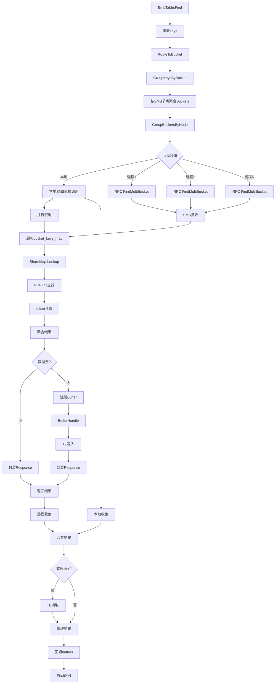
```mermaid
flowchart TD
    A["EmbTable.Find"] --> B["接收keys"]
    B --> C["RouteToBucket"]
    C --> D["GroupKeysByBucket"]
    D --> E["按SMS节点聚合Buckets"]
    E --> F["GroupBucketsByNode"]
    F --> G{"节点分组"}
    G -->|"本地"| H["本地SMS直接调用"]
    G -->|"远程1"| I["RPC FindMultiBucket"]
    G -->|"远程2"| J["RPC FindMultiBucket"]
    G -->|"远程N"| K["RPC FindMultiBucket"]
    H --> L["并行查询"]
    I --> M["SMS接收"]
    J --> M
    K --> M
    M --> P["遍历bucket_keys_map"]
    L --> P
    P --> Q["ShareMap.Lookup"]
    Q --> R["PHF O1查找"]
    R --> S["offset读取"]
    S --> T["聚合结果"]
    T --> U{"数据量?"}
    U -->|"小"| W["封装Response"]
    U -->|"大"| X["注册Buffer"]
    X --> Y["BufferHandle"]
    Y --> Z["TE写入"]
    Z --> AA["封装Response"]
    W --> AB["返回结果"]
    AA --> AB
    H --> AC["本地收集"]
    AB --> AD["远程收集"]
    AC --> AE["合并结果"]
    AD --> AE
    AE --> AF{"有Buffer?"}
    AF -->|"是"| AG["TE读取"]
    AF -->|"否"| AH["整理结果"]
    AG --> AH
    AH --> AI["回填buffers"]
    AI --> AJ["Find返回"]
```

#### 5.2.2 详细时序图

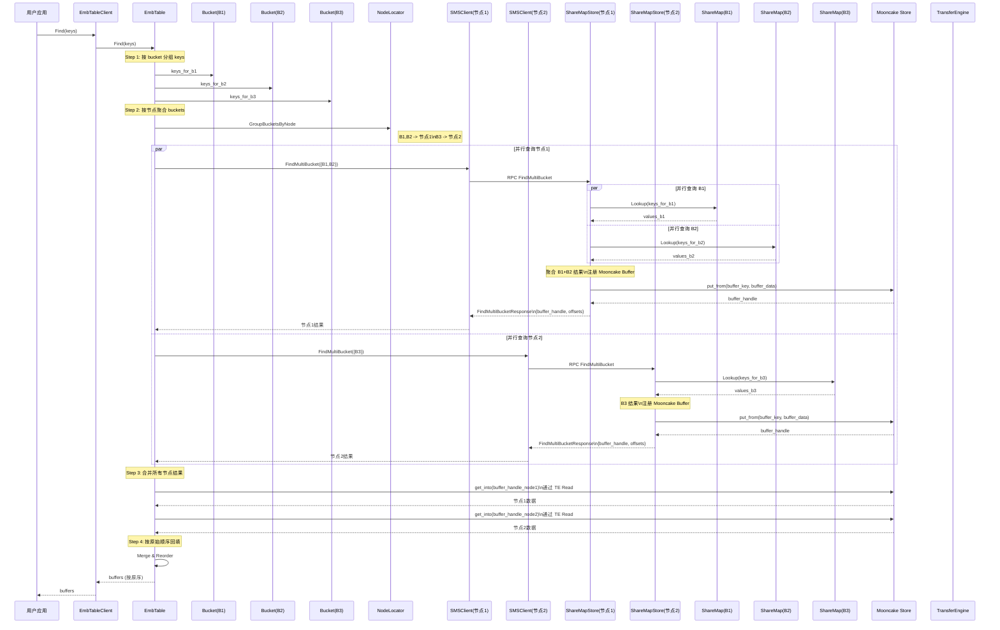
```mermaid
sequenceDiagram
    participant App as 用户应用
    participant EC as EmbTableClient
    participant ET as EmbTable
    participant B1 as Bucket(B1)
    participant B2 as Bucket(B2)
    participant B3 as Bucket(B3)
    participant NLOC as NodeLocator
    participant SMSC1 as SMSClient(节点1)
    participant SMSC2 as SMSClient(节点2)
    participant SMS1 as ShareMapStore(节点1)
    participant SMS2 as ShareMapStore(节点2)
    participant SM1 as ShareMap(B1)
    participant SM2 as ShareMap(B2)
    participant SM3 as ShareMap(B3)
    participant MC as Mooncake Store
    participant TE as TransferEngine

    App->>EC: Find(keys)
    EC->>ET: Find(keys)

    Note over ET: Step 1: 按 bucket 分组 keys
    ET->>B1: keys_for_b1
    ET->>B2: keys_for_b2
    ET->>B3: keys_for_b3

    Note over ET: Step 2: 按节点聚合 buckets
    ET->>NLOC: GroupBucketsByNode

    Note right of NLOC: B1,B2 -> 节点1\nB3 -> 节点2

    par 并行查询节点1
        ET->>SMSC1: FindMultiBucket({B1,B2})
        SMSC1->>SMS1: RPC FindMultiBucket

        par 并行查询 B1
            SMS1->>SM1: Lookup(keys_for_b1)
            SM1-->>SMS1: values_b1
        and 并行查询 B2
            SMS1->>SM2: Lookup(keys_for_b2)
            SM2-->>SMS1: values_b2
        end

        Note over SMS1: 聚合 B1+B2 结果\n注册 Mooncake Buffer
        SMS1->>MC: put_from(buffer_key, buffer_data)
        MC-->>SMS1: buffer_handle

        SMS1-->>SMSC1: FindMultiBucketResponse\n{buffer_handle, offsets}
        SMSC1-->>ET: 节点1结果

    and 并行查询节点2
        ET->>SMSC2: FindMultiBucket({B3})
        SMSC2->>SMS2: RPC FindMultiBucket
        SMS2->>SM3: Lookup(keys_for_b3)
        SM3-->>SMS2: values_b3

        Note over SMS2: B3 结果\n注册 Mooncake Buffer
        SMS2->>MC: put_from(buffer_key, buffer_data)
        MC-->>SMS2: buffer_handle

        SMS2-->>SMSC2: FindMultiBucketResponse\n{buffer_handle, offsets}
        SMSC2-->>ET: 节点2结果
    end

    Note over ET: Step 3: 合并所有节点结果

    ET->>MC: get_into(buffer_handle_node1)\n通过 TE Read
    MC-->>ET: 节点1数据

    ET->>MC: get_into(buffer_handle_node2)\n通过 TE Read
    MC-->>ET: 节点2数据

    Note over ET: Step 4: 按原始顺序回填
    ET->>ET: Merge & Reorder

    ET-->>EC: buffers (按原序)
    EC-->>App: buffers
```

#### 5.2.3 Find 流程详细步骤说明

**Step 1 — Bucket 内 Key 分组**

```cpp
// 将 keys 按 bucket 索引分组
std::unordered_map<uint32_t, std::vector<uint64_t>> bucketGroups;
for (auto key : keys) {
    uint32_t bucketIdx = RouteToBucket(key);
    bucketGroups[bucketIdx].push_back(key);
}
```

**Step 2 — 按 ShareMapStore 节点聚合**

```cpp
// 将 bucket 按目标节点分组
std::unordered_map<NodeId, std::vector<uint32_t>> nodeGroups;
for (auto& [bucketIdx, _] : bucketGroups) {
    auto& bucket = buckets_[bucketIdx];
    NodeId nodeId = bucket->GetTargetNodeId();  // 从 ReplicaInfo 获取
    nodeGroups[nodeId].push_back(bucketIdx);
}
```

**Step 3 — 向各节点发起 FindMultiBucket RPC**

```cpp
// 构造每个节点的 FindMultiBucketRequest
for (auto& [nodeId, bucketIndices] : nodeGroups) {
    FindMultiBucketRequest req;
    req.source_node_id = localNodeId_;

    for (auto idx : bucketIndices) {
        req.bucket_keys.push_back(buckets_[idx]->GetBucketKey());
        req.bucket_keys_map[buckets_[idx]->GetBucketKey()] = bucketGroups[idx];
    }

    // 发起 RPC（本地节点直接调用，远程节点通过 client）
    if (nodeId == localNodeId_) {
        localShareMapStore_->FindMultiBucket(req, resultOffsets);
    } else {
        auto client = GetShareMapStoreClient(nodeId);
        auto resp = client->FindMultiBucket(req);
        // 处理响应...
    }
}
```

**Step 4 — 各节点 ShareMapStore 内部处理**

```cpp
// ShareMapStore::FindMultiBucket 内部逻辑
Status ShareMapStore::FindMultiBucket(
    const FindMultiBucketRequest& req,
    const std::string& resultBufferHandle,
    std::unordered_map<std::string, std::pair<uint64_t, uint64_t>>& outOffsets) {

    // 1. 获取或创建结果 Buffer（通过 Mooncake Store）
    ShareObject resultBuffer(resultBufferHandle, totalSize, realClient_);
    resultBuffer.Import();  // 拉取到本地

    uint64_t currentOffset = 0;

    // 2. 遍历每个 bucket 并行查询
    for (auto& [bucketKey, keys] : req.bucket_keys_map) {
        auto shareMap = GetShareMap(bucketKey);

        std::vector<StringView> values;
        shareMap->Lookup(keys, values);

        // 3. 将结果写入 resultBuffer
        size_t dataSize = SerializeValues(values, 
            static_cast<uint8_t*>(resultBuffer.Data()) + currentOffset);

        outOffsets[bucketKey] = {currentOffset, dataSize};
        currentOffset += dataSize;
    }

    // 4. Publish 结果 Buffer（使其他节点可访问）
    resultBuffer.Publish();

    return Status::OK();
}
```

**Step 5 — 结果聚合与回填**

```cpp
// EmbTable::Find 结果合并
for (auto& [nodeId, resp] : responses) {
    // 从 Mooncake Buffer 读取该节点的结果
    ShareObject nodeBuffer(resp.buffer_handle, resp.buffer_size, realClient_);
    nodeBuffer.Import();

    for (auto& [bucketKey, offset_size] : resp.bucket_offsets) {
        auto [offset, size] = offset_size;
        // 提取该 bucket 的 values
        std::vector<StringView> bucketValues = DeserializeValues(
            static_cast<uint8_t*>(nodeBuffer.Data()) + offset, size);

        // 按原始 key 顺序回填
        // ...
    }
}
```

#### 5.2.4 性能关键点

| 阶段 | 优化点 |
|------|--------|
| **双维度聚合** | 按节点聚合减少 RPC 次数，按 bucket 聚合减少 ShareMap 切换 |
| **并行 RPC** | 多个节点同时发起 coro_rpc 调用，网络并行 |
| **PHF 索引** | O(1) 查找，无冲突，适合只读场景 |
| **Zero-Copy** | 结果通过 Mooncake Buffer + TE 传输，无数据拷贝 |
| **共享锁** | 读操作使用 `shared_lock`，允许并发读 |
| **Offset 精确读取** | 8B-512B 小数据直接 offset 读取，无拷贝 |

---

### 5.3 Load 流程（文件解析 → Insert 加载）

#### 5.3.1 整体流程图

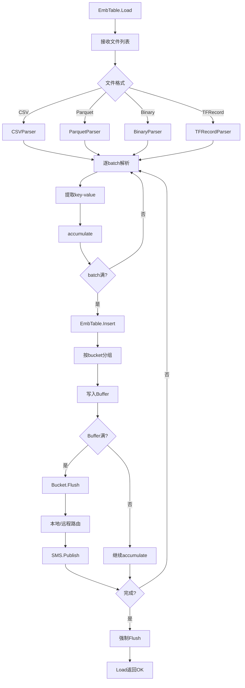
```mermaid
flowchart TD
    A["EmbTable.Load"] --> B["接收文件列表"]
    B --> C{"文件格式"}
    C -->|"CSV"| D["CSVParser"]
    C -->|"Parquet"| E["ParquetParser"]
    C -->|"Binary"| F["BinaryParser"]
    C -->|"TFRecord"| G["TFRecordParser"]
    D --> H["逐batch解析"]
    E --> H
    F --> H
    G --> H
    H --> I["提取key-value"]
    I --> J["accumulate"]
    J --> K{"batch满?"}
    K -->|"否"| H
    K -->|"是"| L["EmbTable.Insert"]
    L --> M["按bucket分组"]
    M --> N["写入Buffer"]
    N --> O{"Buffer满?"}
    O -->|"是"| P["Bucket.Flush"]
    P --> Q["本地/远程路由"]
    Q --> R["SMS.Publish"]
    O -->|"否"| S["继续accumulate"]
    R --> T{"完成?"}
    S --> T
    T -->|"否"| H
    T -->|"是"| U["强制Flush"]
    U --> V["Load返回OK"]
```

#### 5.3.2 时序图

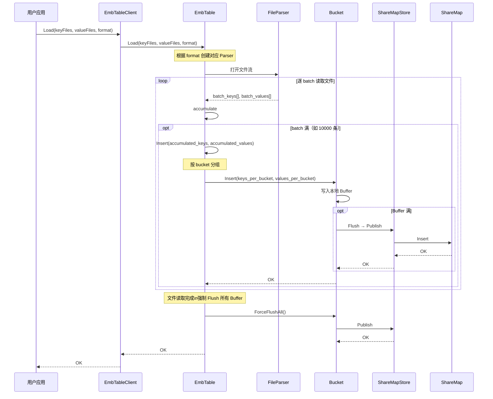
```mermaid
sequenceDiagram
    participant App as 用户应用
    participant EC as EmbTableClient
    participant ET as EmbTable
    participant Parser as FileParser
    participant B as Bucket
    participant SMS as ShareMapStore
    participant SM as ShareMap

    App->>EC: Load(keyFiles, valueFiles, format)
    EC->>ET: Load(keyFiles, valueFiles, format)

    Note over ET: 根据 format 创建对应 Parser
    ET->>Parser: 打开文件流

    loop 逐 batch 读取文件
        Parser-->>ET: batch_keys[], batch_values[]

        ET->>ET: accumulate

        opt batch 满（如 10000 条）
            ET->>ET: Insert(accumulated_keys, accumulated_values)

            Note over ET: 按 bucket 分组
            ET->>B: Insert(keys_per_bucket, values_per_bucket)
            B->>B: 写入本地 Buffer

            opt Buffer 满
                B->>SMS: Flush → Publish
                SMS->>SM: Insert
                SM-->>SMS: OK
                SMS-->>B: OK
            end

            B-->>ET: OK
        end
    end

    Note over ET: 文件读取完成\n强制 Flush 所有 Buffer
    ET->>B: ForceFlushAll()
    B->>SMS: Publish
    SMS-->>B: OK

    ET-->>EC: OK
    EC-->>App: OK
```

#### 5.3.3 文件解析器设计

```cpp
// 文件格式枚举
enum class FileFormat {
    kCsv,       // CSV: key,value 格式
    kParquet,   // Apache Parquet
    kBinary,    // 自定义二进制格式
    kTfrecord,  // TensorFlow TFRecord
};

// 文件解析器接口
class FileParser {
public:
    virtual ~FileParser() = default;

    // 打开文件
    virtual Status Open(const std::vector<std::string>& keyFiles,
                        const std::vector<std::string>& valueFiles) = 0;

    // 读取下一批数据
    virtual Status NextBatch(size_t batchSize,
                             std::vector<uint64_t>& keys,
                             std::vector<std::string>& values,
                             bool& hasMore) = 0;

    // 关闭文件
    virtual Status Close() = 0;
};

// CSV 解析器实现
class CsvParser : public FileParser {
public:
    Status Open(const std::vector<std::string>& keyFiles,
                const std::vector<std::string>& valueFiles) override;

    Status NextBatch(size_t batchSize,
                     std::vector<uint64_t>& keys,
                     std::vector<std::string>& values,
                     bool& hasMore) override;

    Status Close() override;

private:
    std::vector<std::ifstream> keyStreams_;
    std::vector<std::ifstream> valueStreams_;
    size_t currentFileIdx_ = 0;
};

// EmbTable::Load 实现
Status EmbTable::Load(const std::vector<std::string>& keyFiles,
                      const std::vector<std::string>& valueFiles,
                      const std::string& format) {
    // 1. 创建对应格式的解析器
    FileFormat fmt = ParseFormat(format);
    std::unique_ptr<FileParser> parser;
    switch (fmt) {
        case FileFormat::kCsv:      parser = std::make_unique<CsvParser>(); break;
        case FileFormat::kParquet:  parser = std::make_unique<ParquetParser>(); break;
        case FileFormat::kBinary:   parser = std::make_unique<BinaryParser>(); break;
        case FileFormat::kTfrecord: parser = std::make_unique<TfrecordParser>(); break;
        default: return Status::Error(ErrorCode::kInvalidArgument, "Unknown format");
    }

    // 2. 打开文件
    RETURN_IF_ERROR(parser->Open(keyFiles, valueFiles));

    // 3. 逐 batch 读取并插入
    const size_t BATCH_SIZE = 10000;
    std::vector<uint64_t> keys;
    std::vector<std::string> values;
    bool hasMore = true;

    while (hasMore) {
        RETURN_IF_ERROR(parser->NextBatch(BATCH_SIZE, keys, values, hasMore));

        if (!keys.empty()) {
            // 转换为 StringView 后调用 Insert
            std::vector<StringView> valueViews(values.begin(), values.end());
            RETURN_IF_ERROR(Insert(keys, valueViews));
        }
    }

    // 4. 关闭文件
    RETURN_IF_ERROR(parser->Close());

    return Status::OK();
}
```

---

### 5.4 BuildIndex 流程（全局索引构建）

#### 5.4.1 整体流程图

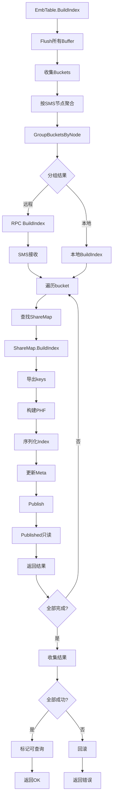
```mermaid
flowchart TD
    A["EmbTable.BuildIndex"] --> B["Flush所有Buffer"]
    B --> C["收集Buckets"]
    C --> D["按SMS节点聚合"]
    D --> E["GroupBucketsByNode"]
    E --> F{"分组结果"}
    F -->|"本地"| G["本地BuildIndex"]
    F -->|"远程"| H["RPC BuildIndex"]
    H --> I["SMS接收"]
    I --> J["遍历bucket"]
    G --> J
    J --> K["查找ShareMap"]
    K --> L["ShareMap.BuildIndex"]
    L --> M["导出keys"]
    M --> N["构建PHF"]
    N --> O["序列化Index"]
    O --> P["更新Meta"]
    P --> Q["Publish"]
    Q --> R["Published只读"]
    R --> S["返回结果"]
    S --> T{"全部完成?"}
    T -->|"否"| J
    T -->|"是"| U["收集结果"]
    U --> V{"全部成功?"}
    V -->|"是"| W["标记可查询"]
    V -->|"否"| X["回滚"]
    W --> Y["返回OK"]
    X --> Z["返回错误"]
```

#### 5.4.2 时序图

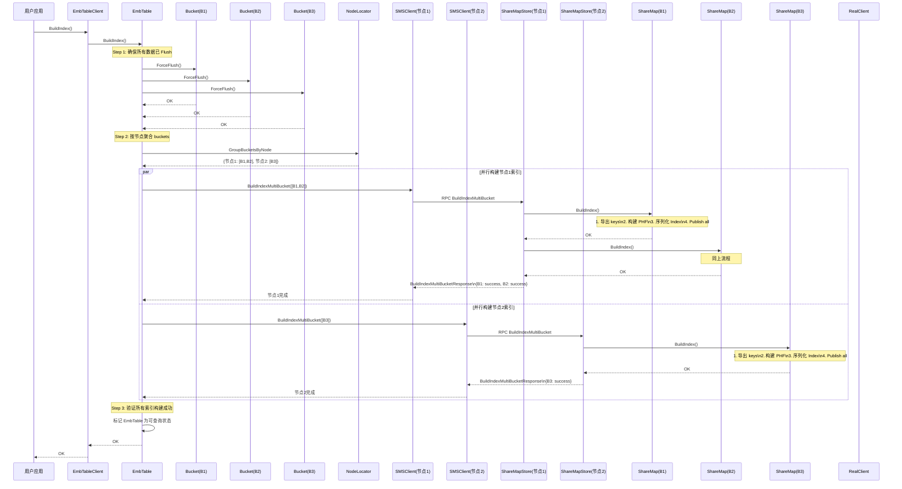
```mermaid
sequenceDiagram
    participant App as 用户应用
    participant EC as EmbTableClient
    participant ET as EmbTable
    participant B1 as Bucket(B1)
    participant B2 as Bucket(B2)
    participant B3 as Bucket(B3)
    participant NLOC as NodeLocator
    participant SMSC1 as SMSClient(节点1)
    participant SMSC2 as SMSClient(节点2)
    participant SMS1 as ShareMapStore(节点1)
    participant SMS2 as ShareMapStore(节点2)
    participant SM1 as ShareMap(B1)
    participant SM2 as ShareMap(B2)
    participant SM3 as ShareMap(B3)
    participant RC as RealClient

    App->>EC: BuildIndex()
    EC->>ET: BuildIndex()

    Note over ET: Step 1: 确保所有数据已 Flush
    ET->>B1: ForceFlush()
    ET->>B2: ForceFlush()
    ET->>B3: ForceFlush()
    B1-->>ET: OK
    B2-->>ET: OK
    B3-->>ET: OK

    Note over ET: Step 2: 按节点聚合 buckets
    ET->>NLOC: GroupBucketsByNode
    NLOC-->>ET: {节点1: [B1,B2], 节点2: [B3]}

    par 并行构建节点1索引
        ET->>SMSC1: BuildIndexMultiBucket([B1,B2])
        SMSC1->>SMS1: RPC BuildIndexMultiBucket

        SMS1->>SM1: BuildIndex()
        Note over SM1: 1. 导出 keys\n2. 构建 PHF\n3. 序列化 Index\n4. Publish all
        SM1-->>SMS1: OK

        SMS1->>SM2: BuildIndex()
        Note over SM2: 同上流程
        SM2-->>SMS1: OK

        SMS1-->>SMSC1: BuildIndexMultiBucketResponse\n{B1: success, B2: success}
        SMSC1-->>ET: 节点1完成

    and 并行构建节点2索引
        ET->>SMSC2: BuildIndexMultiBucket([B3])
        SMSC2->>SMS2: RPC BuildIndexMultiBucket

        SMS2->>SM3: BuildIndex()
        Note over SM3: 1. 导出 keys\n2. 构建 PHF\n3. 序列化 Index\n4. Publish all
        SM3-->>SMS2: OK

        SMS2-->>SMSC2: BuildIndexMultiBucketResponse\n{B3: success}
        SMSC2-->>ET: 节点2完成
    end

    Note over ET: Step 3: 验证所有索引构建成功
    ET->>ET: 标记 EmbTable 为可查询状态

    ET-->>EC: OK
    EC-->>App: OK
```

#### 5.4.3 ShareMap BuildIndex 内部流程

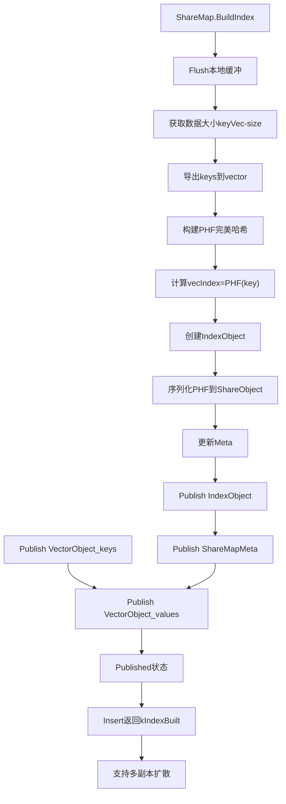
```mermaid
flowchart TD
    A["ShareMap.BuildIndex"] --> B["Flush本地缓冲"]
    B --> C["获取数据大小keyVec-size"]
    C --> D["导出keys到vector"]
    D --> E["构建PHF完美哈希"]
    E --> F["计算vecIndex=PHF(key)"]
    F --> G["创建IndexObject"]
    G --> H["序列化PHF到ShareObject"]
    H --> I["更新Meta"]
    I --> J["Publish IndexObject"]
    J --> K["Publish ShareMapMeta"]
    L["Publish VectorObject_keys"] --> M["Publish VectorObject_values"]
    K --> M
    M --> N["Published状态"]
    N --> O["Insert返回kIndexBuilt"]
    O --> P["支持多副本扩散"]
```

#### 5.4.4 关键代码逻辑

```cpp
// EmbTable::BuildIndex 实现
Status EmbTable::BuildIndex() {
    // Step 1: 强制 Flush 所有 Bucket 的本地 Buffer
    for (auto& bucket : buckets_) {
        RETURN_IF_ERROR(bucket->ForceFlush());
    }

    // Step 2: 按节点聚合所有 buckets
    std::unordered_map<NodeId, std::vector<std::shared_ptr<Bucket>>> nodeGroups;
    RETURN_IF_ERROR(GroupBucketsByNode(buckets_, nodeGroups));

    // Step 3: 向每个节点发起 BuildIndexMultiBucket 请求
    std::vector<std::future<Status>> futures;

    for (auto& [nodeId, bucketGroup] : nodeGroups) {
        futures.push_back(std::async(std::launch::async, [&, nodeId, bucketGroup]() {
            std::vector<std::string> bucketKeys;
            for (auto& b : bucketGroup) {
                bucketKeys.push_back(b->GetBucketKey());
            }

            if (nodeId == localNodeId_) {
                // 本地节点直接调用
                std::vector<BuildIndexResult> results;
                return localShareMapStore_->BuildIndexMultiBucket(bucketKeys, results);
            } else {
                // 远程节点 RPC 调用
                BuildIndexMultiBucketRequest req;
                req.bucket_keys = bucketKeys;
                req.source_node_id = localNodeId_;

                auto client = GetShareMapStoreClient(nodeId);
                auto resp = client->BuildIndexMultiBucket(req);
                return resp.status_code == 0 ? Status::OK() 
                    : Status::Error(ErrorCode::kInternal, resp.message);
            }
        }));
    }

    // Step 4: 等待所有节点完成
    for (auto& f : futures) {
        RETURN_IF_ERROR(f.get());
    }

    // Step 5: 标记全局可查询状态
    isQueryReady_ = true;

    return Status::OK();
}

// ShareMapStore::BuildIndexMultiBucket 实现
Status ShareMapStore::BuildIndexMultiBucket(
    const std::vector<std::string>& bucketKeys,
    std::vector<BuildIndexResult>& outResults) {

    outResults.reserve(bucketKeys.size());

    for (const auto& bucketKey : bucketKeys) {
        BuildIndexResult result;
        result.bucket_key = bucketKey;

        auto shareMap = GetShareMap(bucketKey);
        if (!shareMap) {
            result.status = Status::Error(ErrorCode::kNotFound, 
                                          "ShareMap not found: " + bucketKey);
            outResults.push_back(result);
            continue;
        }

        auto start = std::chrono::steady_clock::now();
        result.status = shareMap->BuildIndex();
        auto end = std::chrono::steady_clock::now();

        result.build_time_us = std::chrono::duration_cast<std::chrono::microseconds>(
            end - start).count();
        result.key_count = shareMap->GetKeyCount();

        outResults.push_back(result);
    }

    return Status::OK();
}
```

#### 5.4.5 BuildIndex 后语义

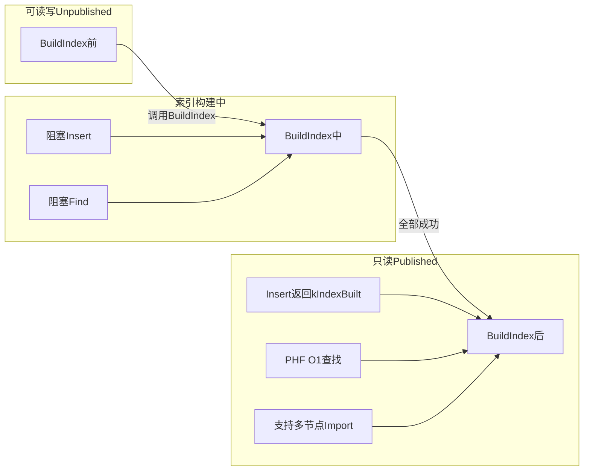
```mermaid
graph LR
    A["BuildIndex前"] -->|"调用BuildIndex"| B["BuildIndex中"]
    B -->|"全部成功"| C["BuildIndex后"]

    subgraph s1["可读写Unpublished"]
        A
    end

    subgraph s2["索引构建中"]
        B
        B1["阻塞Insert"] --> B
        B2["阻塞Find"] --> B
    end

    subgraph s3["只读Published"]
        C
        C1["Insert返回kIndexBuilt"] --> C
        C2["PHF O1查找"] --> C
        C3["支持多节点Import"] --> C
    end
```

| 状态 | Insert | Find/Lookup | 说明 |
|------|--------|-------------|------|
| **Unpublished** | 支持（追加到 VectorObject） | 线性扫描兜底 | 数据加载阶段 |
| **BuildingIndex** | 阻塞等待 | 阻塞等待 | 索引构建中，全局加锁 |
| **Published** | 返回 `kIndexBuilt` 错误 | PHF O(1) 查找 | 只读状态，数据可被多节点共享 |

> **重要**：BuildIndex 完成后，ShareMap 转为 **Published 只读状态**。如需追加数据，需创建新的 ShareMap 实例或重建索引（先 `Import` 现有数据，追加后重新 `BuildIndex`）。

---

## 6. 接口规范汇总

### 6.1 ShareMapStore RPC 接口

| 接口 | 入参 | 出参 | 说明 |
|------|------|------|------|
| `Publish` | bucketKey, valueSize, keys[], values[], sourceNodeId | statusCode, message, insertedCount | 发布数据到指定 bucket |
| `Find` | bucketKey, keys[], sourceNodeId | statusCode, values[], foundKeys[], bufferHandle | 单 bucket 查询（小数据量直接返回） |
| `FindMultiBucket` | bucketKeys[], bucketKeysMap{}, sourceNodeId, resultBufferHandle | statusCode, bucketOffsets{}, bucketSizes{} | **多 bucket 聚合查询**，大数据量通过 Mooncake Buffer 返回 |
| `BuildIndex` | bucketKey, sourceNodeId | statusCode, keyCount, buildTimeUs | 单 bucket 构建索引 |
| `BuildIndexMultiBucket` | bucketKeys[], sourceNodeId | statusCode, results{} | **批量索引构建** |

### 6.2 ShareMapStoreClient 接口

| 接口 | 入参 | 出参 | 说明 |
|------|------|------|------|
| `Init` | - | Status | 建立到目标节点的 RPC 连接 |
| `Publish` | PublishRequest | PublishResponse | RPC 调用远程 Publish |
| `Find` | FindRequest | FindResponse | RPC 调用远程 Find |
| `FindMultiBucket` | FindMultiBucketRequest | FindMultiBucketResponse | RPC 调用远程聚合查询 |
| `BuildIndex` | BuildIndexRequest | BuildIndexResponse | RPC 调用远程建索引 |
| `BuildIndexMultiBucket` | BuildIndexMultiBucketRequest | BuildIndexMultiBucketResponse | RPC 调用远程批量建索引 |
| `IsConnected` | - | bool | 检查连接状态 |

### 6.3 Bucket 接口

| 接口 | 入参 | 出参 | 说明 |
|------|------|------|------|
| `Insert` | keys[], values[] | Status | 写入本地 Buffer，自动 Flush |
| `Find` | keys[] | buffers[], Status | 查询（自动本地/远程路由） |
| `Flush` | - | Status | Buffer 满时触发 Publish（自动本地/远程路由） |
| `ForceFlush` | - | Status | 强制 Flush（Load/BuildIndex 时调用） |
| `BuildIndex` | - | Status | 路由到目标节点执行 BuildIndex |
| `ResolveTargetNode` | - | Status | 解析目标 ShareMapStore 节点 |
| `GetTargetNodeId` | - | string | 获取目标节点 ID |

### 6.4 EmbTable 接口

| 接口 | 入参 | 出参 | 说明 |
|------|------|------|------|
| `Init` | createNew | Status | 创建或查询表元信息 |
| `Insert` | keys[], values[] | Status | 按 bucket 分组插入，逐桶 Flush |
| `Find` | keys[] | buffers[], Status | **按节点聚合查询**，结果按原序回填 |
| `Load` | keyFiles[], valueFiles[], format | Status | **解析文件调用 Insert 加载数据** |
| `BuildIndex` | - | Status | **向所有节点发起 BuildIndex RPC**，完成后可查询 |
| `Delete` | keys[] | Status | 删除（Published 后不支持） |

### 6.5 EmbTableClient / DummyClient 多表与 DDL 接口

| 接口 | 入参 | 出参 | 当前语义 |
|------|------|------|----------|
| `GetTableInfo` | tableName | TableMetaInfo, Status | 查询或懒加载表元数据 |
| `CreateTable` | tableName, numBuckets, valueSize | Status | 创建 table/bucket 元数据并加入本节点表注册表；同名表返回 `kAlreadyExists` |
| `AlterTable` | tableName, numBuckets, valueSize | Status | 相同规格幂等成功；规格变化返回 `kNotSupported`，等待完整的 re-sharding/value migration 实现 |
| `DeleteTable` | tableName | Status | 删除 table/bucket 元数据并移出进程内注册表；ShareMap 数据对象由 Mooncake Store 的淘汰/GC 回收 |
| `Insert` | tableName, keys[], values[] | Status | 按 tableName 路由；DummyClient 的 values 通过 SHM 传递 |
| `Find` | tableName, keys[] | buffers[], Status | 按 tableName 路由；DummyClient 的结果通过 SHM 返回 |
| `BuildIndex` | tableName | Status | 构建指定表索引 |

所有 EmbTable 控制面 RPC request 都显式包含 `tableName`。DummyClient 的 `Options::tableName` 为空时是仅建立 RPC 连接的管理客户端，可用于 DDL；非空时在 `Init()` 查询表规格并注册 POSIX SHM 数据面。

---

## 7. 部署架构

### 7.1 多节点部署拓扑

```mermaid
graph TB
    subgraph N1["Node1 EmbTableClient"]
        ET1["EmbTable"]
        SMS1_LOCAL["SMS本地"]
        SMSC1["SMSClient"]
        B1["Bucket-B1"]
        B2["Bucket-B2"]
        ET1 --> B1
        ET1 --> B2
        B1 --> SMSC1
        B2 --> SMS1_LOCAL
    end

    subgraph N2["Node2 ShareMapStore"]
        SMS2["SMS服务"]
        SM21["ShareMap-B3"]
        SM22["ShareMap-B4"]
        RC2["RealClient"]
        SMS2 --> SM21
        SMS2 --> SM22
        SM21 --> RC2
        SM22 --> RC2
    end

    subgraph N3["Node3 ShareMapStore"]
        SMS3["SMS服务"]
        SM31["ShareMap-B5"]
        SM32["ShareMap-B6"]
        RC3["RealClient"]
        SMS3 --> SM31
        SMS3 --> SM32
        SM31 --> RC3
        SM32 --> RC3
    end

    subgraph MCCL["MooncakeCluster"]
        MCS["MooncakeStore"]
    end

    SMSC1 -.->|"RPC"| SMS2
    SMS1_LOCAL --> SM11["ShareMap-B1-本地"]
    SM11 --> RC1["RealClient"]
    RC1 --> MCS
    RC2 --> MCS
    RC3 --> MCS
```

### 7.2 部署形态对比

| 部署形态 | 适用场景 | 优点 | 缺点 |
|---------|---------|------|------|
| **共进程** | 低延迟、单租户、数据量小 | 部署简单、本地调用零 RPC 开销 | 与用户进程耦合、无法跨节点共享 |
| **独立部署-单节点** | 中等数据量、多租户 | 进程隔离、本地 RPC 开销低 | 无跨节点扩展能力 |
| **独立部署-多节点** | 大数据量、高并发、需要横向扩展 | **支持跨节点分片**、负载均衡、高可用 | 引入 RPC 延迟（~100-300us）、网络依赖 |

### 7.3 启动参数

共进程部署示例：
```cpp
EmbTableClient::Options options;
options.tableName = "recommendation";
options.createNew = false;
options.deployment.enableEmbTableRpc = false;
EmbTableClient client(options);
client.Init();
```

```bash
# ===== 独立部署 - 多表存储节点（启动阶段不创建表） =====
./mooncake-embtable-store/script/embtable_client_main.sh \
  --embtable_rpc_port=50055 \
  --embtable_local_hostname=192.168.1.10 \
  --embtable_master_address=192.168.1.1:50051 \
  --embtable_metadata_server=http://192.168.1.1:8080/metadata \
  --embtable_global_segment_size="16 MB" \
  --embtable_local_buffer_size="16 MB"

# ===== Find benchmark（表不存在时自动通过 DDL 创建） =====
./mooncake-embtable-store/script/embtable_cluster_bench.sh \
  --embtable_rpc_endpoint=192.168.1.10:50055 \
  --embtable_table_name=recommendation \
  --embtable_value_size=128 \
  --embtable_num_buckets=16 \
  --embtable_mode=continuous
```

benchmark 默认启用 `--embtable_create_table_if_missing=true`。当 GetInfo 返回 `kNotFound` 时，它先建立不绑定表的管理型 DummyClient，调用 CreateTable，再初始化共享内存数据客户端。若需要自动建表，`embtable_value_size` 必须大于 0；已有表仍可使用 `embtable_value_size=0` 自动读取服务端规格。

`embtable_client` 不再接受 `embtable_create_new`、`embtable_table_name`、`embtable_num_buckets` 或 `embtable_value_size` 启动参数。表结构的生命周期属于用户侧 DDL，而不是存储节点进程生命周期。

---

## 8. 性能设计

### 8.1 关键路径延迟预算

| 操作 | 本地调用 | 同节点 RPC | 跨节点 RPC |
|------|---------|-----------|-----------|
| **Insert (Buffer 写入)** | < 1us | < 1us | < 1us |
| **Insert (Flush Publish)** | 10-50us | 20-80us | 100-500us |
| **Find (单 key)** | 1-5us | 5-10us | 50-200us |
| **Find (聚合 1000 keys)** | 50-100us | 80-150us | 200-500us |
| **BuildIndex (单 bucket)** | 1-10ms | 2-15ms | 5-30ms |
| **Load (100W 条)** | 100-500ms | 200-800ms | 500ms-2s |

### 8.2 吞吐优化策略

| 策略 | 说明 |
|------|------|
| **Bucket Buffer 批量化** | 默认 4096 条触发 Flush，减少 RPC 次数 |
| **按节点聚合** | Find/BuildIndex 按 ShareMapStore 节点聚合，减少 RPC 连接数 |
| **coro_rpc 异步并行** | 多个节点同时发起异步 RPC 调用 |
| **TE Zero-Copy** | 大数据量通过 Mooncake Buffer + TransferEngine 传输，零拷贝 |
| **PHF O(1) 查找** | BuildIndex 后查询复杂度 O(1)，无哈希冲突 |
| **shared_lock 并发读** | Published 状态下读操作使用共享锁 |

### 8.3 可扩展性设计

```mermaid
graph LR
    A[数据增长] --> B[增加 Bucket 数量]
    B --> C[重新 Hash 分布]
    C --> D[新 Buckets 分配到新节点]
    D --> E[NodeLocator 自动感知]
    E --> F[RPC 路由自动调整]

    G[查询并发增长] --> H[增加 ShareMapStore 节点]
    H --> I[数据 Rebalance]
    I --> J[多节点并行处理 Find]
    J --> K[吞吐线性扩展]
```

---

## 9. 项目结构

```
mooncake-embtable-store/
├── CMakeLists.txt                          # 顶级配置，FetchContent boomphf，链接 mooncake_store
├── include/embtable/
│   ├── types.h                             # Status / ErrorCode / StringView / HashFunctionType / ReplicaInfo
│   ├── share_object/                       # ShareObject 层
│   │   ├── share_object.h                  # 封装 Mooncake Store 整对象 I/O（本地缓冲+整对象上传）
│   │   ├── share_buffer.h                  # 本地字节缓冲
│   │   ├── vector_object.h                 # std::vector<ShareObject> 拼接的动态向量
│   │   ├── index_object.h                  # BBHash PHF 索引
│   │   ├── share_map_meta.h                # 元信息（ylt::struct_json 序列化）
│   │   └── share_map.h                     # 组合 VectorObject + IndexObject + ShareMapMeta
│   ├── share_map_store/                    # ShareMapStore 层（RPC 服务化）
│   │   ├── share_map_store.h               # ShareMapStore 服务端 + RPC 处理逻辑
│   │   ├── share_map_store_client.h        # ShareMapStoreClient RPC 客户端
│   │   ├── share_map_store_rpc_service.h   # RPC 接口定义（Request/Response 结构体）
│   │   └── node_locator.h                  # NodeLocator 节点定位器
│   ├── emb_table/                          # EmbTable 层
│   │   ├── emb_table_meta.h                # TableMetaInfo / BucketInfo / ReplicaInfo + EmbTableMeta
│   │   ├── emb_table_bucket.h              # Bucket（含 LocalBuffer + 节点感知 + 路由逻辑）
│   │   ├── emb_table_file_parser.h         # FileParser 接口 + CSV/Parquet/Binary 实现
│   │   └── emb_table.h                     # EmbTable（xxHash 路由 + 全局调度聚合）
│   └── emb_table_client/                   # EmbTableClient 层
│       ├── emb_table_client.h              # 顶层 facade（Options + Init/Insert/Find/Load/BuildIndex）
│       └── emb_table_dummy_client.h        # RPC 控制面 + POSIX SHM 数据面客户端
├── src/
│   ├── CMakeLists.txt                      # 五个 OBJECT 库 + 聚合 mooncake_embtable_store
│   ├── share_object/*.cpp
│   ├── share_map_store/*.cpp               # ShareMapStore + Client + RpcService + NodeLocator
│   ├── emb_table/*.cpp                     # EmbTable + Bucket + FileParser
│   └── emb_table_client/*.cpp
└── (tests/ 待补)
```

### CMake 目标层级

| 目标 | 类型 | 依赖 | 说明 |
|------|------|------|------|
| `embtable_share_object` | OBJECT | `mooncake_store` | ShareObject 层 |
| `embtable_share_map_store` | OBJECT | `embtable_share_object` | ShareMapStore + Client + NodeLocator |
| `embtable_emb_table` | OBJECT | `embtable_share_map_store` | EmbTable + Bucket + FileParser |
| `embtable_emb_table_client` | OBJECT | `embtable_emb_table` + `embtable_share_map_store` | Client 层 |
| `mooncake_embtable_store` | STATIC | 聚合上述五个 OBJECT 库 | 最终静态库 |

---

## 10. 名词解释

| 名词 | 解释 |
|------|------|
| **Mooncake** | KVCache-centric disaggregated 架构，FAST 2025 最佳论文 |
| **Transfer Engine** | Mooncake 核心零拷贝传输组件 |
| **ShareObject** | 从 Mooncake Store 获取的连续存储单元，本地缓冲 + 整对象上传模型 |
| **VectorObject** | 由多个固定大小 ShareObject 拼接的动态向量 |
| **IndexObject** | 完美哈希索引，由一整块 ShareObject 管理 |
| **ShareMapMeta** | 记录 VectorObject/IndexObject 使用的 ShareObject 信息 |
| **ShareMap** | 基于 ShareObject 的 HashMap 结构（VectorObject + IndexObject + Meta） |
| **ShareMapStore** | **RPC 服务端**，管理 ShareMap 集合，提供 Publish/Find/BuildIndex RPC 接口 |
| **ShareMapStoreClient** | **RPC 客户端**，封装到各 ShareMapStore 节点的远程调用 |
| **NodeLocator** | 节点定位器，判断目标节点是否本地，决定直接调用或 RPC 路由 |
| **ReplicaInfo** | Bucket 副本信息，记录所属 nodeId 和 endpoint |
| **EmbTableClient** | 对外封装，集成 EmbTable + ShareMapStore 本地实例 + ShareMapStoreClient |
| **EmbTableDummyClient** | 独立部署时通过 SHM 与 EmbTableClient 通信的哑客户端 |
| **RealClient** | 连接 Mooncake Master 的真实客户端 |
| **SHM** | 共享内存，用于独立部署时同节点通信 |
| **PHF / BBHash** | 完美哈希函数，O(1) 查找，适合静态数据集 |
| **Lease** | Mooncake 租约机制，保护活跃数据不被回收 |
| **coro_rpc** | yalantinglibs 提供的 C++20 协程 RPC 框架 |

---

## 11. 类型定义

`embtable/types.h` 中统一定义的类型，所有层共享：

| 类型 | 定义 | 说明 |
|------|------|------|
| `Status` | 自定义类 `embtable::Status`，含 `int code_` 与 `std::string msg_`，提供 `OK()` / `IsOk()` / `Error(code, msg)` | 0 表示成功，非 0 表示错误 |
| `ErrorCode` | `enum class ErrorCode : int { kOk, kInvalidArgument, kNotFound, kAlreadyExists, kIndexNotBuilt, kIndexBuilt, kInternal, kIOError, kBufferFull, kOutOfRange, kNotSupported, kRpcError, kNodeNotResolved }` | `kIndexBuilt` 用于 BuildIndex 后 Insert 报错；`kRpcError` 用于 RPC 调用失败；`kNodeNotResolved` 用于节点未解析 |
| `StringView` | `using StringView = std::string_view;` | 统一使用 `std::string_view` |
| `HashFunctionType` | `enum class HashFunctionType { kCity, kMurmur3, kXxHash };` | 默认 `kXxHash`，路由用 `XXH64` |
| `ReplicaInfo` | `struct ReplicaInfo { std::string nodeId; std::string endpoint; bool isLocal; };` | Bucket 副本信息 |
| `NodeId` | `using NodeId = std::string;` | 节点标识类型 |

其他实现级类型：
- `DeploymentConfig`：在 `share_map_store.h` 中定义（见 4.1.4）
- `PublishRequest/Response` / `FindRequest/Response` / `FindMultiBucketRequest/Response` / `BuildIndexRequest/Response` / `BuildIndexMultiBucketRequest/Response`：在 `share_map_store_rpc_service.h` 中定义（见 4.1.2）
- `FileParser` / `CsvParser` / `ParquetParser` / `BinaryParser` / `TfrecordParser`：在 `emb_table_file_parser.h` 中定义（见 5.3.3）
- `RpcServer`：直接使用 `ylt/coro_rpc::coro_rpc_server`，不额外封装（与 mooncake-store 风格一致）
- `EmbTableDummyClient`：通过 coro_rpc 将控制请求转发到同节点的 `EmbTableClient` 进程；Insert values 与 Find results 通过预注册 POSIX SHM 传输。

---

## 12. 实现状态

### 12.1 改造范围

本次 V2 改造围绕 **RPC 服务化** 进行以下核心变更：

| 模块 | 变更内容 | 状态 |
|------|---------|------|
| **ShareMapStore / RealClient** | ShareMapStore 唯一初始化 RealClient，并通过 GetRealClient 供上层复用 | 已实现 |
| **部署模式** | `enableEmbTableRpc` 控制是否启动 EmbTable/ShareMapStore RPC | 已实现 |
| **EmbTableClient 多表注册** | 按 tableName 懒加载并缓存多个 EmbTable | 已实现 |
| **EmbTable DDL RPC** | CreateTable / AlterTable / DeleteTable | 部分实现（Alter 规格变化待迁移能力） |
| **EmbTable 数据 RPC** | GetInfo / Insert / Find / BuildIndex 显式携带 tableName | 已实现 |
| **EmbTableDummyClient** | coro_rpc 控制面 + POSIX SHM 数据面，支持数据接口和 DDL | 已实现 |
| **ShareMapStoreClient** | 远程 Query/BatchQuery，注册 Transfer Buffer | 已实现 |
| **EmbTable::Find** | 本地直接访问、远端按 endpoint 聚合并行查询 | 已实现 |
| **EmbTable::Load** | binary/text 文件加载 | 已实现 |
| **embtable_client** | 无表启动的多表存储节点服务 | 已实现 |

### 12.2 构建验证策略

按模块层级逐级构建验证：
1. **ShareObject 层**（最底层，依赖 mooncake_store）→ 编译验证
2. **ShareMapStore RPC 层**（新增 RPC Service + Client + NodeLocator）→ 编译验证
3. **EmbTable 层**（改造 Bucket + 全局聚合逻辑）→ 编译验证
4. **EmbTableClient 层**（集成 ShareMapStore + ShareMapStoreClient）→ 编译验证
5. 集成到顶级 CMakeLists.txt → 整体编译验证

编译并发度使用 `-j 4`（`mooncake_store` 大文件如 `client_service.cpp` 单独用 `-j 1` 避免 OOM）。

### 12.3 待办

- [ ] AlterTable 的在线 re-sharding、value schema migration 与版本切换
- [ ] DeleteTable 后 ShareMap 物理对象的主动级联清理（当前依赖 Mooncake Store 淘汰/GC）
- [ ] DDL 的分布式并发控制与事务/幂等恢复
- [ ] `tests/` 单元测试用例
- [x] `EmbTableDummyClient` 的 SHM/coro_rpc 远程转发实现

---

## 附录：V2 改造总结

### 核心变更对比

| 变更项 | V1 原版 | V2 RPC 化改造 |
|--------|---------|--------------|
| **ShareMapStore** | 本地实例管理 ShareMap | **RPC 服务端**，提供 Publish/Find/BuildIndex |
| **Bucket → ShareMap** | 直接调用本地 ShareMapStore | **通过 ShareMapStoreClient RPC 调用**，支持本地/远程路由 |
| **节点感知** | 无 | **NodeLocator 动态感知**，同节点直接调用，跨节点 RPC |
| **BucketMeta** | 仅存储容量/size | **扩展 ReplicaInfo**，记录 nodeId + endpoint |
| **Find 流程** | 逐 bucket 串行查询 | **按节点聚合 + 并行 RPC + Mooncake Buffer 聚合结果** |
| **Insert Flush** | 直接调用本地 Publish | **本地/远程路由**，远程时 RPC 发送数据 |
| **Load** | 待实现 | **文件解析 + 调用 Insert 完成加载** |
| **BuildIndex** | 本地串行构建 | **按节点聚合 + 并行 RPC 构建索引** |
| **架构层级** | 四层 | **五层**（新增 ShareMapStoreClient 层） |
| **数据传递** | 函数参数传递 | **RPC Request/Response + Mooncake Buffer + TE** |

### 关键设计决策

1. **ShareMapStore 必须提供 RPC 服务**：作为跨节点数据操作的统一入口，解耦 Bucket 与 ShareMap 的物理位置依赖。

2. **Bucket 通过 Mooncake Query 获取 Replica 信息**：利用 Mooncake Store 的元数据管理能力，动态感知 Bucket 所属节点，支持扩缩容时的数据迁移。

3. **NodeLocator 本地/远程路由**：首次 Flush 时解析节点位置并缓存，后续操作直接使用缓存结果，避免重复 Query。

4. **Find 按节点聚合**：减少 RPC 调用次数，同一节点的多个 bucket 一次性查询，网络效率最大化。

5. **大数据量通过 Mooncake Buffer 传递**：Find 结果超过阈值时，通过 Mooncake Store 注册 Buffer，利用 TransferEngine 零拷贝传输。

6. **BuildIndex 全局同步**：所有节点的 ShareMap 索引构建完成后，EmbTable 才标记为可查询状态，保证数据一致性。
