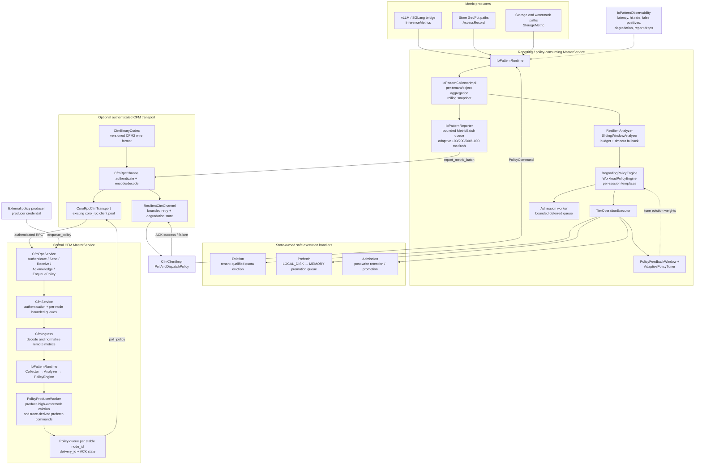

## 5.4.1 设计概述

```
flowchart TD
    subgraph 推理框架层 ["推理框架层 (vLLM/SGLang)"]
        MC["MooncakeConnector<br/>(vLLM v1)"]
        HC["HiCache Connector<br/>(SGLang)"]
        PC["Prefix Cache Manager"]
    end

    subgraph CFM ["CFM (Cache Flow Manager)"]
        COL["Collector<br/>(数据采集)"]
        ANA["Analyzer<br/>(模式分析)"]
        ENG["Policy Engine<br/>(策略决策)"]
        COL --> ANA --> ENG
        EV["Eviction Ops"]
        PF["Prefetch Ops"]
        AD["Admission Ops"]
        ENG --> EV & PF & AD
    end

    MC -->|"CFM Client<br/>(采集/策略/预取)"| COL
    HC -->|"CFM Client"| COL
    PC -->|"CFM Client"| COL

    subgraph CVM ["CVM (Cache View Manager)"]
        VIEW["视图计算 / 发布 / 系统事件感知 / 全局 KV 映射表"]
    end

    EV --> VIEW
    PF --> VIEW
    AD --> VIEW

    subgraph 存储层 ["存储层"]
        L0["L0: HBM<br/>(UB2PCIe/d2h)"]
        L1["L1: Host DRAM/SSD<br/>(计算节点本地内存/SSD(xds)"]
        L2["L2: Segment DRAM<br/>(池化内存 URMA mem)"]
        L3["L3: Nof SSD<br/>(SSU/远端池化 SSD)"]
    end

    VIEW --> L0
    VIEW --> L2
    VIEW --> L3
    L0 <-.->|"tier down/up"| L1
    L1 <-.->|"tier down/up"| L2
    L2 <-.->|"offload/promotion"| L3
```

**模块总体架构图**

```
classDiagram
    class IoPatternCollector {
        <<interface>>
        +ReportInferenceMetrics(metrics) void
        +RecordAccess(key, record) void
        +RecordStorageMetric(metric) void
        +GetSnapshot() IoPatternSnapshot
    }

    class IoPatternAnalyzer {
        <<interface>>
        +AnalyzePattern(snapshot) PatternResult
        +DetectWorkloadType(window) WorkloadType
        +CalculateConfidence(key) float
    }

    class PolicyEngine {
        <<interface>>
        +ExecutePolicy(context, tier, bytes, trace, admissions) PolicyResult
    }

    class EvictionOps {
        <<interface>>
        +Evaluate(context, tier, bytes) EvictionPlan
    }

    class PrefetchOps {
        <<interface>>
        +Evaluate(context, trace) PrefetchPlan
    }

    class AdmissionOps {
        <<interface>>
        +Evaluate(object, tier, context) AdmissionResult
    }

    class CfmClient {
        +ReportInferenceMetrics(metrics) void
        +ReceivePolicy指令() void
        +ExecutePrefetch(candidates) void
    }

    class ScoreBasedEviction {
        +Evaluate(context, tier, bytes) EvictionPlan
    }

    class TraceBasedPrefetch {
        +Evaluate(context, trace) PrefetchPlan
    }

    class PrefixMatchAdmission {
        +Evaluate(object, tier, context) AdmissionResult
    }

    PolicyEngine *-- EvictionOps : contains
    PolicyEngine *-- PrefetchOps : contains
    PolicyEngine *-- AdmissionOps : contains
    IoPatternCollector --> IoPatternAnalyzer : reports
    IoPatternAnalyzer --> PolicyEngine : analyzes
    CfmClient --> IoPatternCollector : reports metrics
    CfmClient --> PolicyEngine : receives policy
    EvictionOps <|.. ScoreBasedEviction : implements
    PrefetchOps <|.. TraceBasedPrefetch : implements
    AdmissionOps <|.. PrefixMatchAdmission : implements
```

## 5.4.2 IO Pattern 三层架构

IO Pattern 模块采用**采集层 -> 分析层 -> 策略层**的三层架构。

### 5.4.2.1 采集层 (IO Pattern Collector)

采集层负责从各数据源采集原始 IO 指标，采用异步上报机制避免阻塞数据路径。

**采集来源分三层：**

| 采集层            | 数据源                                            | 采集指标                                                                                                                 | 现有代码锚点                                                            |
| ----------------- | ------------------------------------------------- | ------------------------------------------------------------------------------------------------------------------------ | ----------------------------------------------------------------------- |
| 推理框架层        | vLLM MooncakeConnector / SGLang HiCache Connector | prefix match length, request priority, token 序列, recompute cost                                                        | `mooncake_connector_v1.py`, SGLang hicache connector                    |
| SuperCache SDK 层 | Client / Master / SubMaster                       | Get/Put/Tier 命中率, 访问时序, key 频率, 前缀树深度/fanout, 副本分布, 迁移 ETA, 写路径指标 (batch_size, overwrite_ratio) | `client_service.cpp`, `master_service.cpp`, `local_hot_cache.cpp`       |
| 存储后端层        | SSD/Nof Segment                                   | 读写带宽, 读写延迟, GC 状态, 盘内 Superblock 布局, 容量水位                                                              | `client_metric.h:SsdMetric`, `allocation_strategy.h:SsdMetricsProvider` |

**采集机制设计：**

1. **轻量级埋点**：复用和扩展现有 `CountMinSketch`（频率统计）、`SsdMetric`（SSD 延迟/吞吐）、`storage_backend.h:last_access_ns_`（最后访问时间）等埋点，避免重复建设
2. **异步上报**：CFM Client 定期异步上报指标至 SubMaster，采用 batch 聚合减少 RPC 开销。上报间隔自适应负载（低负载 100ms，高负载退避至 500ms-1s）
3. **全局聚合**：SubMaster 聚合各节点上报的指标，维护全局 token 指标流动视图
4. **采样降级**：在高负载场景下支持采样率动态调整，优先保障数据路径性能
5. **多租户隔离**：指标按 `TenantId` 分桶采集，避免高频租户淹没低频租户，沿用现有 `CountMinSketch` 的 `tenant_id.MakeScopedKey` 模式

固定 100ms 上报间隔在大规模集群下可能产生可观开销。采用自适应间隔：

| 负载状态 | 上报间隔 | 触发条件                                  |
| -------- | -------- | ----------------------------------------- |
| 低负载   | 100ms    | mem_used_ratio < 50%                      |
| 中负载   | 200ms    | 50% <= mem_used_ratio < 80%               |
| 高负载   | 500ms    | mem_used_ratio >= 80%                     |
| 极高负载 | 1000ms   | mem_used_ratio >= 95% 或 RPC 延迟 > 100ms |

> 
> 高负载时拉长间隔减少 RPC 开销，但保持最低 1s 上报频率确保策略时效性。量化估算：4000 节点集群，100ms 间隔下每秒 40000 RPC，单 RPC ~2KB，总带宽 ~80MB/s

#### 5.4.2.1.1 指标采集与上报流程

```
sequenceDiagram
    participant INF as 推理框架 (vLLM/SGLang)
    participant CFM as CFM Client
    participant SUB as SubMaster

    INF->>CFM: 1. 请求完成/前缀匹配
    CFM->>SUB: 2. 批量上报指标 (InferenceMetrics)
    CFM->>SUB: 3. SDK 层埋点 (AccessRecord)
    CFM->>SUB: 4. 存储后端指标 (StorageMetric)
    Note over SUB: 5. 全局聚合<br/>IoPatternSnapshot
```

#### 5.4.2.1.2 指标分类

IO Pattern 采集指标分为六大类，对应分级缓存淘汰/准入/预取流程的采集指标定义：

**时序指标**

| 指标名                | 类型      | 描述                     | 采集来源   | 现有代码锚点                        |
| --------------------- | --------- | ------------------------ | ---------- | ----------------------------------- |
| `last_access_time`    | timestamp | 最近一次访问时间         | SDK 层     | `storage_backend.h:last_access_ns_` |
| `access_count_window` | uint32    | 最近时间窗口内访问次数   | SDK 层     | `count_min_sketch.h:CountMinSketch` |
| `idle_time`           | duration  | = now - last_access_time | 分析层计算 | -                                   |

**价值指标**

| 指标名           | 类型   | 描述                           | 采集来源   | 现有代码锚点     |
| ---------------- | ------ | ------------------------------ | ---------- | ---------------- |
| `recompute_cost` | float  | 重新计算时间 (token 数 / 时间) | 推理框架层 | connector 层估算 |
| `block_size`     | uint64 | 数据大小 (bytes)               | SDK 层     | object metadata  |
| `token_count`    | uint32 | token 数                       | 推理框架层 | connector 层     |

**结构指标**

| 指标名                     | 类型   | 描述                         | 采集来源   | 现有代码锚点         |
| -------------------------- | ------ | ---------------------------- | ---------- | -------------------- |
| `prefix_depth`             | uint32 | 前缀深度 (prefix tree level) | 推理框架层 | prefix cache manager |
| `prefix_fanout`            | uint32 | 共享该前缀的请求/分支数量    | 推理框架层 | prefix cache manager |
| `match_length`             | uint32 | 前缀匹配长度                 | 推理框架层 | connector 层         |
| `continuous_prefix_length` | uint32 | 连续前缀长度                 | 推理框架层 | connector 层         |

**副本指标**

| 指标名                | 类型     | 描述                       | 采集来源   | 现有代码锚点               |
| --------------------- | -------- | -------------------------- | ---------- | -------------------------- |
| `replica_tiers`       | bitmap   | 当前在哪些层有副本 (L0-L3) | SDK 层     | `master_service.h:Replica` |
| `transfer_eta`        | duration | 迁移路径预计耗时           | 分析层计算 | -                          |
| `ssd_replica_exists`  | bool     | SSD 层是否有副本           | SDK 层     | replica metadata           |
| `other_replica_count` | uint32   | 其他层副本数               | SDK 层     | replica metadata           |

**状态指标**

| 指标名   | 类型 | 描述         | 采集来源 | 现有代码锚点                  |
| -------- | ---- | ------------ | -------- | ----------------------------- |
| `active` | bool | 是否正在使用 | SDK 层   | `local_hot_cache.h:ref_count` |
| `pinned` | bool | 是否不可迁移 | SDK 层   | promotion task pinning        |

**存储后端指标**

| 指标名              | 类型      | 描述              | 采集来源   | 现有代码锚点                                                                 |
| ------------------- | --------- | ----------------- | ---------- | ---------------------------------------------------------------------------- |
| `ssd_read_latency`  | histogram | SSD 读延迟分布    | 存储后端层 | `client_metric.h:SsdMetric`                                                  |
| `ssd_write_latency` | histogram | SSD 写延迟分布    | 存储后端层 | `client_metric.h:SsdMetric`                                                  |
| `ssd_gc_status`     | enum      | SSD GC 状态       | 存储后端层 | Nof TGT                                                                      |
| `mem_used_ratio`    | float     | DRAM 内存水位比例 | SDK 层     | `MasterMetricManager::get_global_mem_used_ratio()` (Master 侧全局 DRAM 水位) |
| `ssd_used_bytes`    | int64     | SSD 已用容量      | 存储后端层 | `allocation_strategy.h:SsdMetricsProvider`                                   |

#### 5.4.2.1.3 指标采集接口

```
// IO Pattern Collector 接口 (新增, 位于 include/io_pattern_collector.h)
class IoPatternCollector {
   public:
    virtual ~IoPatternCollector() = default;

    // 推理框架层指标 (通过 CFM Client 上报)
    virtual void ReportInferenceMetrics(const InferenceMetrics& metrics) = 0;

    // SDK 层指标 (内部埋点)
    virtual void RecordAccess(const std::string& key,
                              const AccessRecord& record) = 0;

    // 存储后端层指标
    virtual void RecordStorageMetric(const StorageMetric& metric) = 0;

    // 获取聚合后的指标快照
    virtual IoPatternSnapshot GetSnapshot() const = 0;
};

struct AccessRecord {
    std::string key;
    std::chrono::steady_clock::time_point access_time;
    uint64_t block_size;
    ReplicaType replica_type;
    bool is_hit;
    std::chrono::microseconds latency;
};

struct InferenceMetrics {
    std::string session_id;
    uint32_t prefix_depth;
    uint32_t prefix_fanout;
    uint32_t match_length;
    uint32_t continuous_prefix_length;
    uint32_t token_count;
    float recompute_cost;
    uint8_t request_priority;
};
```

### 5.4.2.2 分析层 (IO Pattern Analyzer)

分析层对采集的原始指标进行模式识别和特征提取，输出结构化的 IO Pattern 描述。

**分析能力：**

| 分析类型      | 描述                           | 输入指标                                               | 输出                                 | 对应需求       |
| ------------- | ------------------------------ | ------------------------------------------------------ | ------------------------------------ | -------------- |
| 热度分析      | 基于 LFU/滑动窗口的频率统计    | access_count_window, last_access_time                  | hot/cold 分类, 频率评分              | 淘汰/准入/预取 |
| 前缀分析      | Prefix tree 深度和 fanout 分析 | prefix_depth, prefix_fanout, match_length              | 前缀共享度, 预取候选                 | 预取/准入      |
| 时序预测      | 访问间隔和空闲时间分析         | idle_time, access pattern, access_count_window         | 空闲评分, 预取优先级                 | 淘汰/Tier down |
| 代价评估      | 重计算代价和迁移代价评估       | recompute_cost, token 数, block_size, transfer_eta     | 代价评分, 迁移 ROI                   | 淘汰/Tier up   |
| 访问模式识别  | 顺序/随机、大包/小包、读写比   | IO size distribution, access sequence                  | 模式分类 (SEQ/RANDOM/KV_LOOKUP等)    | 缓存分区/分流  |
| 副本分析      | 多层副本分布分析               | replica_tiers, active/pinned                           | 副本冗余度, 迁移安全性               | 淘汰/Tier down |
| 写路径分析    | 写入模式分析                   | write_batch_size, write_burst, overwrite_ratio         | 写穿风险, GC 预警                    | 准入/GC        |
| Workload 识别 | 推理场景类型自动识别           | token_count, prefix_fanout, block_size, frequency 分布 | workload_type (Code Agent/推荐/对话) | 策略模板选择   |

**Workload Type 感知策略模板**

不同推理场景的 IO Pattern 差异巨大，单一通用评分公式无法覆盖所有场景。

**配置参数：**

| 参数                                   | 默认值        | 说明                                                               |
| -------------------------------------- | ------------- | ------------------------------------------------------------------ |
| `workload_detection_window_sec`        | 60            | workload 识别滑动窗口大小                                          |
| `workload_detection_method`            | `auto`        | 识别方法：`auto`(阈值+聚类)、`threshold`(仅阈值)、`kmeans`(仅聚类) |
| `workload_template_transition_windows` | 3             | 模板切换过渡窗口数，控制平滑度                                     |
| `workload_mixed_load_mode`             | `per_session` | 混合负载处理：`per_session`(按会话标记)、`global`(全局统一)        |

**运维观测：**

| 指标                                    | 描述                     |
| --------------------------------------- | ------------------------ |
| `workload_current_type`                 | 当前识别的 workload type |
| `workload_type_switch_count`            | workload type 切换次数   |
| `workload_detection_latency_us`         | 单次识别延迟             |
| `workload_template_transition_progress` | 模板过渡进度 (0.0-1.0)   |

**Workload 识别机制：**

不同推理场景的 KVCache 访问模式差异巨大，单一通用评分公式无法覆盖所有场景。IO Pattern 分析层基于滑动窗口内的指标分布统计，自动识别 workload type 并切换对应策略模板。

**Workload Type 特征矩阵：**

| Workload Type | 典型场景                       | 访问特征                                                                  | 识别信号                                                                |
| ------------- | ------------------------------ | ------------------------------------------------------------------------- | ----------------------------------------------------------------------- |
| Code Agent    | Cursor/Copilot 长程代码生成    | 长上下文（>32K token）、高前缀复用、大 block_size（>512KB）、多轮访问为主 | 高 token_count + 低 prefix_fanout + 大 block_size + 低 frequency        |
| 生成式推荐    | 京东/字节 GR 精排召回          | 高频小 block（<128KB）、高复用、密集访问、低重计算代价                    | 低 token_count + 高 frequency + 小 block_size + 低 recompute_cost       |
| 多轮对话      | ChatGPT 类对话、Agent 工具调用 | 中等 block、高前缀共享、渐进式增长、prefix cache 命中率高                 | 中 token_count + 高 prefix_fanout + 高 match_length + 高 recompute_cost |

**识别算法：**

分析层维护一个滑动窗口（默认 60s），统计窗口内所有请求的 `token_count`/`prefix_fanout`/`block_size`/`frequency` 四维分布。采用两阶段识别：

```
阶段 1: 特征提取
  for each request in window:
    feature_vector = (median(token_count), p90(prefix_fanout), 
                      median(block_size), median(frequency))

阶段 2: 分类决策
  if feature_vector matches阈值规则:
    -> 直接分类 (快速路径, 延迟 < 1ms)
  else:
    -> K-means 聚类 (慢速路径, 延迟 < 10ms, 用于混合负载场景)
```

**阈值规则（快速路径）：**

| 判定条件                                                                           | → Workload Type         |
| ---------------------------------------------------------------------------------- | ----------------------- |
| `median(token_count) > 16KB && p90(prefix_fanout) > 16 && p90(match_length) > 256` | Code Agent              |
| `median(block_size) < 128KB && median(frequency) > 20`                             | 生成式推荐              |
| `p90(prefix_fanout) > 16 && p90(match_length) > 256`                               | 多轮对话                |
| 不满足以上任一                                                                     | 混合负载 → K-means 聚类 |

**策略模板对照：**

每种 workload type 对应一组完整的策略参数模板，覆盖淘汰/准入/预取/Tier 四个维度：

| 策略维度      | Code Agent                                | 生成式推荐                              | 多轮对话                               |
| ------------- | ----------------------------------------- | --------------------------------------- | -------------------------------------- |
| **预取**      | 保守（仅 prefix > 512 预取，best_effort） | 激进（prefix > 64 预取，wait_complete） | 前缀优先（prefix > 256 预取，timeout） |
| **淘汰**      | 激进（低 idle_thres，快速释放 L0）        | 保守（高 idle_thres，保留热数据）       | 前缀感知（prefix_fanout 高权重保留）   |
| **准入**      | 低阈值（access_count > 2 即准入）         | 高阈值（access_count > 20 才准入）      | 前缀准入（match_length > 128 即准入）  |
| **Tier down** | 快速降级（L0→L2 跳级，跳过 L1）           | 缓慢降级（L0→L1→L2 逐层）               | 前缀亲和（共享前缀的 block 同层迁移）  |
| **淘汰权重**  | α=0.8, γ=0.2, δ=0.3, ε=0.1                | α=0.3, γ=0.8, δ=0.2, ε=0.1              | α=0.5, γ=0.4, δ=0.6, ε=0.8             |

**模板切换机制：**

```
flowchart TD
    WIN["滑动窗口指标统计<br/>(60s)"]
    FEAT["特征提取<br/>4 维分布向量"]
    RULE["阈值规则匹配"]
    KMEANS["K-means 聚类<br/>(混合负载)"]
    CLASSIFY["Workload Type 判定"]
    TEMPLATE["策略模板加载<br/>(淘汰/准入/预取/Tier 参数)"]
    APPLY["应用至 Policy Engine"]

    WIN --> FEAT --> RULE
    RULE -->|"匹配成功"| CLASSIFY
    RULE -->|"不匹配"| KMEANS --> CLASSIFY
    CLASSIFY --> TEMPLATE --> APPLY
```

**切换平滑性：** workload type 变化时，策略参数不是瞬间切换，而是通过加权过渡（新旧模板权重在 3 个窗口周期内从 100:0 渐变到 0:100），避免策略突变导致缓存抖动。

**混合负载处理：** 当 K-means 识别出多种 workload type 共存时（如同一集群同时服务对话和推荐），采用 per-session workload 标记——在请求入口处根据 session 特征打标签，各 session 独立使用对应模板，而非全局统一。

### 5.4.2.3 策略层 (IO Pattern Policy Engine)

策略层基于分析层的输出，通过可注册的 Ops 接口驱动各缓存机制：

```
flowchart TD
    PE["Policy Engine"]

    subgraph EvictionOps ["EvictionOps (淘汰策略)"]
        LRU["LRU"]
        LFU["LFU"]
        SBE["ScoreBased<br/>(L0-L3 四层)"]
    end

    subgraph PrefetchOps ["PrefetchOps (预取策略)"]
        BE["BestEffort"]
        TO["Timeout"]
        WC["WaitComplete"]
        TB["TraceBased"]
    end

    subgraph AdmissionOps ["AdmissionOps (准入策略)"]
        FREQ["Frequency"]
        PM["PrefixMatch"]
        WM["Watermark"]
        CA["CostAware"]
    end

    PE --> EvictionOps
    PE --> PrefetchOps
    PE --> AdmissionOps
```

## 5.4.3 缓存机制集成与关键流程

IO Pattern 模块不是重写现有机制，而是在现有机制之上增加统一的数据采集和分析层，通过 Ops 抽象接口驱动各机制。

### 5.4.3.2 淘汰 (Eviction)

**现有机制**：`EvictionStrategy` 抽象类（`eviction_strategy.h`）提供 LRU 和 FIFO 两种实现；`storage_backend.h` 中基于 `last_access_ns_` 维护 LRU 索引。

**IO Pattern 增强**：引入基于评分的淘汰策略 (ScoreBasedEviction)，按4层缓存层级分别使用不同评分公式。所有指标先经归一化处理（`normalize(x) = x / max_observed_x`，映射到 `[0, 1]`），消除量纲差异后再加权求和。归一化基准基于滑动窗口（默认 60s）内的最大观测值动态更新。

```
flowchart TD
    SNAP["IO Pattern Snapshot"]
    NORM["归一化处理<br/>norm(x) = x / max_observed"]
    PE["Policy Engine<br/>选择层级策略"]
    SNAP --> NORM --> PE

    PE --> L0S["L0 HBM Evict"]
    PE --> L1S["L1 Host DRAM/SSD Evict"]
    PE --> L2S["L2 Segment DRAM Evict"]
    PE --> L3S["L3 Nof SSD Evict"]

    L0S --> L0F["α\*norm(idle) - γ\*norm(freq)<br/>- δ\*norm(recompute) - ε\*norm(fanout)"]
    L1S --> L1F["α\*norm(idle) - γ\*norm(freq)<br/>+ δ\*norm(lower_replica)<br/>- ε\*norm(fanout) - ζ*norm(recompute)"]
    L2S --> L2F["α\*norm(idle) - γ\*norm(freq)<br/>+ δ\*norm(lower_replica)<br/>- ε\*norm(fanout) - ζ*norm(recompute)"]
    L3S --> L3F["α\*norm(idle)\*norm(block_size)<br/>- γ\*norm(freq) - δ\*norm(recompute)<br/>+ η*norm(other_replica)"]

    L0F --> L0OUT["-> L1"]
    L1F --> L1OUT["-> L2"]
    L2F --> L2OUT["-> L3"]
    L3F --> L3OUT["-> 丢弃"]
```

**各层淘汰策略说明：**

| 层级             | 评分侧重                                                              | 淘汰去向 | 说明                      |
| ---------------- | --------------------------------------------------------------------- | -------- | ------------------------- |
| L0 HBM           | `idle_time` 主导，`recompute_cost`/`prefix_fanout` 高权重保留         | → L1     | HBM 最贵，冷数据快速降级  |
| L1 Host DRAM/SSD | 下层已有副本可安全淘汰，`prefix_fanout`/`recompute_cost` 高的数据保留 | → L2     | 本地 DRAM/SSD 到远端 DRAM |
| L2 Segment DRAM  | `prefix_fanout`/`recompute_cost` 高的数据保留                         | → L3     | 池化内存到远端 SSD        |
| L3 Nof SSD       | `block_size` 大 + 其他层已有副本优先淘汰                              | → 丢弃   | 最底层，无下降空间        |

**集成方式**：扩展现有 `EvictionStrategy` 接口，新增 `ScoreBasedEvictionStrategy`，由 Policy Engine 根据层级动态选择策略。

### 5.4.3.3 准入 (Admission)

**现有机制**：

- Client 侧：`CountMinSketch` + `admission_threshold_` 频率准入（`client_service.cpp`），仅频繁访问的 key 提升 hot cache
- Master 侧：Promotion-on-Hit 的 `promotion_admission_threshold_` 频率门控 + watermark 门控（`master_service.cpp`）

**IO Pattern 增强**：扩展准入策略为多层逐级准入控制，每层提升需满足对应条件：

| 准入路径 | 条件                                                           | 说明                                                  |
| -------- | -------------------------------------------------------------- | ----------------------------------------------------- |
| L3→L2    | `access_count_window >= threshold`                             | 频率达标才从 Nof SSD 提升至 Segment DRAM              |
| L2→L1    | `access_count_window >= threshold && upper_space <= max_space` | 频率达标且上层有空间才提升 Segment DRAM→Host DRAM/SSD |
| L1→L0    | `max_length >= threshold (64)`                                 | 前缀长度达标才从 Host DRAM/SSD 提升至 HBM             |

> 
> SSD→HBM 跨层直达（跳过中间层）仅由推理框架 prefix cache 命中时触发，Mooncake 侧不自主执行跨层晋升到 HBM。

```
flowchart TD
    REQ["访问请求"]
    ANA["IO Pattern Analyzer<br/>计算准入条件"]
    REQ --> ANA

    ANA --> P1["L3→L2<br/>access_cnt >= thres"]
    ANA --> P2["L2→L1<br/>access_cnt >= thres<br/>&& upper_space <= max"]
    ANA --> P3["L1→L0<br/>max_length >= 64"]

    P1 --> FA["频率准入<br/>(CountMin Sketch)"]
    P2 --> FA2["频率+空间准入<br/>(Frequency + Watermark)"]
    P3 --> PA["前缀准入<br/>(PrefixMatch Admission)"]
```

**集成方式**：扩展现有 `CountMinSketch` 准入逻辑，新增 `PrefixMatchAdmission` 和 `CostAwareAdmission` 策略。

### 5.4.3.4 Tier Down / SSD Offload

**现有机制**：

- `enable_ssd_offload` + `ssd_offload_path` 配置 SSD offload 路径（`real_client.cpp`）
- `offload_on_evict` 模式：在淘汰时延迟 offload 到 LOCAL_DISK（`master_service.cpp`）
- `offload_force_evict`：超过 offload cap 时直接淘汰不 offload

**IO Pattern 增强**：基于热度阈值的逐级 tier down，数据按 L0→L1→L2→L3 顺序逐层降级：

```
flowchart TD
    START["L0 HBM 容量/水位检测"]
    C1{"idle_time >= L0 cold_thres || frequency < L0 hot_thres ?"}
    C2{"L2 seg_dram_avail ?"}
    C3{"L3 nof SSD avail ?"}
    C4{"L1 host DRAM<= thres ?"}
    C5{"xds available ?"}
    C6{"idle_time >= L1 cold_thres || frequency < L1 hot_thres ?"}
    C7{"idle_time >= L2 cold_thres || frequency < L2 hot_thres ?"}
	TD_L1A["L1 Host DRAM"]
	TD_L1B["L1 SSD(xds)"]
	TD_L2["L2 Segment DRAM"]
    TD_L3["L3 Nof SSD"]

    START --> C1
    C1 -->|是| C4
    C4 -->|是| TD_L1A
    C4 -->|否| C5
    C5 -->|是| TD_L1B
    C5 -->|否| C2
    C2 -->|是| TD_L2
    C2 -->|否| C3
    C3 -->|否| WAIT["下层均不可用<br/>等待重试 / 强制 evict"]
    C3 -->|是| TD_L3
    TD_L1A --> C6
    C6 -->|是| C2
    TD_L2 --> C7
    C7 -->|是| C3
```

> 
> 当所有下层均不可用时，数据暂留当前层并等待下层恢复，或触发强制 evict 释放空间。冷数据不会保留在高速层——高速层是最昂贵的资源，冷数据必须逐级降级。

### 5.4.3.5 Tier Up / Promotion-on-Hit

**现有机制**：

- `promotion_on_hit` 模式（`master_service.cpp:379`）：Get 观察到 LOCAL_DISK-only key 时队列异步拷贝回 MEMORY
- `CountMinSketch` 频率门控（`master_service.cpp:6944`）
- watermark 门控：DRAM 低于 `eviction_high_watermark_ratio_` 才允许 promotion
- `promotion_queue_limit` + `promotion_max_per_heartbeat` 控制 promotion 速率
- `PromotionCandidate` 跟踪 + 重试 + TTL 过期

**IO Pattern 增强**：IO Pattern 分析层为 promotion 提供更丰富的决策输入：

- 前缀匹配度：高前缀匹配的 key 优先 promotion
- 重计算代价：高 recompute_cost 的 key 优先 promotion
- 迁移 ETA：根据带宽和 block_size 估算 transfer_eta，避免迁移耗时过长

> 
> Mooncake 侧 promotion 仅执行逐级提升（L3→L2→L1），不自主晋升到 L0 HBM。L0 HBM 层的数据加载由推理框架 prefix cache 命中时自主触发。

```
flowchart TD
    START["prefix cache 命中/预取触发/get"]
    CALC["Tier Up Priority 计算:<br/>priority = w0 * recompute_cost<br/>+ w1 * continuous_prefix<br/>+ w2 * request_priority<br/>- w3 * transfer_eta"]
    SORT["按优先级排序"]
    EXEC["执行逐级 tier up<br/>L3→L2→L1"]

    START --> CALC --> SORT --> EXEC
```

### 5.4.3.6 预取 (Prefetch)

**现有机制**：当前无显式预取机制，Promotion-on-Hit 在 Get 命中 LOCAL_DISK 时异步提升到 MEMORY。

**IO Pattern 增强**：新增 `PrefetchOps` 抽象，SubMaster 根据 trace 和置信阈值生成预取器：

**预取触发条件：** 低速层 prefix match length > 阈值 (256) 时触发预取至上一层（如 L3→L2、L2→L1）

**预取策略（三种模式）：**

| 策略            | 描述                                | 适用场景             |
| --------------- | ----------------------------------- | -------------------- |
| `best_effort`   | check & match，无论是否完成立即返回 | 对 TTFT 时延敏感业务 |
| `timeout`       | 预取完成或超时立即返回              | 兼顾时延和命中率     |
| `wait_complete` | 死等数据加载完成                    | 追求极致命中率       |

分析层基于 trace 历史命中率和置信阈值生成策略输入。置信度 = 滑动窗口内命中次数 / 总访问次数，低于阈值时不触发操作避免误判。例如预取器生成：

- SubMaster 根据 trace 历史 + 置信阈值（如 `confidence > 0.6 && prefix match length > 256`）生成预取器
- 置信度低于阈值时不触发操作，避免误判导致的缓存污染
- 置信阈值精确定义和各策略默认值详见

**置信度计算：** 基于滑动窗口内的历史命中率，衡量当前预测的可信程度。

```
confidence = hit_count_in_window / total_access_in_window
```

**置信阈值应用：**

| 策略     | 置信阈值                                        | 含义                                    | 默认值                               |
| -------- | ----------------------------------------------- | --------------------------------------- | ------------------------------------ |
| 预取触发 | `confidence > 0.6 && match_length > 256`        | 历史命中率 > 60% 且前缀匹配足够长才预取 | prefix_threshold=256, confidence=0.6 |
| 准入提升 | `confidence > 0.5 && access_count >= threshold` | 历史命中率 > 50% 且频率达标才提升       | confidence=0.5                       |
| 淘汰保守 | `confidence > 0.8` 时降低淘汰权重               | 高置信热数据更保守淘汰                  | confidence=0.8                       |

> 
> 置信度低于阈值时不触发操作，避免误判导致的缓存污染。置信度窗口默认 60s，可通过 `confidence_window_sec` 配置。

预取流程仅看 `match_length > 256` 触发

```
flowchart TD
    START["低速层 prefix match<br/>(L1-L3)"]
    C1{"match_length > 256 ?"}
    NOP["不预取"]
    SEL["选择预取策略"]

    START --> C1
    C1 -->|否| NOP
    C1 -->|是| SEL
    SEL --> BE["best_effort"]
    SEL --> TO["timeout"]
    SEL --> WC["wait_complete"]
```

- `max_prefetch_ratio`：预取占用带宽上限比例，默认 20%，可通过 `prefetch_max_bw_ratio` 配置
- 带宽不足时延迟重试，而非直接丢弃预取请求

**集成方式**：在 SubMaster 中新增预取器，根据 IO Pattern 分析层的置信阈值异步预取 key 至上层。

## 5.4.5 上层推理框架对接

### 5.4.5.1 vLLM 集成

**现有对接**：`MooncakeConnector`（`mooncake_connector_v1.py`）实现 vLLM `KVConnectorBase_V1` 接口，支持 PD disaggregation（Prefill/Decode 分离）。

> 
> **上层框架改动**：vLLM 侧无需改动。`MooncakeConnector` 作为 vLLM 的 out-of-tree connector（通过 `--kv_connector_module_path` 加载），在 connector 内部新增 CFM Client 调用即可上报指标和接收策略指令，不涉及 vLLM scheduler/engine 接口变更。vLLM v0.13.0+ 已内置 mooncake connector，后续可考虑将 CFM Client 合入上游。

**IO Pattern 对接增强**：

```
flowchart TD
    VLLM["vLLM Engine"]

    subgraph MC ["MooncakeConnector (KVConnectorBase_V1)"]
        GNMT["get_num_new_matched_tokens()<br/>上报 match_length"]
        USA["update_state_after_alloc()<br/>上报 prefix_depth"]
        RF["request_finished()<br/>上报 token_count, recompute_cost"]
    end

    subgraph CFMC ["CFM Client (新增)"]
        RIM["IoPatternCollector<br/>.ReportInferenceMetrics()"]
        POP["PrefetchOps<br/>接收预取指令"]
        AOP["AdmissionOps<br/>接收准入策略"]
    end

    VLLM --> MC
    VLLM --> CFMC
    GNMT --> RIM
    USA --> RIM
    RF --> RIM
```

**采集对接**：在 `MooncakeConnector` 中增加 CFM Client 调用，将以下指标上报至 IO Pattern Collector：

- `match_length`：prefix cache 命中长度（来自 `get_num_new_matched_tokens()`）
- `prefix_depth` / `prefix_fanout`：前缀树结构（来自 `update_state_after_alloc()` 及 prefix cache manager）
- `token_count`：请求 token 数（来自 `request_finished()`）
- `recompute_cost`：重计算代价估算（connector 侧基于 token_count 和模型 FLOPS 估算）
- `request_priority`：请求优先级（connector 层从 request metadata 提取）

**策略对接**：CFM Client 接收 Policy Engine 的策略指令：

- 预取指令：根据 prefix match length > 256 触发异步预取
- 准入指令：根据频率/前缀匹配控制数据提升层级
- 淘汰指令：根据淘汰评分驱动 L0-L3 层间淘汰

### 5.4.5.2 SGLang 集成

**现有对接**：SGLang HiCache 通过 `--hicache-storage-backend: mooncake` 将 Mooncake 作为存储后端，支持 layer_first / page_first 布局。

**IO Pattern 对接增强**：

```
flowchart TD
    SGL["SGLang Engine"]

    subgraph HCC ["HiCache Connector"]
        HR["hicache-ratio<br/>容量配比"]
        HML["hicache-mem-layout<br/>layer_first / page_first"]
        HIO["hicache-io-backend<br/>direct / async"]
    end

    subgraph CFMS ["CFM Client (新增)"]
        RIM2["IoPatternCollector<br/>.ReportInferenceMetrics()"]
        DLA["数据布局适配<br/>(layer_first / page_first)"]
        PAS["预取/准入/淘汰策略"]
    end

    SGL --> HCC
    SGL --> CFMS
    HR --> RIM2
    HML --> DLA
    HIO --> RIM2
```

**数据布局适配**：IO Pattern 需感知推理框架的 KV cache 布局模式，vLLM 和 SGLang 均需适配：

| 框架   | 布局模式                       | 描述                                                                      | IO Pattern 适配                                 |
| ------ | ------------------------------ | ------------------------------------------------------------------------- | ----------------------------------------------- |
| SGLang | `layer_first`                  | (2, layer, slot, num_head, head_dim)                                      | 前缀分析按 layer 维度，预取按 layer 批量        |
| SGLang | `page_first`                   | (2, page_num, layer, num_head, head_dim)                                  | 前缀分析按 page 维度，预取按 page 批量          |
| SGLang | `page_first_direct`            | 混合模型 (Full Attention + SWA/Mamba)                                     | 分区准入，full KV 固定分区 + SWA/mamba 灵活分配 |
| vLLM   | `page-based` (block_size 粒度) | vLLM v1 默认 page-based 布局，connector 通过 `get_kv_cache_layout()` 检测 | 前缀分析按 block 维度，预取按 block 批量        |
| vLLM   | `HMA multi-group`              | 混合模型 (attention + Mamba2)，`SupportsHMA` 多 group 布局                | 分组准入，各 group 独立淘汰/预取策略            |

> 
> vLLM connector 已在初始化时调用 `get_kv_cache_layout()` 检测布局（`mooncake_connector_v1.py:511`），并通过 `SupportsHMA` 支持 hybrid 模型多 group 布局。SGLang 通过 `--hicache-mem-layout` 参数显式配置布局。两者均需在 CFM Client 上报时附带布局信息，供 IO Pattern 分析层选择对应的预取/准入粒度。

### 5.4.5.3 CFM Client 设计

CFM Client 部署在推理节点侧，作为推理框架与 SuperCache 之间的策略桥梁：

```
flowchart TD
    subgraph CFMClient ["CFM Client"]
        MR["Metrics Reporter<br/>(采集上报)"]
        PR["Policy Receiver<br/>(策略接收)"]
        PE["Prefetch Executor<br/>(预取执行)"]
        RPC["CFM RPC Channel<br/>(to SubMaster / PrefixCache Master)"]
        MR --> RPC
        PR --> RPC
        PE --> RPC
    end
```

**职责：**

1. **Metrics Reporter**：定期（100ms）批量上报推理框架指标至 SubMaster
2. **Policy Receiver**：接收 Policy Engine 的淘汰/预取/准入策略指令
3. **Prefetch Executor**：执行异步预取，支持 best_effort / timeout / wait_complete 三种模式

## 5.4.6 Ops 抽象接口设计

> **接口修订（2026-09）**：本节原始的 string/vector 简化签名仅用于
> 查询示例，不能承载租户、字节预算、评分、Tier、超时和置信度等执行
> 元数据。实际实现统一采用文末“Revised Ops contract”中的完整计划接口。

### 5.4.6.1 EvictionOps

```
// include/eviction_ops.h (扩展现有 eviction_strategy.h)
class EvictionOps {
   public:
    virtual ~EvictionOps() = default;

    // 基于 IO Pattern 评分选择淘汰 key
    virtual std::vector<std::string> SelectEvictionCandidates(
        const IoPatternSnapshot& snapshot,
        CacheTier tier,
        size_t target_bytes) = 0;

    // 注册淘汰算法
    static void Register(const std::string& name,
                         std::function<std::shared_ptr<EvictionOps>()> factory);
};

// 已有实现: LRU, FIFO (eviction_strategy.h)
// 新增实现: ScoreBasedEviction (L0-L3 四层不同评分公式)
```

### 5.4.6.2 PrefetchOps

```
// include/prefetch_ops.h (新增)
class PrefetchOps {
   public:
    virtual ~PrefetchOps() = default;

    // 基于 trace 和置信阈值生成预取候选
    virtual std::vector<PrefetchCandidate> GeneratePrefetchPlan(
        const IoPatternSnapshot& snapshot,
        const TraceHistory& trace) = 0;

    // 执行预取
    virtual ErrorCode ExecutePrefetch(
        const std::vector<PrefetchCandidate>& candidates,
        PrefetchStrategy strategy) = 0;

    static void Register(const std::string& name,
                         std::function<std::shared_ptr<PrefetchOps>()> factory);
};

enum class PrefetchStrategy {
    kBestEffort,    // 无论是否完成立即返回
    kTimeout,       // 预取完成或超时立即返回
    kWaitComplete,  // 死等数据加载完成
};
```

### 5.4.6.3 AdmissionOps

```
// include/admission_ops.h (新增, 扩展现有 CountMinSketch 准入)
class AdmissionOps {
   public:
    virtual ~AdmissionOps() = default;

    // 准入决策：是否允许数据进入目标层
    virtual AdmissionDecision CheckAdmission(
        const std::string& key,
        CacheTier target_tier,
        const IoPatternSnapshot& snapshot) = 0;

    static void Register(const std::string& name,
                         std::function<std::shared_ptr<AdmissionOps>()> factory);
};

enum class AdmissionDecision {
    kAdmit,           // 允许进入
    kRejectFrequency, // 频率不足
    kRejectWatermark, // 水位过高
    kRejectPrefix,    // 前缀匹配不足
    kDefer,           // 延迟决策 (记录候选)
};

// 已有实现: FrequencyAdmission (CountMinSketch)
// 新增实现: PrefixMatchAdmission, CostAwareAdmission
```

### 5.4.6.4 Ops 注册机制

```
classDiagram
    class EvictionOps {
    <<interface>>
    +SelectEvictionCandidates(snapshot, tier, bytes) vector~string~
    +Register(name, factory) void
    }
    class PrefetchOps {
    <<interface>>
    +GeneratePrefetchPlan(snapshot, trace) vector~PrefetchCandidate~
    +ExecutePrefetch(candidates, strategy) ErrorCode
    +Register(name, factory) void
    }
    class AdmissionOps {
    <<interface>>
    +CheckAdmission(key, tier, snapshot) AdmissionDecision
    +Register(name, factory) void
    }
    class PolicyEngine {
        -ops_registry_ : map
        +SelectOps(type, name) Ops
        +ExecutePolicy(snapshot) PolicyResult
    }

    PolicyEngine --> EvictionOps : 查找/执行
    PolicyEngine --> PrefetchOps : 查找/执行
    PolicyEngine --> AdmissionOps : 查找/执行
```

## 5.4.7 写路径 IO Pattern

### 5.4.7.1 写路径采集指标

| 指标名              | 类型   | 描述                           | 采集来源            |
| ------------------- | ------ | ------------------------------ | ------------------- |
| `write_batch_size`  | uint32 | 批量写入 key 数                | SDK 层 (`BatchPut`) |
| `write_object_size` | uint64 | 单次写入数据大小               | SDK 层              |
| `write_burst`       | bool   | 是否突发写入（短时间大量 Put） | 分析层计算          |
| `write_frequency`   | uint32 | key 写入频率                   | SDK 层              |
| `overwrite_ratio`   | float  | 覆盖写比例 (同 key 重复 Put)   | 分析层计算          |

### 5.4.7.2 写路径 Pattern 对策略的影响

| Pattern    | 影响策略               | 处理方式                                                           |
| ---------- | ---------------------- | ------------------------------------------------------------------ |
| 突发写入   | 准入：避免写穿 SSD     | 突发写入期间提高 `admission_threshold`，冷数据暂留 DRAM 不 offload |
| 高覆盖写   | 准入：跳过 SSD offload | 覆盖写比例高的 key 不 offload 到 SSD，避免无效写入                 |
| 大批量写入 | GC：提前触发           | 预估写入量，提前通知 SSD 后端准备 GC 空间                          |
| 低频写入   | 淘汰：降低保留优先级   | 低频写入的 key 在淘汰评分中 `frequency` 低，优先淘汰               |

## 5.4.8 健壮性与可观测性

### 5.4.8.1 失败降级

IO Pattern 模块自身故障时，必须不影响数据路径，降级到现有基础机制：

```
flowchart TD
    START["策略执行请求"]
    C1{"IO Pattern 模块可用?"}
    C2{"分析层响应<br/>超时?"}
    NORMAL["正常路径:<br/>ScoreBasedEviction / PrefixMatchAdmission / TraceBasedPrefetch"]
    DEGRADE["降级路径:<br/>LRU / FIFO / FrequencyAdmission<br/>(现有基础机制)"]

    START --> C1
    C1 -->|是| C2
    C1 -->|否| DEGRADE
    C2 -->|否| NORMAL
    C2 -->|是| DEGRADE
```

| 故障场景       | 降级行为                          | 触发条件            |
| -------------- | --------------------------------- | ------------------- |
| SubMaster 崩溃 | 回退到 Client 本地 LRU/FIFO       | RPC 连续失败 > 3 次 |
| 分析层超时     | 使用上一次成功快照                | 响应延迟 > 500ms    |
| 分析层 OOM     | 丢弃 per-key 指标，仅保留全局指标 | 内存占用 > 阈值     |
| RPC 网络抖动   | 延长上报间隔，本地缓存策略        | 丢包率 > 5%         |

### 5.4.8.2 反馈闭环

策略执行后需评估效果并自适应调优参数，形成闭环：

```
flowchart LR
    EXEC["策略执行<br/>(eviction/prefetch/admission)"]
    EVAL["效果评估<br/>(命中率/eviction抖动/TTFT)"]
    TUNE["参数调优<br/>(权重/阈值自适应)"]
    EXEC --> EVAL --> TUNE --> EXEC
```

**效果评估指标：**

| 指标                | 描述                           | 评估窗口      |
| ------------------- | ------------------------------ | ------------- |
| `hit_rate_delta`    | 策略执行后命中率变化           | 60s 滑动窗口  |
| `eviction_churn`    | 淘汰抖动（刚淘汰又被访问）     | 120s 滑动窗口 |
| `ttft_delta`        | TTFT 时延变化                  | 30s 滑动窗口  |
| `prefetch_accuracy` | 预取命中率（预取后是否被访问） | 60s 滑动窗口  |

**参数自适应：** 当 `hit_rate_delta < 0` 持续超过 3 个评估窗口时，自动回退权重调整（如降低 `α` 权重），或切换到更保守的策略（如 ScoreBased → LRU）。

### 5.4.8.3 IO Pattern 自观测

IO Pattern 模块自身的运行指标，用于运维和调优：

| 指标                             | 描述                                      |
| -------------------------------- | ----------------------------------------- |
| `io_pattern_collect_latency_us`  | 单次采集延迟                              |
| `io_pattern_analyze_latency_us`  | 单次分析延迟                              |
| `io_pattern_policy_decision_qps` | 策略决策 QPS                              |
| `io_pattern_strategy_hit_rate`   | 策略命中率（策略命中 vs 总决策）          |
| `io_pattern_false_positive_rate` | 误判率（预取未被访问 / 淘汰后被重新加载） |
| `io_pattern_degrade_count`       | 降级次数                                  |
| `io_pattern_report_drop_count`   | 上报丢弃数（采样降级）                    |


# IO Pattern implementation design

This page records the implementation state of the IO Pattern design and is
updated together with the code. It is intentionally separate from the original
proposal so that unresolved decisions are visible.

## Current architecture

```text
Store/Get/Put -> Collector -> bounded Analyzer -> PolicyEngine -> Ops
                 |                 |                   |-> Eviction handler
                 |                 |                   |-> Prefetch handler
                 |                 |                   `-> Admission handler
                 |                 `-> per-session K-means fallback
                 `-> Reporter -> authenticated CFM channel/pool
```

`MasterService` owns the runtime because it owns the authoritative replica
metadata. Its handlers use the existing safe quota-eviction and
promotion-on-hit queues; HBM stays inference-runtime-owned and is never moved
by the Store master.

### Current implementation architecture

The following diagram is the implementation-level view. It distinguishes the
local Store data path from the optional *remote* central CFM deployment: metric
reporting is asynchronous, while a received CFM command is executed by the
same storage handlers as a locally planned command. The two `MasterService`
boxes are deployment roles, not two mandatory Mooncake service types. A normal
deployment has one active Master (plus an optional HA standby); a separate
central CFM Master is needed only when metrics and policy are centralized
across multiple Masters. The roles may also be co-located for a single-Master
deployment.



`CfmClientImpl` is deliberately not the normal metric-reporting entry point in
the production wiring. `IoPatternReporter` sends metric batches directly
through `CfmRpcChannel`; the client object owns the polling, dispatch and ACK
loop for CFM-issued policy commands.

## Implemented

- `IoPatternCollectorImpl` aggregates inference, access and storage metrics by
  tenant/object and returns deterministic snapshots.
- `ThresholdAnalyzer` classifies Code Agent, recommendation, conversation and
  mixed workloads and calculates continuous confidence scores.
- `ScoreBasedEvictionOps`, `PrefixMatchAdmissionOps` and
  `TraceBasedPrefetchOps` provide the first production policy implementations.
- `WorkloadPolicyEngine` selects workload templates, applies real weighted
  transition over three detection windows, and selects independent templates
  for K-means-labelled sessions.
- `OpsRegistry` and `RegistryPolicyEngine` resolve named policy implementations.
- `PolicyEngine::ExecutePolicy` returns one `PolicyResult` containing eviction,
  prefetch and admission outcomes.
- `IoPatternReporter` provides bounded, non-blocking batches with explicit
  report/drop counters and a transport-agnostic sink.
- `MetricBatchTransport` defines the transport seam, and the reporter exposes
  load-sensitive 100/200/500/1000 ms flush recommendations.
- `IoPatternRuntime` wires collection, bounded analysis, policy execution,
  feedback tuning and storage handlers; `MasterService` feeds it from actual
  Get/Put/watermark paths.
- `CfmClientImpl` dispatches received policy commands through
  `IoPatternRuntime::ExecuteCommand`, so CFM-issued plans take the same safe
  Store execution route as locally planned ones.
- `CfmIngress` is the CFM-to-Store endpoint: it decodes authenticated snapshot
  and metric-batch payloads into the runtime, and executes remote prefetch
  plans through the same handlers.
- `ResilientCfmChannel` adds bounded retries and consecutive-failure
  degradation state around a concrete transport.
- `PolicyFeedbackWindow` aggregates bounded execution-effect windows, and
  `AdaptivePolicyTuner` adjusts eviction weights after repeated negative
  hit-rate deltas.
- `IoPatternObservability` provides thread-safe counters for collection and
  analysis latency, policy hit rate, false positives, degradation and report
  drops.
- Its windowed snapshot also exposes strategy hit rate, false-positive rate and
  policy decision QPS.
- `SlidingWindowAnalyzer` keeps timestamp-bounded snapshots and computes
  median/p90 workload features before threshold classification.
- `IoPatternCollectorImpl` enforces an optional per-tenant key quota and
  exposes dropped-observation counts for overload protection.
- The vLLM connector accumulates match, allocation and completion metrics per
  request and reports a complete layout-aware record through its optional
  `io_pattern_bridge`. `SglangHiCacheIoPatternBridge` provides the matching
  bounded, layout-aware adapter for HiCache request-finished/prefix hooks.
- `TierOperationExecutor` bridges `PolicyResult` to storage-owned eviction,
  prefetch and admission handlers and marks missing handlers as degraded.
- `ResilientAnalyzer` caches the last successful result and falls back to it
  (or conservative mixed mode) when analysis throws, with failure tracking.
- `CfmBinaryCodec` defines the versioned `CFM2` protocol and fully round-trips
  snapshots, metric batches and every policy command. `InProcessCfmRpcTransport`
  provides authenticated embedded operation, while `CfmChannelPool` reuses and
  fails over a bounded set of injected network channels.
- `CfmRpcChannel::SendMetricBatch` and `MakeCfmMetricBatchSink` connect the
  bounded Reporter to the RPC path; producers only enqueue and Flush performs
  the transport call outside the data-path critical section.
- `IoPatternReporter::Start/Stop` provides a background flush worker with
  adaptive intervals; `Stop` performs a final synchronous drain.
- `IoPatternCollectorImpl` derives write-path fields for PUT records:
  frequency, batch size, object size, overwrite ratio and burst flag.
- `DegradingPolicyEngine` switches to a caller-provided fallback engine after
  repeated failures and supports explicit recovery.
- `AdaptivePolicyTuner` also reacts to eviction churn, TTFT regression and
  prefetch accuracy, exposes conservative mode and supports persistence
  callbacks for tuned weights. The runtime accepts feedback samples and
  applies the resulting weights to both global and per-session engines.
- Analyzer execution has a single in-flight worker, timeout fallback to the
  last safe result, and an explicit key-count budget; collector key quotas and
  reporter bounds provide the associated overload/OOM protection.
- Access and write frequencies use timestamped buckets pruned against a true
  rolling 60-second cutoff. Sliding analysis deduplicates objects across
  snapshots and enforces a hard total retained-key budget (including a single
  oversized snapshot), so repeated high-watermark evaluations cannot multiply
  complete snapshots without bound. CFM ingress rebases process-local monotonic
  timestamps to receiver time, and each object also has a hard bucket-count cap.
- Store-side eviction executes only the tenant-qualified objects selected by
  the policy. The legacy `BatchEvict` path runs only when policy execution
  fails, avoiding a second unplanned eviction pass.
- Non-memory PUT completions enqueue bounded, asynchronous L1 retention/
  promotion evaluation. This is a post-write cache-admission hook, not initial
  replica placement: the existing `PutStart` contract selects and allocates
  replicas before write metrics such as batch and overwrite are known.
- CFM polling distinguishes a command, a healthy empty queue and a transport
  error. Only transport errors contribute to consecutive-failure degradation.
- Reporter intervals follow the documented memory/RPC load thresholds
  (100/200/500/1000 ms), and in-process transport callbacks execute outside the
  transport mutex.

## Interface decision: complete plans versus document shorthand

The proposal's shorthand methods returned only keys, candidates or a decision.
The implementation also needs tenant identity, byte sizes, scores, confidence,
timeout and strategy metadata. Therefore the complete plan interfaces are the
only Ops execution seam:

- `EvictionOps::Evaluate` returns `EvictionPlan`.
- `PrefetchOps::Evaluate` returns `PrefetchPlan`.
- `AdmissionOps::Evaluate` returns `AdmissionResult`.

The former shorthand methods (`SelectEvictionCandidates`,
`GeneratePrefetchPlan`, `ExecutePrefetch`, and `CheckAdmission`) have been
removed from the C++ interfaces. Callers must use complete plans and
`TierOperationExecutor` for execution.

### Revised Ops contract (2026-09)

The following contract supersedes the shorthand signatures in section 5.4.6:

```cpp
class EvictionOps {
 public:
  virtual EvictionPlan Evaluate(const PolicyContext&, CacheTier,
                                uint64_t target_bytes) const = 0;
};

class PrefetchOps {
 public:
  virtual PrefetchPlan Evaluate(const PolicyContext&,
                                const TraceHistory&) const = 0;
};

class AdmissionOps {
 public:
  virtual AdmissionResult Evaluate(const ObjectRef&, CacheTier,
                                   const PolicyContext&) const = 0;
};
```

`EvictionPlan` carries tenant-qualified objects, byte budgets and scores;
`PrefetchPlan` carries source/target tiers, strategy, timeout and confidence;
`AdmissionResult` carries tenant identity, target tier, decision and
confidence. These fields are required by execution, observability and
multi-tenant isolation and must not be collapsed into strings.

`PolicyEngine::ExecutePolicy` is the single orchestration entry point and
returns `PolicyResult` with explicit `degraded` propagation.

Registry ownership is external and thread-safe. Factories return independent
Ops instances; callers own the returned smart pointers. Concrete storage and
RPC resources are injected through execution handlers and CFM channels.

## Production CFM wiring

Master registers authenticated CFM handlers on its existing `coro_rpc` port.
`CoroRpcCfmTransport` is the production client: metric batches are delivered to
`CfmIngress`, while policy commands use a bounded per-node queue and are polled
by stable `node_id`. Received commands execute through
`IoPatternRuntime::ExecuteCommand`, preserving the same storage-safe handlers as
local policy decisions. Every report RPC also carries that `node_id`; ingress
uses it as the authoritative storage-metric source so central aggregation does
not merge watermarks from different Masters.

Configure a central CFM receiver with `io_pattern_cfm_auth_token`. Configure each
reporting/policy-consuming Master with:

- `io_pattern_cfm_endpoint=host:port`
- `io_pattern_cfm_node_id=<stable unique node id>` (defaults to `cluster_id`)
- the same `io_pattern_cfm_auth_token`
- on the central receiver only, a distinct
  `io_pattern_cfm_producer_auth_token` for policy producers
- optional `io_pattern_cfm_timeout_ms` and
  `io_pattern_cfm_policy_queue_capacity`

An outbound Master authenticates during construction and fails startup if the
configured CFM endpoint cannot be reached or rejects the token. At runtime the
Reporter sends metric batches over the channel and a resilient poll loop
dispatches queued policies. On the receiver, each accepted metric batch is put
onto a bounded policy-production queue; the central runtime runs
Collector -> Analyzer -> PolicyEngine asynchronously and automatically queues
high-watermark eviction and trace-derived prefetch commands for the reporting
`node_id`. An external policy producer may also call the registered
`CfmRpcService::EnqueuePolicy` RPC with a target node id and an encoded
`PolicyCommand`.

Node credentials cannot use that explicit enqueue RPC; an external producer
must authenticate with the separately configured producer credential. The
server validates commands before enqueueing them, assigns a delivery id, and
retains each command until the target node acknowledges successful execution.
Its poll response distinguishes an authenticated empty queue from a rejected
or invalid request, so authorization failures enter the normal degradation
path. The configured capacity is enforced for both pending production work and
policy delivery, with policy delivery bounded both per node and globally.

The SGLang adapter remains framework-neutral because SGLang source is not
vendored in this repository.
