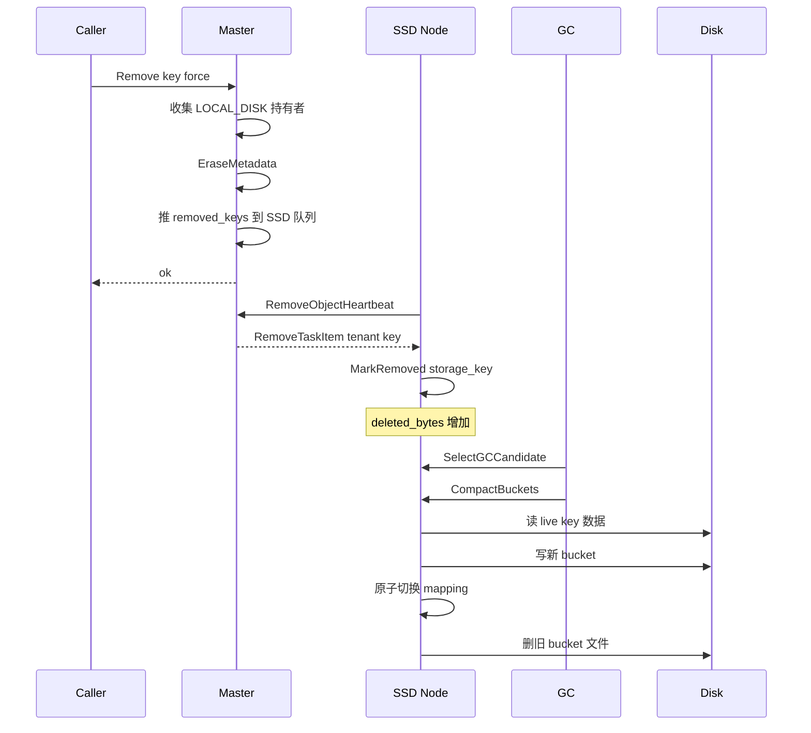
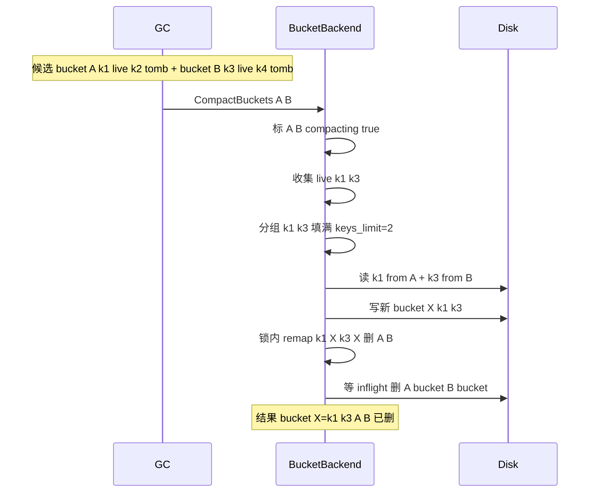

# SSD Explicit-Delete-Only GC for Bucket Storage Backend

- Status: Implemented
- Date: 2026-06-25 (updated 2026-06-27)
- Branch: `supercache_dev_ssd_remove`

## 1. Problem

Mooncake Store 的 `Remove` / `BatchRemove` 只删除 master 元数据，不回收
SSD bucket 文件空间。被删除 key 的数据留在 `.bucket` 文件里成为孤儿。

## 2. Constraints

1. 不启用 LRU/FIFO eviction 回收 SSD 空间。
2. 只给 `Remove` / `BatchRemove` 实现 SSD 回收。
3. 不改变现有接口签名。
4. 未删除 key 不能丢。
5. 并发一致性。
6. 跨 bucket 合并：多个稀疏 bucket 的 live key 合并到新 bucket。

## 3. Architecture

### 3.1 角色分离

- **调用方**（stress_cluster_bench / Python client）：发起 `Remove` /
  `BatchRemove`，只删 master metadata。
- **Master**：`Remove` / `BatchRemove` 时收集 `LOCAL_DISK` replica 持有者，
  将 `{tenant_id, key}` 推入该 client 的 `removed_keys` 队列。
- **SSD 存储节点**（`mooncake_client`）：`FileStorage::Heartbeat` 通过
  `RemoveObjectHeartbeat` RPC 从 master 拉取 removed keys，对每个 key 调
  `MarkRemoved` 标记 tombstone。后台 GC 线程 compact bucket 回收空间。

### 3.2 配置要求

```
MOONCAKE_OFFLOAD_BUCKET_EVICTION_POLICY=lru
MOONCAKE_OFFLOAD_DISABLE_SSD_EVICTION=true
```

`eviction_policy=LRU` 让 `BatchLoad` 更新 `last_access_ns_`（GC 冷热信号）。
`disable_ssd_eviction=true` 让 `PrepareEviction` 成为 no-op（不删 bucket）。

## 4. RemoveObjectHeartbeat RPC

### 4.1 数据结构

```cpp
struct RemoveTaskItem {
    std::string tenant_id;
    std::string key;
};
```

### 4.2 Master 侧

`LocalDiskSegment` 新增 `removed_keys` 队列（`segment.h`）。

`MasterService::Remove` 和 `BatchRemove` 在 `EraseMetadata` 前：
1. `VisitReplicas` 收集 `LOCAL_DISK` replica 持有者 `client_id`
2. `EraseMetadata` 删除 metadata
3. 对每个持有者，往 `removed_keys` 队列推入 `RemoveTaskItem{tenant_id, key}`

`MasterService::RemoveObjectHeartbeat(client_id)`：
- 查找 client 的 `LocalDiskSegment`
- 取出并清空 `removed_keys` 队列
- 返回 `vector<RemoveTaskItem>`

### 4.3 Client 侧

`FileStorage::Heartbeat` Step 0（在 offload heartbeat 之前）：
1. 调 `client_->RemoveObjectHeartbeat(client_->getClientId())`
2. 对每个返回的 `RemoveTaskItem`，构造 tenant-scoped storage key
3. 调 `storage_backend_->MarkRemoved(storage_key)`

### 4.4 RPC 注册

`rpc_service.cpp`：`register_handler<RemoveObjectHeartbeat>`
`master_client.cpp`：`invoke_rpc<RemoveObjectHeartbeat, vector<RemoveTaskItem>>`

## 5. MarkRemoved（tombstone 标记）

`BucketStorageBackend::MarkRemoved(key)`：
1. 持 `mutex_` 独占锁
2. 查 `object_bucket_map_`，找不到则返回（幂等）
3. 从 `object_bucket_map_` 删除 key（本地立即不可见）
4. `deleted_bytes_ += (data_size + key_size)`
5. 无磁盘 IO

## 6. GC Compaction

### 6.1 GC 线程

`GCThreadFunc` 在 `Init` 启动，`~BucketStorageBackend` 停止。
每 `gc_interval_ms` 扫一次候选。

### 6.2 候选收集

`GCThreadFunc` 持锁扫描 `buckets_`：
- `deleted_bytes_ > 0` 且 `compacting_ == false`
- `deleted_ratio >= gc_deleted_ratio`（或 `space_pressure` 强制）
- 受 `gc_max_buckets_per_round` 限制

### 6.3 CompactBuckets（跨 bucket 合并）

`CompactBuckets(bucket_ids, space_pressure)` 流程：

**Step 1 — 锁内收集 + 标记 compacting_：**
- 对每个旧 bucket 置 `compacting_ = true`
- 遍历 keys 收集 live key（在 `object_bucket_map_` 且 `bucket_id` 匹配）
- 记录 `{key, old_bucket_id, meta}`

**Step 1.5 — 删空 bucket：**
- 无 live key 的旧 bucket 立即删除（不等合并）

**Step 2 — 用 metadata 分组（无文件 IO）：**
- 按 `bucket_keys_limit` / `bucket_size_limit` 分组 live keys
- 第一组填满 → 继续；不够且无 `space_pressure` → 延迟到下轮

**Step 3 — 只读第一组的 key 数据：**
- 按 `old_bucket_id` 分组，每个旧 bucket 开一次文件
- `BucketReadGuard` 保护，`vector_read` 读 data

**Step 4 — 写新 bucket：**
- `BuildBucket` + `WriteBucket`

**Step 5 — 锁内原子切换（二次校验）：**
- 对新 bucket 每个 key 二次校验：仍在 `object_bucket_map_` 且
  `bucket_id` 指向旧 bucket → 重映射到新 bucket
- 有剩余 live key 的旧 bucket 重置 `compacting_`（下轮再 compact）
- 无剩余 live key 的旧 bucket 从 `buckets_` / `lru_index_` 删除

**Step 6 — 锁外删旧文件：**
- `WaitForInflightReads` + `DeleteBucketFiles`

### 6.4 CompactBucket（单 bucket 包装）

`CompactBucket(bucket_id)` 调 `CompactBuckets({bucket_id}, true)`，
`space_pressure=true` 强制写入即使不够填满。

## 7. Concurrency

| 场景 | 保证 |
|---|---|
| Remove vs BatchLoad | MarkRemoved 删 mapping（独占锁）；BatchLoad 查 mapping（共享锁）。最终一致。 |
| GC vs BatchLoad | 切换前旧 bucket 可读；切换后新读走新 bucket；旧文件等 inflight 归零再删。 |
| GC vs Remove | RemoveObjectHeartbeat 拉到的 key 调 MarkRemoved；GC Step 5 二次校验排除。 |
| GC vs BatchOffload | 新 offload 是新 bucket；duplicate 检查保护。 |
| GC vs GC | `compacting_` 标志防重入。 |

## 8. Configuration

| 环境变量 | 默认 | 说明 |
|---|---|---|
| `MOONCAKE_OFFLOAD_BUCKET_EVICTION_POLICY` | `none` | **必须设 `lru`** |
| `MOONCAKE_OFFLOAD_DISABLE_SSD_EVICTION` | `false` | **必须设 `true`** |
| `MOONCAKE_OFFLOAD_BUCKET_GC_ENABLE` | `true` | 启用后台 GC |
| `MOONCAKE_OFFLOAD_BUCKET_GC_INTERVAL_MS` | `1000` | GC 扫描间隔 |
| `MOONCAKE_OFFLOAD_BUCKET_GC_DELETED_RATIO` | `0.25` | compact 阈值 |
| `MOONCAKE_OFFLOAD_BUCKET_GC_HIGH_WATERMARK_RATIO` | `0.90` | 空间压力阈值 |
| `MOONCAKE_OFFLOAD_BUCKET_GC_MAX_BUCKETS_PER_ROUND` | `1` | 每轮最多收集旧 bucket 数 |
| `MOONCAKE_OFFLOAD_BUCKET_GC_MERGE_ENABLE` | `true` | 启用跨 bucket 合并 |

## 9. Sequence diagrams

参与者：`Caller`=调用方，`Master`=MasterService，`SSD Node`=mooncake_client，
`GC`=后台 GC 线程，`Disk`=SSD 文件。

### 9.1 Remove → tombstone → GC 回收



### 9.2 跨 bucket 合并



## 10. Testing

### 10.1 单元测试（storage_backend_test）

- `MarkRemoved` 隐藏 key + 幂等
- `CompactBucket` 回收删除 key + 保留 live key 数据
- 并发 MarkRemoved + BatchLoad
- `disable_ssd_eviction` 下空间不足 offload 失败
- `CrossBucketMergeCompaction`：2 bucket 合并到 1
- `MergeDeferredWhenNotFull`：不够填满延迟，space_pressure 强制

### 10.2 集成测试（gc_e2e_test）

- `RemoveReclaimsSSDSpace`：put 2 key, remove 1, GC 回收
- `RemoveMiddleKeyPreservesSurvivors`：survivor 数据完整
- `BatchRemoveMixedExistingAndAbsent`：batch remove + 存在/不存在 key

## 11. Open questions

- 无。
