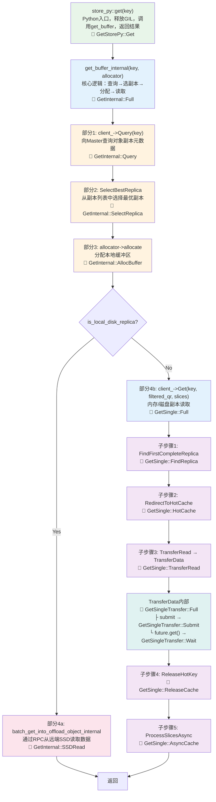
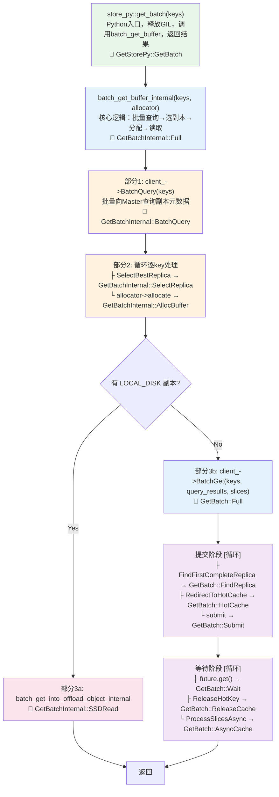

## 打点流程图

### `get` 流程

```mermaid
flowchart TB
    Start["store_py::get(key)<br/>Python入口，释放GIL，调用get_buffer，返回结果<br/>🔑 GetStorePy::Get"] --> Internal["get_buffer_internal(key, allocator)<br/>核心逻辑：查询→选副本→分配→读取<br/>🔑 GetInternal::Full"]

    Internal --> QueryPart["部分1: client_->Query(key)<br/>向Master查询对象副本元数据<br/>🔑 GetInternal::Query"]
    QueryPart --> SelectPart["部分2: SelectBestReplica<br/>从副本列表中选择最优副本<br/>🔑 GetInternal::SelectReplica"]
    SelectPart --> AllocPart["部分3: allocator->allocate<br/>分配本地缓冲区<br/>🔑 GetInternal::AllocBuffer"]

    AllocPart --> CheckDisk{is_local_disk_replica?}

    CheckDisk -->|Yes| SSDPart["部分4a: batch_get_into_offload_object_internal<br/>通过RPC从远端SSD读取数据<br/>🔑 GetInternal::SSDRead"]
    SSDPart --> Done["返回"]

    CheckDisk -->|No| ClientGetPart["部分4b: client_->Get(key, filtered_qr, slices)<br/>内存/磁盘副本读取<br/>🔑 GetSingle::Full"]

    ClientGetPart --> FindReplica["子步骤1: FindFirstCompleteReplica<br/>🔑 GetSingle::FindReplica"]
    FindReplica --> HotCache["子步骤2: RedirectToHotCache<br/>🔑 GetSingle::HotCache"]
    HotCache --> TransferRead["子步骤3: TransferRead → TransferData<br/>🔑 GetSingle::TransferRead"]
    TransferRead --> TransferDetail["TransferData内部<br/>🔑 GetSingleTransfer::Full<br/>├ submit → GetSingleTransfer::Submit<br/>└ future.get() → GetSingleTransfer::Wait"]
    TransferDetail --> ReleaseCache["子步骤4: ReleaseHotKey<br/>🔑 GetSingle::ReleaseCache"]
    ReleaseCache --> AsyncUpdate["子步骤5: ProcessSlicesAsync<br/>🔑 GetSingle::AsyncCache"]
    AsyncUpdate --> Done

    style Start fill:#e8f5e9
    style Internal fill:#e3f2fd
    style QueryPart fill:#fff3e0
    style SelectPart fill:#fff3e0
    style AllocPart fill:#fff3e0
    style SSDPart fill:#fce4ec
    style ClientGetPart fill:#e3f2fd
    style FindReplica fill:#f3e5f5
    style HotCache fill:#f3e5f5
    style TransferRead fill:#f3e5f5
    style TransferDetail fill:#e0f2f1
    style ReleaseCache fill:#f3e5f5
    style AsyncUpdate fill:#f3e5f5
```

### `get_batch` 流程

```mermaid
flowchart TB
    Start["store_py::get_batch(keys)<br/>Python入口，释放GIL，调用batch_get_buffer，返回结果<br/>🔑 GetStorePy::GetBatch"] --> Internal["batch_get_buffer_internal(keys, allocator)<br/>核心逻辑：批量查询→选副本→分配→读取<br/>🔑 GetBatchInternal::Full"]

    Internal --> QueryPart["部分1: client_->BatchQuery(keys)<br/>批量向Master查询副本元数据<br/>🔑 GetBatchInternal::BatchQuery"]
    QueryPart --> LoopPart["部分2: 循环逐key处理<br/>├ SelectBestReplica → GetBatchInternal::SelectReplica<br/>└ allocator->allocate → GetBatchInternal::AllocBuffer"]

    LoopPart --> CheckDisk{有 LOCAL_DISK 副本?}

    CheckDisk -->|Yes| SSDPart["部分3a: batch_get_into_offload_object_internal<br/>🔑 GetBatchInternal::SSDRead"]

    CheckDisk -->|No| BatchGetPart["部分3b: client_->BatchGet(keys, query_results, slices)<br/>🔑 GetBatch::Full"]

    BatchGetPart --> SubmitLoop["提交阶段 [循环]<br/>├ FindFirstCompleteReplica → GetBatch::FindReplica<br/>├ RedirectToHotCache → GetBatch::HotCache<br/>└ submit → GetBatch::Submit"]
    SubmitLoop --> WaitLoop["等待阶段 [循环]<br/>├ future.get() → GetBatch::Wait<br/>├ ReleaseHotKey → GetBatch::ReleaseCache<br/>└ ProcessSlicesAsync → GetBatch::AsyncCache"]

    SSDPart --> Done["返回"]
    WaitLoop --> Done

    style Start fill:#e8f5e9
    style Internal fill:#e3f2fd
    style QueryPart fill:#fff3e0
    style LoopPart fill:#fff3e0
    style SSDPart fill:#fce4ec
    style BatchGetPart fill:#e3f2fd
    style SubmitLoop fill:#f3e5f5
    style WaitLoop fill:#f3e5f5
```

