# Mooncake Transfer Engine 深度解析

本文基于源码详细讲解 Mooncake Transfer Engine（TE）的初始化流程、读写机制以及 URMA 通信原理。

---

## 目录

1. [整体架构概览](#1-整体架构概览)
2. [核心数据结构](#2-核心数据结构)
3. [初始化流程](#3-初始化流程)
4. [内存注册](#4-内存注册)
5. [读写流程](#5-读写流程)
6. [URMA 通信详解](#6-urma-通信详解)
7. [连接建立与握手](#7-连接建立与握手)
8. [完成与状态查询](#8-完成与状态查询)

---

## 1. 整体架构概览

Transfer Engine 采用**数据面与控制面分离**的分层设计。自顶向下可以理解为：用户 API 层、实现/调度层、传输后端层，以及负责发现、握手和段信息发布的元数据控制面。

```
┌─────────────────────────────────────────────────────────┐
│                   用户 API 层                            │
│              TransferEngine (门面类)                     │
├─────────────────────────────────────────────────────────┤
│                   实现层                                 │
│          TransferEngineImpl + MultiTransport            │
├──────────┬──────────┬──────────┬──────────┬─────────────┤
│ RDMA     │ TCP      │ UB/URMA  │ CXL      │ NVLink/...  │
│Transport │Transport │Transport │Transport │ Transport   │
├──────────┴──────────┴──────────┴──────────┴─────────────┤
│          TransferMetadata / Handshake (控制面)            │
│          etcd / HTTP / Redis / P2P Handshake            │
└─────────────────────────────────────────────────────────┘
```

**核心类关系：**

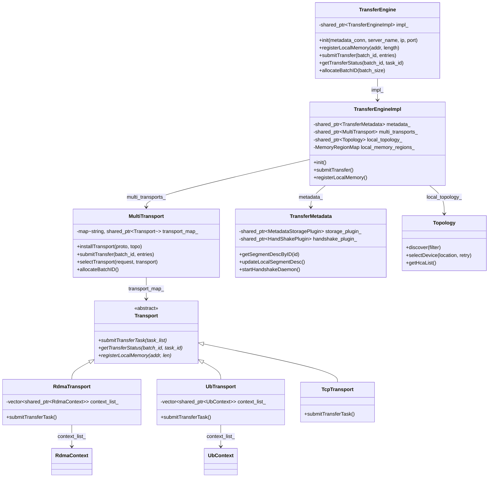

### 源码位置索引

| 组件 | 头文件 | 实现文件 |
|------|--------|----------|
| TransferEngine | `include/transfer_engine.h:42` | `src/transfer_engine.cpp:22` |
| TransferEngineImpl | `include/transfer_engine_impl.h:54` | `src/transfer_engine_impl.cpp:77` |
| MultiTransport | `include/multi_transport.h:23` | `src/multi_transport.cpp:69` |
| Transport (基类) | `include/transport/transport.h:42` | - |
| RdmaTransport | `include/transport/rdma_transport/rdma_transport.h:41` | `src/transport/rdma_transport/rdma_transport.cpp:60` |
| UbTransport | `include/transport/kunpeng_transport/ub_transport.h` | `src/transport/kunpeng_transport/ub_transport.cpp:25` |
| TransferMetadata | `include/transfer_metadata.h:43` | - |

---

## 2. 核心数据结构

> 本节代码片段用于说明字段职责，保留了主路径相关字段；实际源码还包含不同编译选项下的扩展字段。

### 2.1 TransferRequest — 传输请求

```cpp
// transport.h:58-67
struct TransferRequest {
    enum OpCode { READ, WRITE };
    OpCode opcode;        // 读或写
    void *source;         // 本地内存地址
    SegmentID target_id;  // 目标段 ID
    uint64_t target_offset; // 目标偏移
    size_t length;        // 传输长度
    int advise_retry_cnt = 0;
};
```

### 2.2 Slice — 传输切片

大块传输被拆分为多个 Slice，每个 Slice 是一次 RDMA/URMA 操作的基本单位。

```cpp
// transport.h:104-238
struct Slice {
    void *source_addr;
    size_t length;
    TransferRequest::OpCode opcode;
    SegmentID target_id;
    SliceStatus status;  // PENDING -> POSTED -> SUCCESS/FAILED

    union {
        struct { /* rdma */ uint64_t dest_addr; uint32_t source_lkey;
                 uint32_t dest_rkey; volatile int *qp_depth; ... } rdma;
        struct { /* ub/urma */ uint64_t dest_addr; volatile int *jetty_depth;
                 void *r_seg; void *l_seg; ... } ub;
        struct { /* tcp */ uint64_t dest_addr; } tcp;
        // ... 其他传输类型
    };
};
```

### 2.3 TransferTask — 传输任务

一个 TransferRequest 对应一个 TransferTask，包含多个 Slice。

```cpp
// transport.h:281-312
struct TransferTask {
    volatile uint64_t slice_count = 0;
    volatile uint64_t success_slice_count = 0;
    volatile uint64_t failed_slice_count = 0;
    volatile uint64_t transferred_bytes = 0;
    volatile bool is_finished = false;
    uint64_t total_bytes = 0;
    BatchID batch_id = 0;
    const TransferRequest *request = nullptr;
    std::vector<Slice *> slice_list;

#ifdef USE_EVENT_DRIVEN_COMPLETION
    volatile uint64_t completed_slice_count = 0;
#endif
};
```

### 2.4 BatchDesc — 批次描述符

```cpp
// transport.h:314-335
struct BatchDesc {
    BatchID id;                           // 即 BatchDesc 指针本身
    size_t batch_size;
    std::vector<TransferTask> task_list;
    void *context;                        // 供具体 transport 扩展
    int64_t start_timestamp;
    std::atomic<bool> has_failure{false};
    std::atomic<bool> is_finished{false};
    std::atomic<uint64_t> finished_transfer_bytes{0};

#ifdef USE_EVENT_DRIVEN_COMPLETION
    std::atomic<uint64_t> finished_task_count{0};
    std::mutex completion_mutex;
    std::condition_variable completion_cv;
#endif
};
```

> **BatchID 本质上是 BatchDesc 指针的整型表示**（`transport.h:98-100`）：
> ```cpp
> static inline BatchDesc &toBatchDesc(BatchID id) {
>     return *reinterpret_cast<BatchDesc *>(id);
> }
> ```

### 2.5 SegmentDesc — 段描述符

```cpp
// transfer_metadata.h:88-108
struct SegmentDesc {
    std::string name;                  // 段名（通常是 ip:port）
    std::string protocol;              // "rdma" / "ub" / "tcp" 等
    std::vector<DeviceDesc> devices;   // 网卡设备列表
    Topology topology;                 // 拓扑选择矩阵
    std::vector<BufferDesc> buffers;   // 已注册的内存区
    std::vector<NVMeoFBufferDesc> nvmeof_buffers;
    std::string cxl_name;
    uint64_t cxl_base_addr;
    RankInfoDesc rank_info;            // Ascend 场景
    int tcp_data_port;
};
```

数据结构之间的关系：

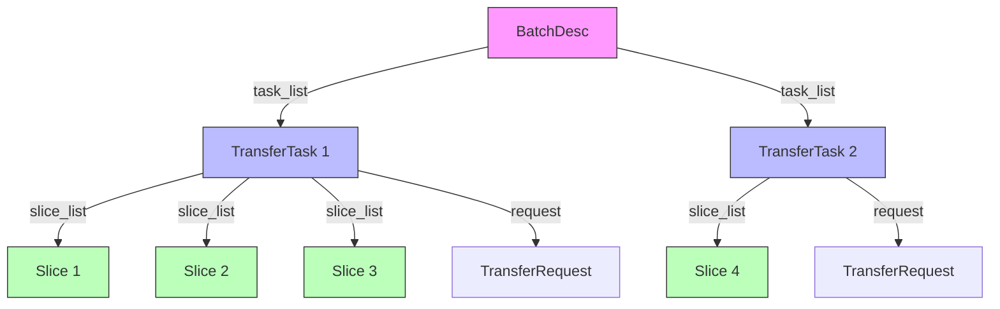

---

## 3. 初始化流程

### 3.1 整体初始化时序

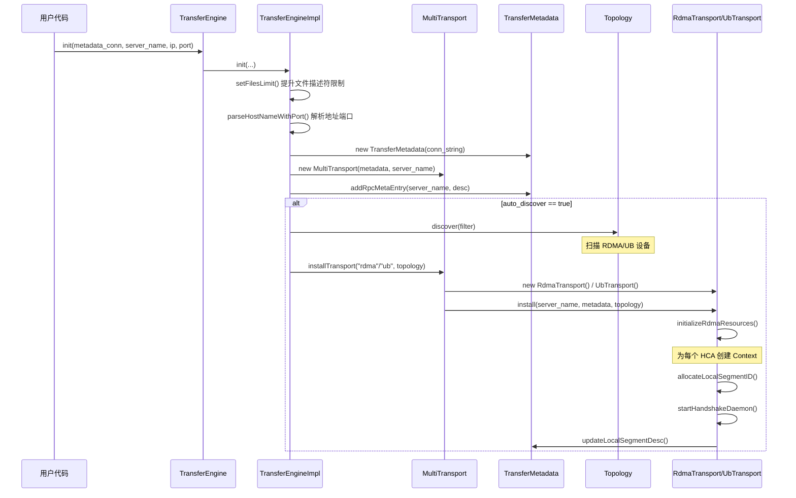

### 3.2 逐步详解

#### 步骤 1：构造 TransferEngine

```cpp
// transfer_engine.cpp:22-24
TransferEngine::TransferEngine(bool auto_discover)
    : impl_(std::make_shared<TransferEngineImpl>(auto_discover)) {}
```

`TransferEngine` 是纯门面类，所有调用直接转发给 `TransferEngineImpl`。

#### 步骤 2：调用 init()

源码位于 `transfer_engine_impl.cpp:77-368`，核心步骤：

1. **提升系统资源限制**：调用 `setFilesLimit()` 将 RLIMIT_NOFILE 提升到最大值。

2. **解析地址端口**：
   ```cpp
   auto [host_name, port] = parseHostNameWithPort(local_server_name);
   local_server_name_ = local_server_name;
   ```

3. **配置 RPC 描述符**：
   - Legacy/P2P 模式：使用 `local_server_name` 中指定的端口
   - 新模式：自动发现本机 IP + 随机端口

4. **创建元数据管理器**：
   ```cpp
   metadata_ = std::make_shared<TransferMetadata>(metadata_conn_string);
   ```
   支持的后端：`etcd://`、`http://`、`redis://`、`P2PHANDSHAKE`。

5. **创建多传输管理器**：
   ```cpp
   multi_transports_ = std::make_shared<MultiTransport>(metadata_, local_server_name_);
   ```

6. **注册 RPC 元数据条目**：
   ```cpp
   metadata_->addRpcMetaEntry(local_server_name_, desc);
   ```

7. **自动拓扑发现与传输安装**（`auto_discover_ == true` 时）：

   ```mermaid
   flowchart TD
    A[auto_discover?] -->|Yes| B[Topo.discover]
    B --> C{有 HCA 设备?}
    C -->|Yes, USE_UB| D[installTransport 'ub']
    C -->|Yes, RDMA| E[installTransport 'rdma']
    C -->|No, MC_FORCE_TCP| F[installTransport 'tcp']
    C -->|Yes, NVLink| G[installTransport 'nvlink']
    D --> H[initializeUbResources]
    E --> I[initializeRdmaResources]
    H --> J[allocateLocalSegmentID]
    I --> J
    J --> K[startHandshakeDaemon]
    K --> L[updateLocalSegmentDesc]
   ```

   设备选择逻辑（`transfer_engine_impl.cpp:236-364`）可以按优先级理解：
   - `USE_ASCEND` / `USE_ASCEND_DIRECT` → 直接安装 Ascend 传输，跳过普通自动发现路径
   - `USE_UBSHMEM` → 安装 `ubshmem`，并关闭普通 `auto_discover_`
   - `USE_CXL` 且设置 `MC_CXL_DEV_PATH` → 额外安装 `CxlTransport`
   - `auto_discover_ == true` → 自动发现或解析 `MC_CUSTOM_TOPO_JSON`
   - `USE_UB` → 安装 `UbTransport`（URMA）
   - `USE_ASCEND_HETEROGENEOUS` → 安装异构 Ascend 传输
   - `USE_MACA` → 安装 MACA 传输
   - `USE_MNNVL` / `USE_INTRA_NVLINK` → 根据 `MC_FORCE_MNNVL`、`MC_INTRANODE_NVLINK` 和 HCA 是否存在选择 `nvlink`、`nvlink_intra` 或 RDMA
   - 默认路径：检测到 HCA 且未设置 `MC_FORCE_TCP`，或设置了 `MC_FORCE_HCA` → 安装 `RdmaTransport`；否则安装 `TcpTransport`
   - `USE_HIP` → 额外安装 HIP GPU P2P 传输，可与跨节点 RDMA/TCP 路径共存

### 3.3 Transport 安装流程

以 `RdmaTransport` 为例（`rdma_transport.cpp:92-130`）：

```cpp
int RdmaTransport::install(string &local_server_name,
                           shared_ptr<TransferMetadata> meta,
                           shared_ptr<Topology> topo) {
    metadata_ = meta;
    local_server_name_ = local_server_name;
    local_topology_ = topo;

    // 1. 初始化 RDMA 资源（为每个 HCA 创建 Context）
    ret = initializeRdmaResources();

    // 2. 分配本地段 ID
    ret = allocateLocalSegmentID();

    // 3. 启动握手守护线程
    ret = startHandshakeDaemon(local_server_name);

    // 4. 发布段描述符到元数据服务
    ret = metadata_->updateLocalSegmentDesc();
}
```

`initializeRdmaResources()` 的实现（`rdma_transport.cpp:651-672`）：

```cpp
int RdmaTransport::initializeRdmaResources() {
    auto hca_list = local_topology_->getHcaList();
    for (auto &device_name : hca_list) {
        auto context = make_shared<RdmaContext>(*this, device_name);
        int ret = context->construct(
            config.num_cq_per_ctx,       // CQ 数量
            config.num_comp_channels_per_ctx,
            config.port,                  // IB 端口 (默认1)
            config.gid_index,             // GID 索引
            config.max_cqe,               // 最大 CQE 数
            config.max_ep_per_ctx         // 最大端点数
        );
        if (ret)
            local_topology_->disableDevice(device_name);
        else
            context_list_.push_back(context);
    }
}
```

**RdmaContext 的构造**（`rdma_context.h:65-228`）为每个 RDMA NIC 分配：
- `ibv_context` — 设备上下文
- `ibv_pd` — Protection Domain
- CQ 列表（`RdmaCq`） — 完成队列
- Completion Channel — 事件通知通道
- Endpoint Store — 连接端点管理

---

## 4. 内存注册

### 4.1 注册流程

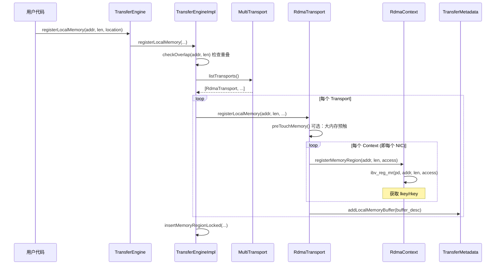

### 4.2 RDMA 内存注册细节

```cpp
// rdma_transport.cpp:182-303
int RdmaTransport::registerLocalMemoryInternal(void *addr, size_t length, ...) {
    const int kBaseAccessRights = IBV_ACCESS_LOCAL_WRITE |
                                  IBV_ACCESS_REMOTE_WRITE |
                                  IBV_ACCESS_REMOTE_READ;

    // 可选：大内存（>4GB）并行预触
    if (context_list_.size() > 0 && length >= 4GB) {
        preTouchMemory(addr, length);  // 多线程 mmap 触页
    }

    // 并行或串行注册
    for (auto &context : context_list_) {
        context->registerMemoryRegion(addr, length, access_rights);
        // 底层调用 ibv_reg_mr()
    }

    // 收集所有 context 的 lkey/rkey
    for (auto &context : context_list_) {
        buffer_desc.lkey.push_back(context->lkey(addr));
        buffer_desc.rkey.push_back(context->rkey(addr));
    }

    // 添加到元数据
    metadata_->addLocalMemoryBuffer(buffer_desc, update_metadata);
}
```

### 4.3 URMA 内存注册

```cpp
// ub_transport.cpp:83-123
int UbTransport::registerLocalMemory(void *addr, size_t length, ...) {
    for (auto &context : context_list_) {
        // 注册内存段，获取 target segment (tseg)
        context->registerMemoryRegion((uint64_t)addr, length);
        // 构建包含 tseg 信息的 buffer 描述符
        context->buildLocalBufferDesc((uint64_t)addr, buffer_desc);
    }
    metadata_->addLocalMemoryBuffer(buffer_desc, update_metadata);
}
```

URMA 底层调用 `urma_register_seg()` 注册内存，生成的 `tseg`（target segment）用于后续的远程内存访问。

---

## 5. 读写流程

### 5.1 写操作完整时序

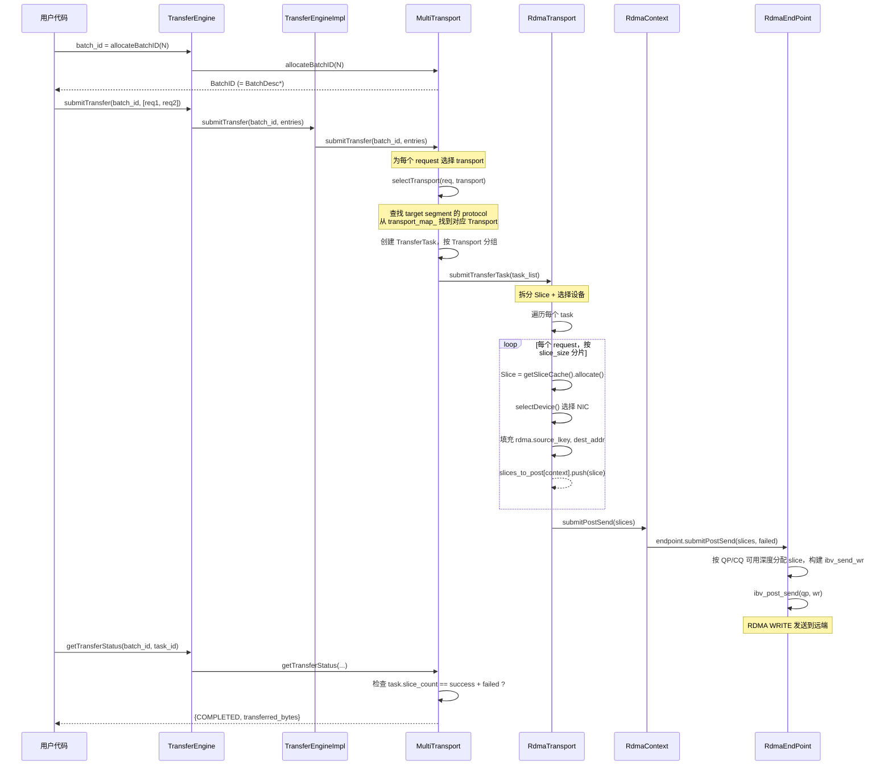

### 5.2 submitTransferTask 详解

以 RDMA 传输为例（`rdma_transport.cpp:456-574`）：

```cpp
Status RdmaTransport::submitTransferTask(
    const vector<TransferTask*> &task_list) {

    unordered_map<shared_ptr<RdmaContext>, vector<Slice*>> slices_to_post;
    const size_t kBlockSize = globalConfig().slice_size;  // 默认 ~1MB

    for (auto &task : task_list) {
        auto &request = *task->request;

        // 1. 尝试整体选择 device（优化：整个 request 用同一个 NIC）
        selectDevice(local_segment_desc, (uint64_t)request.source,
                     request.length, request_buffer_id, request_device_id);

        // 2. 按 slice_size 分片
        for (uint64_t offset = 0; offset < request.length; offset += kBlockSize) {
            Slice *slice = getSliceCache().allocate();
            slice->source_addr = (char*)request.source + offset;
            slice->length = merge_final ? request.length - offset : kBlockSize;
            slice->opcode = request.opcode;
            slice->rdma.dest_addr = request.target_offset + offset;

            // 3. 选择目标设备（确定用哪个 NIC）
            selectDevice(local_segment_desc, (uint64_t)slice->source_addr,
                         slice->length, buffer_id, device_id);

            // 4. 填充 RDMA 密钥
            slice->rdma.source_lkey =
                local_segment_desc->buffers[buffer_id].lkey[device_id];

            // 5. 按设备分组
            slices_to_post[context_list_[device_id]].push_back(slice);
            task.slice_count++;

            // 6. 达到水位线时提前提交
            if (nr_slices >= kSubmitWatermark) {
                context->submitPostSend(entry.second);
                slices_to_post.clear();
            }
        }
    }
    // 7. 提交剩余 slices
    for (auto &entry : slices_to_post)
        entry.first->submitPostSend(entry.second);
}
```

### 5.3 Slice 分片策略

```
TransferRequest: length = 3.5 MB, slice_size = 1 MB
                ┌──────┐──────┐──────┐─────┐
                │ 1 MB │ 1 MB │ 1 MB │0.5MB│
                └──────┘──────┘──────┘─────┘
                 Slice0  Slice1  Slice2  Slice3

fragment_limit 控制最后一个分片的合并策略：
若剩余长度 <= slice_size + fragment_limit，则合并为一个 Slice
```

### 5.4 RDMA submitPostSend

```cpp
// rdma_endpoint.h:144
int RdmaEndPoint::submitPostSend(vector<Slice*> &slice_list,
                                  vector<Slice*> &failed_slice_list) {
    // 1. 根据 QP 深度和 CQ 剩余容量，把 slice 分配到可用 QP
    int cq_remaining = globalConfig().max_cqe - *cq_outstanding_;
    int qp_avail = max_wr_depth_ - wr_depth_list_[qp_index];

    // 2. 构建工作请求
    ibv_send_wr wr;
    wr.opcode = (opcode == WRITE) ? IBV_WR_RDMA_WRITE : IBV_WR_RDMA_READ;
    wr.wr.rdma.remote_addr = slice->rdma.dest_addr;
    wr.wr.rdma.rkey = dest_rkey;
    wr.sg_list = &sge;  // {addr=source_addr, lkey, length}

    // 3. 批量提交到硬件，并更新 QP/CQ outstanding 计数
    ibv_post_send(qp_list_[qp_index], &wr, &bad_wr);
}
```

当前实现不是简单 round-robin。`RdmaEndPoint::submitPostSend()` 会综合 `max_wr_depth_`、每个 QP 的 `wr_depth_list_` 和 CQ 的 outstanding 数，把待发送 slice 分 chunk 分发到多个 QP；如果 `ibv_post_send()` 部分失败，则把失败 slice 放入 `failed_slice_list`，后续由 worker 侧重试或标记失败。

### 5.5 URMA submitPostSend

```cpp
// urma_endpoint.h 中
int UrmaEndpoint::submitPostSend() {
    // 1. 随机选择一个 Jetty
    int jetty_index = SimpleRandom::Get().next(jetty_list_.size());

    // 2. 构建工作请求
    urma_jfs_wr_t wr;
    wr.opcode = (opcode == WRITE) ? URMA_OPC_WRITE : URMA_OPC_READ;
    wr.rw.src.sge[0].addr = slice->source_addr;
    wr.rw.src.sge[0].tseg = slice->ub.l_seg;    // 本地 segment
    wr.rw.dst.sge[0].addr = slice->ub.dest_addr;
    wr.rw.dst.sge[0].tseg = slice->ub.r_seg;    // 远端 segment
    wr.tjetty = remote_jetty;                     // 远端 Jetty 引用

    // 3. 提交到硬件
    urma_post_jetty_send_wr(jetty, &wr);
}
```

URMA 路径同样有 outstanding 深度控制和失败重试。当前源码中 Jetty 选择是随机选择，不是 round-robin；完成事件由 `UbWorkerPool` 轮询 JFC 后调用 `markSuccess()` 或进入失败重试路径。

### 5.6 设备选择策略

`selectDevice()` 的核心逻辑（`rdma_transport.cpp:684-698`）：

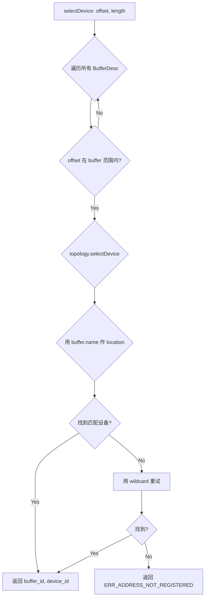

Topology 的选择矩阵会根据内存位置（NUMA node / GPU）优先选择距离最近的 NIC，减少跨 NUMA 访问。

---

## 6. URMA 通信详解

### 6.1 URMA 是什么

**URMA (Unified Remote Memory Access)** 是华为鲲鹏 (Kunpeng) 处理器专有的高速互联通信框架，基于 **UB (Unified Bus)** 总线。它提供了类似 RDMA 的编程模型，但针对鲲鹏芯片架构进行了深度优化。

核心概念映射：

| RDMA 概念 | URMA 对应 | 说明 |
|-----------|-----------|------|
| QP (Queue Pair) | Jetty | 通信通道 |
| CQ (Completion Queue) | JFC (Jetty Factory Completion) | 完成队列 |
| MR (Memory Region) | Segment (tseg) | 注册内存区 |
| ibv_post_send | urma_post_jetty_send_wr | 提交工作请求 |
| ibv_poll_cq | urma_poll_jfc | 轮询完成 |
| LID/GID | EID (Endpoint ID) | 设备地址标识 |

### 6.2 URMA 架构层次

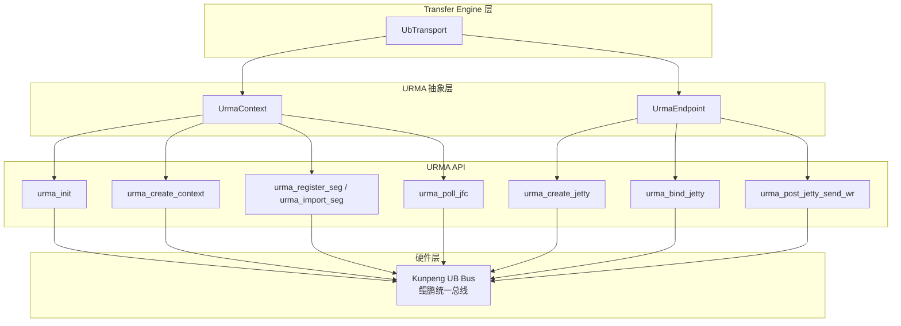

### 6.3 UrmaContext 初始化

```cpp
// urma_endpoint.h:50-147
class UrmaContext : public UbContext {
    urma_context_t *urma_ctx_;          // URMA 上下文
    vector<urma_jfc_t> jfc_list_;       // 完成队列列表
    vector<urma_jfr_t> jfr_list_;       // 接收队列列表
    vector<urma_jfce_t> jfce_list_;     // 完成事件队列
    map<uintptr_t, urma_tseg_t*> local_tsegs_;   // 本地注册段
    map<string, void*> imported_segs_;            // 导入的远端段
};

UrmaContext::construct(GlobalConfig &config) {
    // 1. 创建完成事件队列 (JFCE)
    urma_create_jfce(ctx, &jfce);

    // 2. 创建完成队列 (JFC)
    urma_create_jfc(ctx, jfce, &jfc);

    // 3. 注册 EID
    urma_register_eid_by_index(ctx, eid_index, &eid);

    // 4. 启动后台工作线程池
    worker_pool_->start();
}
```

### 6.4 UrmaEndpoint 连接管理

```cpp
// urma_endpoint.h:150-196
class UrmaEndpoint : public UbEndPoint {
    vector<urma_jetty_t> jetties_;           // Jetty 列表（类似 QP）
    map<string, urma_tjetty_t> imported_jetties_; // 远端 Jetty 引用
};
```

Jetty 配置参数：
```cpp
urma_jetty_attr_t attr;
attr.depth = 2048;                    // 最大工作请求数
attr.trans_mode = URMA_TM_RC;         // 可靠连接模式
attr.priority = 15;
attr.max_sge = 5;                     // 最大 SGE 数
attr.rnr_retry = 7;
attr.err_timeout = 17;
```

### 6.5 URMA 数据传输流程

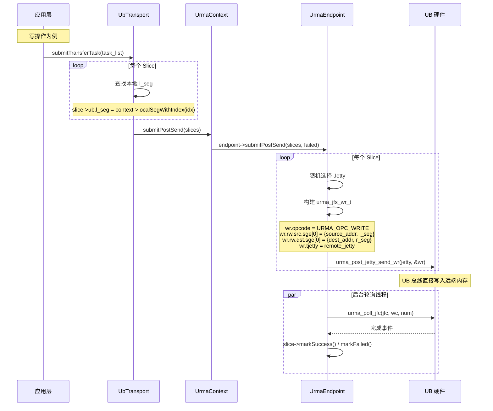

### 6.6 URMA 内存操作

**本地注册：**
```cpp
int UrmaContext::registerMemoryRegion(uint64_t va, size_t length) {
    urma_seg_attr_t attr;
    attr.va = va;
    attr.len = length;
    attr.cacheable = URMA_NON_CACHEABLE;
    attr.access = URMA_ACCESS_READ | URMA_ACCESS_WRITE | URMA_ACCESS_ATOMIC;
    attr.token_policy = URMA_TOKEN_NONE;

    urma_tseg_t *tseg;
    urma_register_seg(urma_ctx_, &attr, tseg);
    local_tsegs_[va] = tseg;  // 缓存用于后续查找
}
```

**远端导入：**
```cpp
void* UrmaContext::retrieveRemoteSeg(const string &remoteSegmentStr) {
    // 反序列化远端 segment 信息
    urma_import_attr_t attr;
    attr.cacheable = URMA_NON_CACHEABLE;
    attr.access = URMA_ACCESS_READ | URMA_ACCESS_WRITE;
    attr.mapping = URMA_SEG_NOMAP;

    urma_tseg_t *tseg;
    urma_import_seg(urma_ctx_, &attr, tseg);
    imported_segs_[remoteSegmentStr] = tseg;
}
```

远端 segment 信息通过元数据服务交换，在 Slice 提交时通过 `slice->ub.r_seg` 引用。

### 6.7 完成轮询

URMA 的完成轮询运行在后台线程中：

```cpp
// 工作线程循环
while (running) {
    urma_wc_t wc[kBatchSize];
    int count = urma_poll_jfc(jfc, wc, kBatchSize);

    for (int i = 0; i < count; i++) {
        Slice *slice = (Slice*)wc[i].user_ctx;
        if (wc[i].status == URMA_WC_SUCCESS)
            slice->markSuccess();
        else
            slice->markFailed();
    }
}
```

---

## 7. 连接建立与握手

### 7.1 握手协议

Transfer Engine 使用基于 RPC 的握手协议建立连接，而非 RDMA CM。

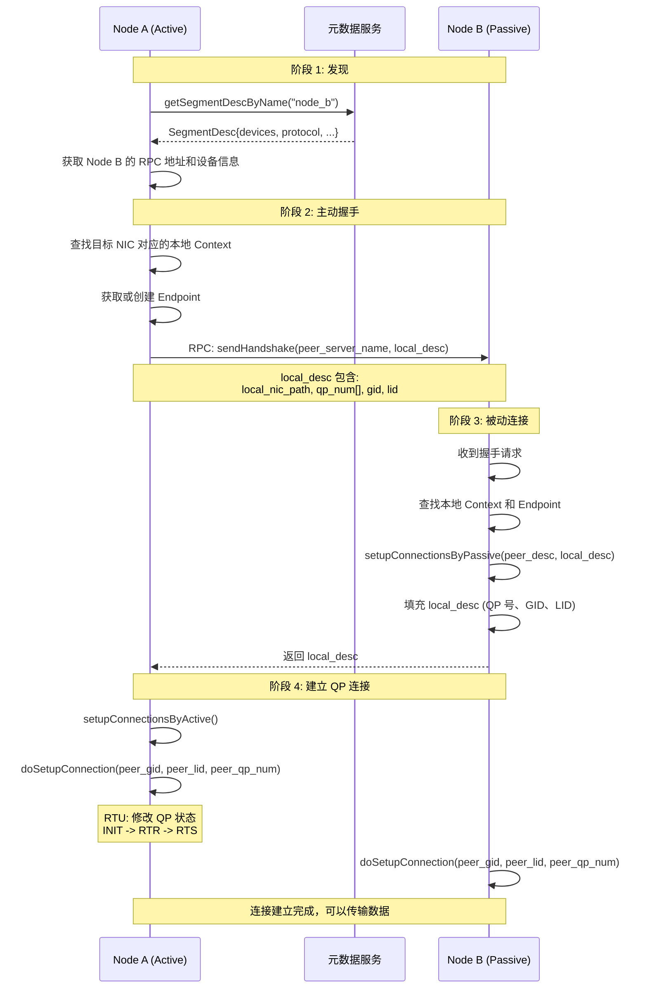

### 7.2 RDMA QP 状态转换

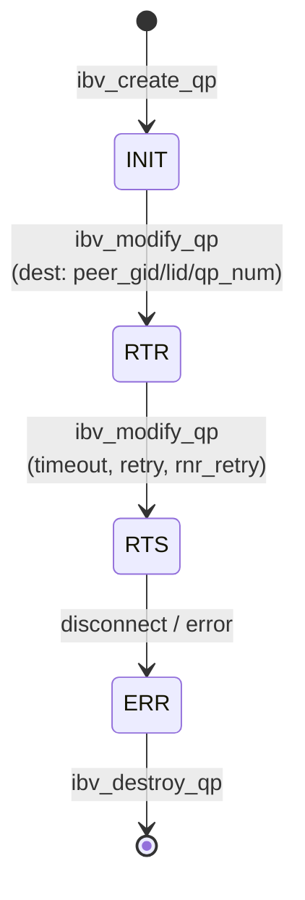

`doSetupConnection` 的实现（`rdma_endpoint.cpp`）：

```cpp
int RdmaEndPoint::doSetupConnection(int qp_index,
    const ibv_gid &peer_gid, uint16_t peer_lid, uint32_t peer_qp_num) {

    // QP: INIT -> RTR (Ready to Receive)
    ibv_qp_attr attr;
    attr.qp_state = IBV_QPS_RTR;
    attr.path_mtu = IBV_MTU_4096;
    attr.dest_qp_num = peer_qp_num;
    attr.rq_psn = 0;
    attr.ah_attr.dlid = peer_lid;
    attr.ah_attr.dgid = peer_gid;
    ibv_modify_qp(qp, &attr, IBV_QP_STATE | IBV_QP_PATH_MTU | ...);

    // QP: RTR -> RTS (Ready to Send)
    attr.qp_state = IBV_QPS_RTS;
    attr.sq_psn = 0;
    attr.timeout = 14;
    attr.retry_cnt = 7;
    attr.rnr_retry = 7;
    ibv_modify_qp(qp, &attr, IBV_QP_STATE | IBV_QP_TIMEOUT | ...);
}
```

### 7.3 URMA Jetty 连接建立

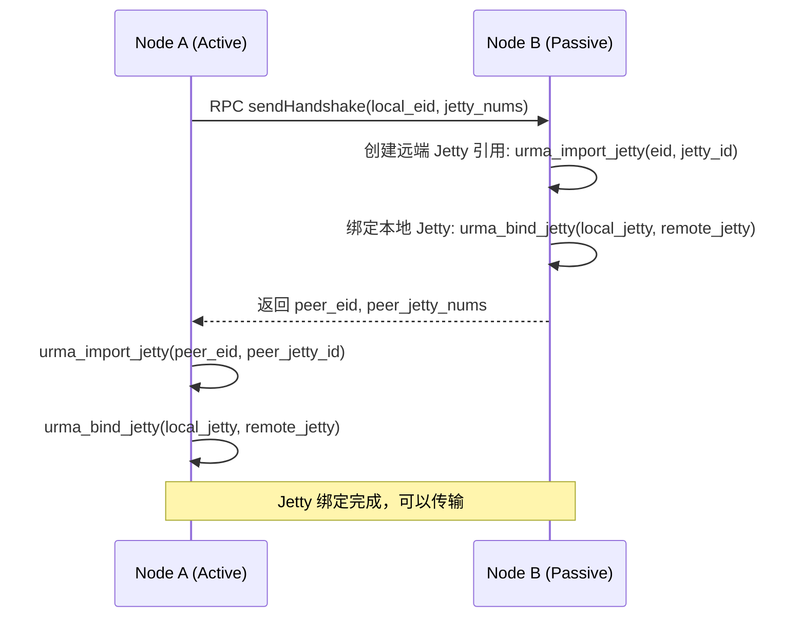

---

## 8. 完成与状态查询

### 8.1 默认完成机制：轮询聚合

默认情况下，worker 线程负责轮询底层完成队列：
- RDMA 路径调用 `ibv_poll_cq()`，根据 `ibv_wc.status` 判断成功或失败。
- URMA 路径调用 `urma_poll_jfc()`，根据 completion record 判断成功或失败。
- 成功时 `Slice::markSuccess()` 增加 `transferred_bytes` 和 `success_slice_count`。
- 失败时 `Slice::markFailed()` 增加 `failed_slice_count`。

用户侧通过 `getTransferStatus()` 查询单个 task，或通过 `getBatchTransferStatus()` 聚合整个 batch 的状态。未开启事件驱动完成时，batch 完成状态主要在这些查询函数中被聚合出来。

### 8.2 可选事件驱动完成机制

如果编译时启用了 `USE_EVENT_DRIVEN_COMPLETION`，`Slice::check_batch_completion()` 会在最后一个 slice 完成时推进 task/batch 级计数，并通过条件变量唤醒等待者。该路径适合 `submitTransferWithNotify()` 等需要完成后触发通知的场景。

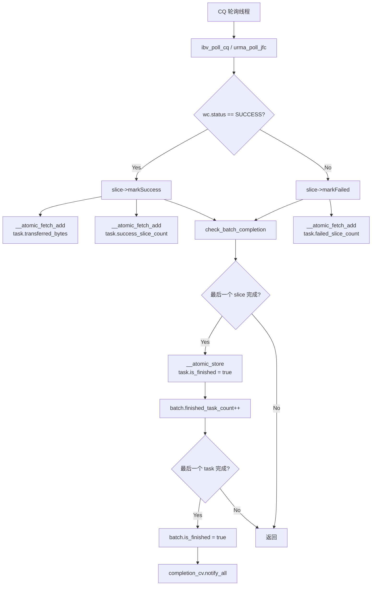

### 8.3 用户侧状态查询

```cpp
// multi_transport.cpp:190-227
Status MultiTransport::getTransferStatus(BatchID batch_id, size_t task_id,
                                         TransferStatus &status) {
    auto &task = batch_desc.task_list[task_id];
    status.transferred_bytes = task.transferred_bytes;

    uint64_t success = task.success_slice_count;
    uint64_t failed = task.failed_slice_count;

    if (success + failed == task.slice_count) {
        status.s = failed ? FAILED : COMPLETED;
        task.is_finished = true;
    } else {
        // 超时检测
        if (globalConfig().slice_timeout > 0) {
            for (auto &slice : task.slice_list) {
                if (current_ts - slice->ts > kPacketDeliveryTimeout)
                    return TIMEOUT;
            }
        }
        status.s = WAITING;
    }
}
```

Batch 级查询会遍历所有 task，聚合 `transferred_bytes`，并在所有 task 完成时设置 `batch_desc.is_finished` 和 `finished_transfer_bytes`：

```cpp
Status MultiTransport::getBatchTransferStatus(BatchID batch_id,
                                              TransferStatus &status) {
    if (batch_desc.is_finished.load(...) || task_count == 0) {
        status.s = COMPLETED;
        status.transferred_bytes = batch_desc.finished_transfer_bytes.load(...);
        return Status::OK();
    }

    for (size_t task_id = 0; task_id < task_count; task_id++) {
        getTransferStatus(batch_id, task_id, task_status);
        // 任一 task FAILED，则 batch FAILED；
        // 全部 COMPLETED，则 batch COMPLETED；否则 WAITING。
    }
}
```

### 8.4 典型使用模式

```cpp
// 完整的读写使用示例
TransferEngine engine;
engine.init("etcd://127.0.0.1:2379", "192.168.1.1:12345");

// 注册本地内存
engine.registerLocalMemory(buffer, buffer_size, "cpu:0");

// 打开远程段
SegmentHandle remote = engine.openSegment("192.168.1.2:12345");

// 分配批次
BatchID batch = engine.allocateBatchID(16);

// 构造写请求
std::vector<TransferRequest> requests;
requests.push_back({
    .opcode = TransferRequest::WRITE,
    .source = local_buffer,
    .target_id = remote,
    .target_offset = 0,
    .length = data_size
});

// 提交传输
engine.submitTransfer(batch, requests);

// 轮询单个 task 完成状态
TransferStatus status;
while (true) {
    engine.getTransferStatus(batch, 0, status);
    if (status.s == COMPLETED || status.s == FAILED) break;
    // 可以做其他事情...
}

// 释放资源
engine.freeBatchID(batch);
```

如果一个 batch 内提交了多个 request，更推荐查询 batch 级状态：

```cpp
TransferStatus batch_status;
while (true) {
    engine.getBatchTransferStatus(batch, batch_status);
    if (batch_status.s == COMPLETED || batch_status.s == FAILED) break;
}
```

---

## 附录：调用链速查

### 初始化调用链
```
TransferEngine::init()
 └→ TransferEngineImpl::init()
     ├→ TransferMetadata(conn_string)           // 创建元数据客户端
     ├→ MultiTransport(metadata, server_name)   // 创建多传输管理器
     ├→ Topology::discover()                    // 发现硬件拓扑
     └→ MultiTransport::installTransport(proto)
         └→ RdmaTransport::install()
             ├→ initializeRdmaResources()
             │   └→ RdmaContext::construct()     // 每个NIC创建context
             ├→ allocateLocalSegmentID()
             ├→ startHandshakeDaemon()
             └→ metadata_->updateLocalSegmentDesc()
```

### 写操作调用链
```
TransferEngine::submitTransfer(batch_id, entries)
 └→ TransferEngineImpl::submitTransfer()
     └→ MultiTransport::submitTransfer()
         ├→ selectTransport(req)                 // 选transport
         └→ RdmaTransport::submitTransferTask()
             ├→ selectDevice()                   // 选NIC/buffer
             ├→ Slice 分片
             └→ RdmaContext::submitPostSend()
                 └→ RdmaEndPoint::submitPostSend()
                     └→ ibv_post_send()          // 提交RDMA操作
```

### 默认完成查询调用链
```
CQ 轮询线程
 └→ ibv_poll_cq()
     └→ Slice::markSuccess() / markFailed()
         ├→ task.success_slice_count / failed_slice_count
         └→ task.transferred_bytes

用户线程
 └→ getTransferStatus()
     └→ 检查 task.is_finished && slice 计数
 └→ getBatchTransferStatus()
     └→ 聚合所有 task 状态并更新 batch_desc.is_finished
```

### 事件驱动完成调用链（USE_EVENT_DRIVEN_COMPLETION）
```
CQ/JFC 轮询线程
 └→ Slice::markSuccess() / markFailed()
     └→ check_batch_completion()
         ├→ task.completed_slice_count++
         ├→ batch_desc.finished_task_count++
         └→ batch_desc.completion_cv.notify_all()
```
