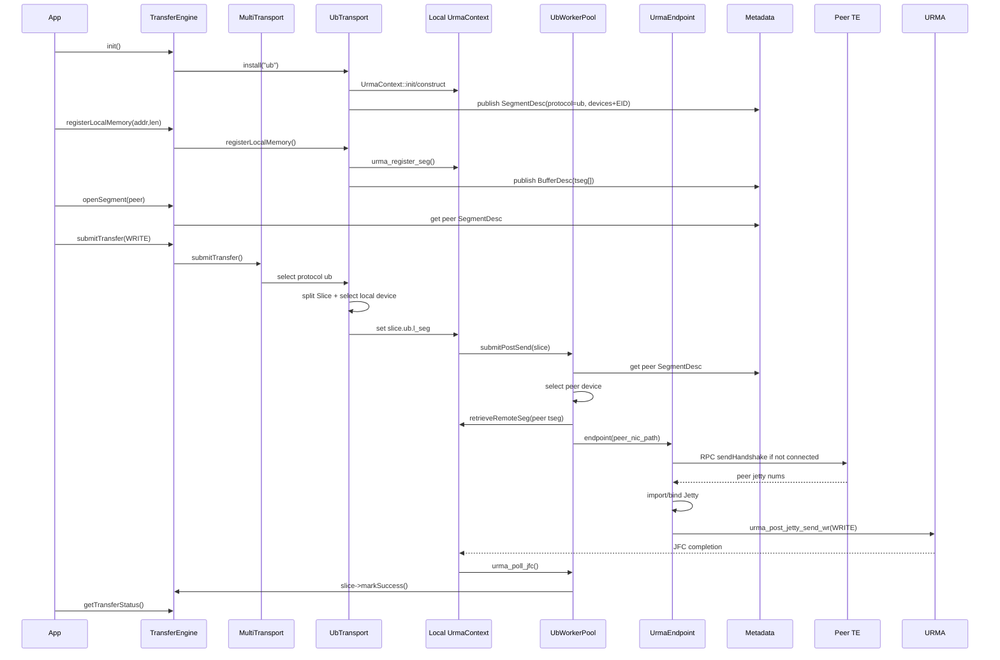

# 使用 URMA 的 Transfer Engine 全流程

本文基于 `transfer-engine-deep-dive.md` 和当前源码，单独梳理 Mooncake Transfer Engine 在 `USE_UB` 编译路径下使用 URMA 的初始化、内存注册、读写提交、握手建连、完成轮询与重试流程。

URMA 在 Mooncake 中不是独立暴露给用户的 API，而是作为 `UbTransport` 的默认 endpoint 类型接入 Transfer Engine：

```text
TransferEngine API
  -> TransferEngineImpl
    -> MultiTransport
      -> UbTransport              protocol = "ub"
        -> UbContext
          -> UrmaContext          URMA 设备上下文
            -> UrmaEndpoint       Jetty 连接与 post send
```

## 1. 前置条件

使用 URMA 路径需要满足：

- 编译时启用 `USE_UB`。
- 运行环境存在可发现的 UB/URMA 设备。
- `auto_discover_` 未被关闭，或者调用方手动安装了 `ub` transport。
- 两端 Transfer Engine 都发布了 `protocol = "ub"` 的 `SegmentDesc`。

URMA 和 RDMA 的概念大致对应如下：

| RDMA | URMA | Mooncake 中的作用 |
| --- | --- | --- |
| HCA / RNIC | UB device | 拓扑里的设备列表 |
| QP | Jetty | 端到端传输通道 |
| CQ | JFC | 发送完成队列 |
| MR | target segment / tseg | 注册后的本地/远端内存描述 |
| `ibv_post_send` | `urma_post_jetty_send_wr` | 提交 READ/WRITE |
| `ibv_poll_cq` | `urma_poll_jfc` | 轮询完成事件 |
| GID/LID | EID | 设备端点地址 |

## 2. 初始化总流程

用户调用：

```cpp
TransferEngine engine;
engine.init(metadata_conn, local_server_name, local_hostname, rpc_port);
```

调用链：

```text
TransferEngine::init()
  -> TransferEngineImpl::init()
    -> 创建 TransferMetadata
    -> 创建 MultiTransport
    -> Topology::discover()
    -> MultiTransport::installTransport("ub", topology)
      -> UbTransport::install()
        -> initializeUbResources()
          -> UbTransport::init()
            -> UrmaContext::init()
          -> 为每个 UB device 创建 UrmaContext
          -> UrmaContext::doConstruct()
        -> allocateLocalSegmentID()
        -> startHandshakeDaemon()
        -> metadata_->updateLocalSegmentDesc()
```

### 2.1 拓扑发现

`TransferEngineImpl::init()` 在 `auto_discover_ == true` 时调用：

```cpp
local_topology_->discover(filter_);
```

如果设置了 `MC_CUSTOM_TOPO_JSON`，则改为解析用户提供的拓扑。拓扑发现的目的不是马上建连接，而是得到：

```text
内存位置 cpu:0 / cpu:1 / cuda:n / *
  -> preferred_hca
  -> avail_hca
```

后续 `UbTransport::selectDevice()` 会用这个矩阵为每个 slice 选择本地 UB device。

### 2.2 安装 UbTransport

启用 `USE_UB` 后，初始化会安装：

```cpp
multi_transports_->installTransport("ub", local_topology_);
```

`MultiTransport::installTransport()` 创建 `UbTransport`，然后调用：

```cpp
transport->install(local_server_name_, metadata_, topo);
```

`UbTransport` 默认构造参数是：

```cpp
UbTransport(UB_ENDPOINT_TYPE endpoint_type = URMA_ENDPOINT);
```

所以当前 UB 路径默认走 URMA endpoint。

### 2.3 初始化 URMA 模块

`UbTransport::initializeUbResources()` 先调用：

```cpp
UbTransport::init()
  -> UrmaContext::init()
    -> urma_init()
```

这一步初始化 URMA runtime。`urma_init()` 成功后，Mooncake 才能打开 URMA 设备、注册 segment、创建 Jetty。

### 2.4 为每个设备创建 UrmaContext

`initializeUbResources()` 从拓扑里取设备列表：

```cpp
hca_list = local_topology_->getHcaList();
```

然后对每个设备创建 context：

```cpp
context = std::make_shared<UrmaContext>(*transport, device_name, max_endpoints);
context->doConstruct(config);
```

`UbContext::doConstruct()` 做两件事：

```text
1. 调用 UrmaContext::construct(config)
2. 创建 endpoint_store_，用于按 peer_nic_path 缓存 UrmaEndpoint
```

### 2.5 UrmaContext::construct()

`UrmaContext::construct()` 是每张 UB device 的底层资源初始化：

```text
UrmaContext::construct()
  -> openDevice(device_name, port, eid_index)
  -> urma_create_jfce()     创建完成事件队列
  -> epoll 监听 async fd
  -> urma_create_jfc()      创建发送完成队列
  -> urma_create_jfc()      创建接收完成队列
  -> urma_create_jfr()      创建接收队列
  -> 启动 UbWorkerPool
```

其中 `openDevice()` 会调用 URMA 设备枚举和打开逻辑，并得到当前 device 的 EID。EID 会在后续握手时发给对端。

### 2.6 发布本地 SegmentDesc

`UbTransport::allocateLocalSegmentID()` 创建本地 segment 描述：

```cpp
desc->name = local_server_name_;
desc->protocol = "ub";
for (auto& context : context_list_) {
    device_desc.name = context->deviceName();
    device_desc.eid = context->getEid();
    desc->devices.push_back(device_desc);
}
desc->topology = *local_topology_;
```

这一步发布的是节点级信息：

```text
server name
protocol = ub
设备列表 device name + EID
拓扑矩阵
```

此时还没有内存 buffer 信息。内存 buffer 会在 `registerLocalMemory()` 后追加到本地 `SegmentDesc`。

### 2.7 启动握手服务

`UbTransport::startHandshakeDaemon()` 注册被动握手回调：

```cpp
metadata_->startHandshakeDaemon(
    std::bind(&UbTransport::onSetupConnections, this, ...),
    rpc_port,
    sockfd);
```

这表示对端后续第一次向本节点某个 UB device 传输时，可以通过 RPC 调用本节点的 `onSetupConnections()`，完成 Jetty 绑定。

### 2.8 更新元数据

最后：

```cpp
metadata_->updateLocalSegmentDesc();
```

把本节点的 `SegmentDesc` 发布到元数据服务中。对端通过 `openSegment()` 或 `getSegmentDescByName()` 能拿到它。

## 3. 内存注册流程

用户调用：

```cpp
engine.registerLocalMemory(addr, length, location);
```

调用链：

```text
TransferEngine::registerLocalMemory()
  -> TransferEngineImpl::registerLocalMemory()
    -> MultiTransport 中每个已安装 transport 注册
      -> UbTransport::registerLocalMemory()
        -> 每个 UrmaContext::registerMemoryRegion()
        -> 每个 UrmaContext::buildLocalBufferDesc()
        -> metadata_->addLocalMemoryBuffer()
```

### 3.1 在每个 URMA 设备上注册 segment

`UbTransport::registerLocalMemory()` 遍历所有 `context_list_`：

```cpp
for (auto& context : context_list_) {
    context->registerMemoryRegion((uint64_t)addr, length);
    context->buildLocalBufferDesc((uint64_t)addr, buffer_desc);
}
```

也就是说，同一块用户内存会在每个可用 UB device 上注册一次。原因是后续 `selectDevice()` 可能选择任意一个 device；每个 device 都需要自己的可访问 segment handle。

`UrmaContext::registerMemoryRegion()` 主要做：

```text
1. 构造 urma_reg_seg_flag_t
   - token_policy = URMA_TOKEN_NONE
   - cacheable = URMA_NON_CACHEABLE
   - access = READ | WRITE | ATOMIC

2. 构造 urma_seg_cfg_t
   - va = 用户虚拟地址
   - len = 注册长度
   - token_value = urma_token

3. 调用 urma_register_seg()

4. 保存返回的 urma_target_seg_t*
   - local_tseg_list_
   - seg_region_list_
```

`seg_region_list_` 用于根据地址反查本地 tseg；`local_tseg_list_` 用于根据 metadata 中的 index 快速取出本地 segment。

### 3.2 构建 BufferDesc

注册完以后，`UrmaContext::buildLocalBufferDesc()` 会把 URMA segment 序列化：

```cpp
auto str = serializeBinaryData(&seg(addr)->seg, sizeof(urma_seg_t));
buffer_desc.tseg.push_back(str);
buffer_desc.l_seg_index.push_back(index);
```

`BufferDesc` 中和 URMA 相关的关键字段是：

```text
addr           本地 buffer 起始地址
length         buffer 长度
name           内存位置，例如 cpu:0 / * / cuda:0
tseg[]         每个 device 对应的序列化 urma_seg_t
l_seg_index[]  每个 device 对应的本地 tseg 索引
```

### 3.3 自动识别内存位置

如果用户传入的 location 是 `"*"`：

```cpp
getMemoryLocation(addr, length, only_first_page = true)
```

Mooncake 会尝试识别这块内存属于哪个 NUMA node 或设备，然后写入 `buffer_desc.name`。后续设备选择会优先使用与这个 location 更近的 UB device。

如果用户显式传入 `cpu:0`、`cpu:1` 等 location，则直接使用用户传入的值。

### 3.4 更新元数据

最后：

```cpp
metadata_->addLocalMemoryBuffer(buffer_desc, update_metadata);
```

这样远端才能通过元数据拿到：

```text
目标地址范围
目标 buffer 所在 location
目标设备列表
每个设备对应的远端 tseg 字符串
```

这些信息是远端执行 URMA READ/WRITE 的必要条件。

## 4. 打开远端 Segment

在读写之前，发起端通常会调用：

```cpp
auto target_id = engine.openSegment(remote_server_name);
```

逻辑上它会从元数据服务中拿到远端 `SegmentDesc`，并在本地保存一个 `SegmentID` 映射。

对 URMA 来说，远端 `SegmentDesc` 至少需要包含：

```text
protocol = "ub"
devices[] = { device name, EID }
buffers[] = { addr, length, tseg[], location }
topology
```

后续 `MultiTransport::selectTransport()` 会根据：

```cpp
target_segment_desc->protocol
```

选择 `transport_map_["ub"]`，也就是 `UbTransport`。

## 5. 写流程

用户侧写请求：

```cpp
TransferRequest req;
req.opcode = TransferRequest::WRITE;
req.source = local_addr;
req.target_id = remote_segment_id;
req.target_offset = remote_addr_or_offset;
req.length = length;

auto batch = engine.allocateBatchID(1);
engine.submitTransfer(batch, {req});
```

完整调用链：

```text
TransferEngine::submitTransfer()
  -> TransferEngineImpl::submitTransfer()
    -> MultiTransport::submitTransfer()
      -> selectTransport(req)
         根据 target SegmentDesc.protocol 选择 UbTransport
      -> UbTransport::submitTransferTask()
        -> 查找本地 buffer/device
        -> 按 slice_size 拆分 Slice
        -> 为每个 Slice 填充本地 l_seg
        -> 按本地 UrmaContext 分组
        -> UrmaContext::submitPostSend()
          -> UbWorkerPool::submitPostSend()
            -> 查找远端 buffer/device
            -> import 远端 tseg
            -> 按 peer_nic_path 入队
          -> worker 线程 performPostSend()
            -> 获取/创建 UrmaEndpoint
            -> 必要时主动握手
            -> UrmaEndpoint::submitPostSend()
              -> urma_post_jetty_send_wr()
```

### 5.1 选择本地设备

`UbTransport::submitTransferTask()` 先尝试判断整个 request 是否落在同一个本地 buffer：

```cpp
selectDevice(local_segment_desc, request.source, request.length,
             request_buffer_id, request_device_id)
```

如果能整体命中，后续每个 slice 复用同一个 `buffer_id/device_id`。这是一个优化，避免每个 slice 都重新查找。

如果整体不能命中，则每个 slice 单独执行：

```cpp
selectDevice(local_segment_desc, slice->source_addr, slice->length,
             buffer_id, device_id, retry_cnt)
```

`selectDevice()` 的逻辑是：

```text
1. 遍历本地 SegmentDesc.buffers
2. 找到覆盖 source_addr + length 的 BufferDesc
3. 用 buffer.name 到 topology 中选择 device
4. 如果按 location 找不到，就用 "*" fallback
5. 返回 buffer_id 和 device_id
```

### 5.2 Slice 分片

大请求按 `globalConfig().slice_size` 拆成多个 slice：

```text
request.length = 3.5 MB
slice_size = 1 MB

Slice0 1 MB
Slice1 1 MB
Slice2 1 MB
Slice3 0.5 MB
```

如果最后一段长度小于 `slice_size + fragment_limit`，会合并为最后一个 slice，减少碎片。

每个 slice 会记录：

```text
source_addr
length
opcode = WRITE
target_id
ub.dest_addr = request.target_offset + offset
retry_cnt
max_retry_cnt
task 指针
```

### 5.3 填充本地 l_seg

找到本地 `buffer_id/device_id` 后：

```cpp
auto local_tseg_index =
    local_segment_desc->buffers[buffer_id].l_seg_index[device_id];
slice->ub.l_seg = context->localSegWithIndex(local_tseg_index);
```

`l_seg` 是本地 URMA segment handle。WRITE 时它作为源端 segment。

### 5.4 提交到 UbWorkerPool

slice 会按本地 `UrmaContext` 分组：

```cpp
slices_to_post[context].push_back(slice);
```

达到水位线后，或者所有 slice 处理完后：

```cpp
context->submitPostSend(slice_list);
```

`UrmaContext::submitPostSend()` 本身只是转给 worker pool：

```cpp
worker_pool_->submitPostSend(slice_list);
```

### 5.5 查找远端目标设备和 r_seg

`UbWorkerPool::submitPostSend()` 对每个 slice：

```text
1. 根据 target_id 获取远端 SegmentDesc
2. 根据 ub.dest_addr + length 在远端 buffers 中找目标 BufferDesc
3. 用远端 topology 选择远端 device
4. 取出 peer_segment_desc->buffers[buffer_id].tseg[device_id]
5. context_.retrieveRemoteSeg(targetSegment)
6. 构造 peer_nic_path = remote_server + remote_device
7. 按 peer_nic_path 入队
```

这里有一个重要细节：

```cpp
auto hint = globalConfig().enable_dest_device_affinity
                ? context_.deviceName()
                : "";
```

如果启用了目标设备亲和，远端选 device 时会优先尝试和本地 device 同名或匹配 hint 的设备，尽量形成稳定的本地/远端设备配对。

### 5.6 导入远端 segment

远端 `tseg` 是序列化后的 `urma_seg_t` 字符串。发起端需要把它导入到本地 URMA context：

```cpp
slice->ub.r_seg = context_.retrieveRemoteSeg(targetSegment);
```

`UrmaContext::retrieveRemoteSeg()` 做：

```text
1. 查 import_tseg_map 缓存
2. 反序列化 remoteSegmentStr -> urma_seg_t
3. 调用 urma_import_seg()
4. 缓存 import_tseg_map[remoteSegmentStr]
5. 返回 imported target segment
```

WRITE 时，`r_seg` 是远端目标内存 segment。

### 5.7 建立 Endpoint

worker 线程执行 `performPostSend()` 时，以 `peer_nic_path` 为 key 获取 endpoint：

```cpp
auto endpoint = context_.endpoint(peer_nic_path);
```

如果 endpoint 不存在，`UbContext::endpoint()` 会创建并缓存：

```text
UbSIEVEEndpointStore
  peer_nic_path -> UrmaEndpoint
```

如果 endpoint 尚未 connected：

```cpp
endpoint->setupConnectionsByActive();
```

这会触发 URMA Jetty 主动握手。

### 5.8 提交 URMA WRITE

连接建立后：

```cpp
endpoint->submitPostSend(slice_vector, failed_slice_list);
```

`UrmaEndpoint::submitPostSend()` 的关键步骤：

```text
1. 随机选择一个 Jetty
2. 检查 Jetty WR 深度和 JFC outstanding 深度
3. 为每个 slice 构造 urma_jfs_wr_t
4. WRITE 时：
   src.sge = 本地 source_addr + l_seg
   dst.sge = 远端 dest_addr + r_seg
5. 设置 wr.user_ctx = slice
6. 设置 wr.tjetty = imported remote jetty
7. 标记 slice 为 POSTED
8. 调用 urma_post_jetty_send_wr()
```

WRITE 的数据方向：

```text
本地 source_addr / l_seg
  -> URMA Jetty
    -> 远端 ub.dest_addr / r_seg
```

## 6. 读流程

READ 请求和 WRITE 使用同一套 `submitTransferTask()`、worker、endpoint、完成轮询逻辑，差异主要在 opcode 和 SGE 方向。

用户请求：

```cpp
TransferRequest req;
req.opcode = TransferRequest::READ;
req.source = local_addr;
req.target_id = remote_segment_id;
req.target_offset = remote_addr_or_offset;
req.length = length;
```

在 `UrmaEndpoint::submitPostSend()` 中：

```cpp
wr.opcode = URMA_OPC_READ;
wr.rw.src.sge = &r_sge;
wr.rw.dst.sge = &l_sge;
```

READ 的数据方向：

```text
远端 ub.dest_addr / r_seg
  -> URMA Jetty
    -> 本地 source_addr / l_seg
```

所以 `TransferRequest::source` 在 Mooncake API 中始终是本地地址：

- WRITE：本地地址是源。
- READ：本地地址是目标。

`target_offset` 始终描述远端地址。

## 7. URMA 握手与 Jetty 绑定

URMA 路径使用 Transfer Engine 的 RPC handshake，不使用 RDMA CM。

### 7.1 主动端

主动端在 worker 线程中发现 endpoint 未连接时调用：

```cpp
UrmaEndpoint::setupConnectionsByActive()
```

主动端构造 `HandShakeDesc`：

```cpp
local_desc.local_nic_path = context_->nicPath();
local_desc.peer_nic_path = peer_nic_path_;
local_desc.jetty_num = JettyNum();
```

然后发 RPC：

```cpp
context_->engine().sendHandshake(peer_server_name, local_desc, peer_desc);
```

收到对端返回后，主动端从远端 `SegmentDesc` 中找到目标 device 的 EID：

```cpp
doSetupConnection(peer_eid, peer_desc.jetty_num);
```

### 7.2 被动端

被动端 handshake daemon 收到 RPC 后进入：

```text
UbTransport::onSetupConnections()
  -> 根据 peer_desc.peer_nic_path 找本地 context
  -> context->endpoint(peer_desc.local_nic_path)
  -> endpoint->setupConnectionsByPassive(peer_desc, local_desc)
```

被动端返回给主动端：

```text
local_desc.local_nic_path
local_desc.peer_nic_path
local_desc.jetty_num
reply_msg
```

如果校验失败，`reply_msg` 会带错误信息，主动端拒绝继续建连。

### 7.3 Jetty import 与 bind

主动端和被动端都会执行：

```cpp
UrmaEndpoint::doSetupConnection(peer_eid, peer_jetty_num_list)
```

对每个 Jetty：

```text
1. peer_eid 字符串转 urma_eid_t
2. 构造 urma_rjetty_t
3. urma_import_jetty()
4. urma_bind_jetty(local_jetty, imported_jetty)
5. imported_jetty_map_[local_jetty] = imported_jetty
```

全部 Jetty 绑定成功后：

```cpp
status_ = CONNECTED;
```

之后 `submitPostSend()` 就可以把 `wr.tjetty` 设置为对应的 imported remote Jetty。

## 8. 完成轮询与状态查询

URMA 完成由 `UbWorkerPool` 后台线程处理。

### 8.1 worker 主循环

`UbWorkerPool::transferWorker()` 循环执行：

```text
while running:
  如果没有未完成 slice:
    等待 cond_var
  否则:
    performPostSend()
    performPoll()
```

`performPostSend()` 负责把队列中的 slice 提交到 endpoint。

`performPoll()` 负责轮询 JFC：

```cpp
context_.poll(kPollCount, cr, jfc_index);
```

### 8.2 UrmaContext::poll()

底层调用：

```cpp
urma_poll_jfc(jfc_list_[jfc_index].native, num_entries, cr);
```

每个 completion record 里通过 `user_ctx` 找回 slice：

```cpp
auto slice = (Transport::Slice*)cr[i].user_ctx;
```

如果成功：

```cpp
slice->markSuccess();
```

如果失败，`poll()` 只记录错误；`performPoll()` 根据 slice 状态决定重试或最终失败。

### 8.3 markSuccess / markFailed 的效果

`Slice::markSuccess()` 会推进 task 级计数：

```text
task.success_slice_count++
task.transferred_bytes += slice.length
```

`Slice::markFailed()` 会推进：

```text
task.failed_slice_count++
```

用户侧查询：

```cpp
TransferStatus status;
engine.getTransferStatus(batch, task_id, status);
```

`UbTransport::getTransferStatus()` 判断：

```text
success_slice_count + failed_slice_count == slice_count
```

如果全部 slice 完成：

- 有失败 slice：`FAILED`
- 全部成功：`COMPLETED`
- 否则：`WAITING`

## 9. 失败重试流程

URMA 路径有两类失败处理。

### 9.1 post send 失败

`UrmaEndpoint::submitPostSend()` 调用：

```cpp
urma_post_jetty_send_wr(jetty, wr_list, &bad_wr);
```

如果失败，会把 `bad_wr` 对应的 slice 放入 `failed_slice_list`，并回滚：

```text
wr_depth_list_[jetty_index]--
jfc_outstanding_--
```

worker 随后调用：

```cpp
redispatch(failed_slice_list, thread_id);
```

### 9.2 completion 失败

`performPoll()` 发现 slice 不是 SUCCESS：

```text
slice->ub.retry_cnt++

如果 retry_cnt >= max_retry_cnt:
  deleteEndpoint(peer_nic_path)
  slice->markFailed()
否则:
  重新放回 collective_slice_queue_
```

重新分发时会带着新的 `retry_cnt` 调用：

```cpp
UbTransport::selectDevice(..., retry_cnt)
```

`retry_cnt` 会改变 topology 中的 device 选择，尽量避开刚刚失败的路径。

## 10. 注销内存与释放资源

用户注销内存：

```cpp
engine.unregisterLocalMemory(addr);
```

调用链：

```text
TransferEngine::unregisterLocalMemory()
  -> UbTransport::unregisterLocalMemory()
    -> metadata_->removeLocalMemoryBuffer()
    -> 每个 UrmaContext::unregisterMemoryRegion()
      -> urma_unregister_seg()
```

`UrmaContext::unregisterMemoryRegion()` 会在 `seg_region_list_` 中找到覆盖该地址的 segment，并调用：

```cpp
urma_unregister_seg(seg);
```

Transfer Engine 释放时，`UbTransport` 析构会：

```text
removeSegmentDesc(local_server_name_)
清空 batch_desc_set_
清空 context_list_
```

`UrmaEndpoint::deconstruct()` 会：

```text
urma_unbind_jetty()
urma_unimport_jetty()
urma_delete_jetty()
回收 outstanding 计数
```

`UrmaContext::uninit()` 最终调用：

```cpp
urma_uninit();
```

## 11. 一次 WRITE 的端到端时序



## 12. 调用链速查

### 初始化

```text
TransferEngine::init
  -> TransferEngineImpl::init
    -> Topology::discover
    -> MultiTransport::installTransport("ub")
      -> UbTransport::install
        -> initializeUbResources
          -> UrmaContext::init
          -> UrmaContext::doConstruct
            -> UrmaContext::construct
              -> openDevice
              -> urma_create_jfce
              -> urma_create_jfc
              -> urma_create_jfr
            -> create endpoint_store_
        -> allocateLocalSegmentID
        -> startHandshakeDaemon
        -> updateLocalSegmentDesc
```

### 内存注册

```text
TransferEngine::registerLocalMemory
  -> TransferEngineImpl::registerLocalMemory
    -> UbTransport::registerLocalMemory
      -> UrmaContext::registerMemoryRegion
        -> urma_register_seg
      -> UrmaContext::buildLocalBufferDesc
      -> metadata_->addLocalMemoryBuffer
```

### WRITE / READ 提交

```text
TransferEngine::submitTransfer
  -> MultiTransport::submitTransfer
    -> MultiTransport::selectTransport
    -> UbTransport::submitTransferTask
      -> UbTransport::selectDevice(local)
      -> Slice 分片
      -> context->localSegWithIndex
      -> UrmaContext::submitPostSend
        -> UbWorkerPool::submitPostSend
          -> get peer SegmentDesc
          -> UbTransport::selectDevice(peer)
          -> UrmaContext::retrieveRemoteSeg
          -> queue by peer_nic_path
        -> UbWorkerPool::performPostSend
          -> context.endpoint(peer_nic_path)
          -> UrmaEndpoint::setupConnectionsByActive
          -> UrmaEndpoint::submitPostSend
            -> urma_post_jetty_send_wr
```

### 完成

```text
UbWorkerPool::transferWorker
  -> performPoll
    -> UrmaContext::poll
      -> urma_poll_jfc
      -> slice->markSuccess / error
  -> getTransferStatus
    -> success_slice_count + failed_slice_count
```

## 13. 最容易混淆的点

1. `UbTransport` 是 Transfer Engine 的 transport，`UrmaContext` 和 `UrmaEndpoint` 是它的底层实现。
2. 用户传入的 `source` 永远是本地地址；WRITE 时是本地源地址，READ 时是本地目标地址。
3. `target_offset` 是远端地址或远端 segment 内偏移，slice 中保存为 `slice->ub.dest_addr`。
4. 本地内存注册生成 `l_seg`，远端 metadata 中的 `tseg` 被导入后生成 `r_seg`。
5. `openSegment()` 只拿元数据，不等于已经建立 Jetty 连接；Jetty 通常在第一次真正提交到某个 `peer_nic_path` 时懒建立。
6. 设备选择发生两次：本地 source buffer 选本地 device，远端 target buffer 选远端 device。
7. 完成不是用户线程同步等待底层 API，而是 worker 线程轮询 JFC 后更新 slice/task 计数，用户通过状态查询看到结果。
